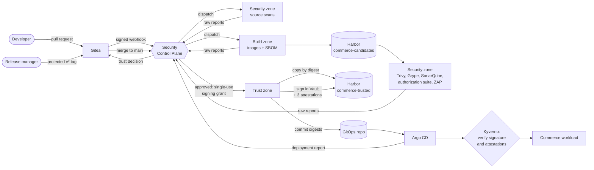
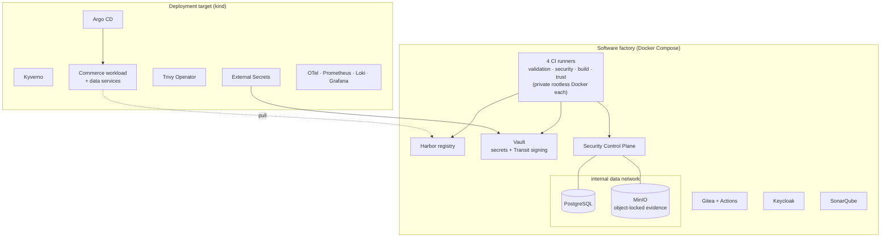

<div align="center">

# Software Supply Chain Security Platform

**A DevSecOps platform that proves, step by step, that the software running in
Kubernetes is exactly the software that was reviewed, built, scanned and approved.**

[](docs/architecture-overview.md)
[](docs/production-considerations.md)
[](docs/trust-policy.md)


[](docs/codebase-guide.md)
[](docs/cli-reference.md)
[](docs/kubernetes-security.md)
[](docs/architecture-overview.md)
[](docs/ci-pipelines.md)
[](docs/gitops-and-admission.md)
[](docs/gitops-and-admission.md#admission-policies)

[](docs/secret-management.md)
[](docs/artifact-registry.md)
[](docs/identity-and-authorization.md)
[](docs/release-signing.md)
[](docs/release-signing.md#why-slsa-style)
[](docs/security-scanning.md)
[](docs/observability.md)

[](docs/security-scanning.md)
[](docs/testing-strategy.md)

</div>

---

## Contents

- [What is this?](#what-is-this)
- [Why it exists](#why-it-exists)
- [What it does](#what-it-does)
- [How it works](#how-it-works)
- [Architecture](#architecture)
- [Technology](#technology)
- [Security guarantees](#security-guarantees)
- [Getting started](#getting-started)
- [Using the platform](#using-the-platform)
- [Testing and verification](#testing-and-verification)
- [Stopping and cleaning up](#stopping-and-cleaning-up)
- [Project layout](#project-layout)
- [Limitations](#limitations)
- [Documentation](#documentation)

## What is this?

This project is a complete **software supply chain**, built so that every step can be
checked. A software supply chain is everything between a developer's change and the
program running in production: source control, CI pipelines, security scanners, the image
registry, signing and deployment.

The platform runs entirely on one workstation, in Docker and a local Kubernetes cluster
(kind). It secures a realistic .NET 10 commerce backend, which has six deployable services,
events, a database and personal data. The workload travels through the chain like real
software would:

> A change reaches the cluster only after **isolated CI zones** have produced security
> evidence, a **Security Control Plane** has judged that evidence against a written policy,
> and the approved image has been **signed with a key that never leaves Vault**. Kubernetes
> then **checks that signature again, on its own**, before it runs anything.

The heart of the project is the **Security Control Plane**, a .NET 10 service written for
it. The Control Plane:

- collects raw scanner reports;
- ties each report to one exact commit and image digest;
- decides whether an image may be trusted;
- issues single-use signing permission for approved releases;
- keeps a tamper-evident audit trail of everything.

## Why it exists

Modern attacks increasingly target the *path* software takes, not the software itself:

- a malicious pull request that edits the CI pipeline to skip its security scans, or to
  steal deployment credentials;
- a compromised build job that pushes a tampered image;
- a stolen registry credential used to re-tag an image;
- a leaked signing key;
- a "temporary" suppression of a finding that nobody ever removes.

Many pipelines only *run* scanners. They do not prove that the scanned artifact is the one
being deployed, or that the scan results were not faked. This platform shows how to close
those gaps with open-source tools, and it explains each design choice, its alternatives
and its limits.

The problems it solves:

| Problem | How the platform answers it |
|---|---|
| Untrusted code can influence the security pipeline | Security pipelines live in a separate platform repository and run only on runners that application workflows cannot reach |
| CI jobs can lie about scan results | The Control Plane stores and parses the raw reports itself; evidence is accepted only from the pipeline run it dispatched, for the exact digest |
| What was scanned may not be what runs | Images are built once and identified only by digest; the same digest is scanned, signed, deployed and checked at admission |
| Signing keys get stolen | The key is a non-exportable Vault Transit key; signing rights exist only for minutes, for one approved release, from one runner |
| Deployments bypass review | Only Argo CD deploys, from Git; no CI zone holds cluster credentials; Kyverno refuses any image without a valid signature and a positive trust decision |
| Accepted risks are forgotten | Risk exceptions cover one finding, need a second person's approval and expire within 90 days |
| Nobody can reconstruct what happened | Every decision, signature and deployment is linked by digest and recorded in a hash-chained audit log |

## What it does

**Source to trusted artifact**

- **Pull-request gates.** Every pull request gets Gitleaks, Semgrep, Checkov and Hadolint
  scans, run by the platform (not the application) and reported as a required commit
  status (`sscp/source-security`).
- **Isolated CI zones.** There are four runners: *validation*, *security*, *build* and
  *trust*. Each has its own private rootless Docker daemon, its own network address and its
  own Vault identity bound to that address.
- **Build once, by digest.** The build zone builds six images from digest-pinned base images
  and a locked, signature-checked NuGet restore. It pushes them to a candidates project and
  registers their digests.
- **Evidence for every build.** For each image the platform collects:
  - a CycloneDX SBOM (Syft);
  - vulnerability scans (Trivy, which gates; Grype, as a second opinion), using mirrored
    offline databases that must be less than 7 days old.

  For the commit as a whole it collects:
  - the source scans;
  - a SonarQube quality gate;
  - dynamic tests: an authorization suite of 25 checks and an authenticated OWASP ZAP scan
    against the running candidates.
- **Policy-based trust decisions.** A written trust policy defines the mandatory evidence,
  severity gates and a vulnerability remediation SLA. The outcome is `PASS`,
  `PASS_WITH_EXCEPTION` or `FAIL`. Missing, failed or tampered evidence always means `FAIL`.
- **Two-person risk exceptions.** An exception covers one finding, for a limited time, and
  is approved by someone other than the requester. It is re-checked immediately before
  signing.

**Trusted artifact to running workload**

- **Signing and attestation.** A protected release tag triggers the trust zone:
  1. the release is re-evaluated;
  2. each image is copied by digest to the trusted project;
  3. it is signed with Cosign through Vault;
  4. three signed attestations are attached: SLSA-style provenance, the trust decision and
     the SBOM.
- **GitOps deployment.** The release bot commits the new digests to the GitOps repository.
  Argo CD applies them in ordered waves. The Control Plane confirms the deployment by
  reading Git itself.
- **Independent admission control.** Kyverno refuses any commerce image that lacks the
  release signature, a positive trust-decision attestation, provenance from the platform's
  pipeline or an SBOM. Further policies enforce hardened pods, digest-only images, no
  hand-made Secrets, no new exposure and no debug containers.
- **Runtime protection.** The cluster runs with:
  - default-deny network policies;
  - token-less workload identities;
  - secrets delivered from Vault by External Secrets;
  - signed events between services.

**Seeing and proving it**

- **Observability.**
  - OpenTelemetry, Prometheus, Loki and Grafana, with 17 alert rules and two dashboards.
  - Every workload signal carries the release that produced it.
  - The Trivy Operator rescans the images that actually run.
- **Traceability.** From any running digest, `GET /api/artifacts/{digest}/trace` returns
  its commit, build, evidence, decisions, signatures, promotions, releases and deployments.
- **Proof, not claims.** 80 operational checks attack the running platform and assert that
  each control holds. Examples: pushing an unsigned image, using a zone credential from
  another container, opening forbidden network paths.

## How it works



1. **A developer opens a pull request** on `commerce/commerce-app`. The application's own
   validation workflow builds and runs its unit and architecture tests on the validation
   runner. That runner has no Docker socket and no credentials.
2. **The Control Plane receives Gitea's signed webhook** and starts the platform's source
   pipeline on the security runner. It judges the reports and sets `sscp/source-security`.
   The merge needs that status, the validation status and a maintainer's approval.
3. **After the merge, the main pipeline runs:**
   - the build zone builds and pushes six candidate images;
   - the security zone scans and dynamically tests them;
   - the Control Plane decides for each image and sets `sscp/trust-decision`, for example
     `PASS for 6 images`.
4. **A release manager pushes a `v*` tag.** The trust zone re-evaluates the release. It
   then receives a single-use signing grant, and promotes, signs and attests every image.
   Finally it commits their digests to the GitOps repository.
5. **Argo CD deploys the commit.** Kyverno verifies every image's signature and
   attestations before any pod starts.
6. **The Control Plane confirms the deployment** by comparing the Git revision with its own
   records. It then sets `sscp/release` to `release vX deployed to local`.

The full walk-through, with every state and status, is in
[docs/end-to-end-flow.md](docs/end-to-end-flow.md).

## Architecture

The platform has two runtime tiers on one Docker network:



| Tier | Runs on | Contains | Why separate |
|---|---|---|---|
| **Software factory** | Docker Compose | Gitea, four CI runners, Harbor, Vault, Keycloak, the Security Control Plane, SonarQube, PostgreSQL, MinIO | must exist before any cluster, and survive the cluster being recreated |
| **Deployment target** | kind (Kubernetes 1.36, one node) | Argo CD, Kyverno, External Secrets, Trivy Operator, the commerce workload, observability | where enforcement independent of CI (admission, network policy, Pod Security) happens |

**Three repositories, three owners.** The workspace holds three directories. `sscp` publishes
each one to its own Gitea repository:

| Gitea repository | Directory | Owner | Contents |
|---|---|---|---|
| `commerce/commerce-app` | [`commerce-app/`](commerce-app) | commerce team | the .NET workload, tests, Dockerfile, validation workflow. Treated as **untrusted input** |
| `platform/supply-chain-platform` | [`supply-chain-platform/`](supply-chain-platform) | platform team | the Control Plane, trust policy, platform pipelines, CI helper, automation, cluster security state |
| `platform/commerce-gitops` | [`commerce-gitops/`](commerce-gitops) | platform team and the release bot | the workload's desired Kubernetes state, with images pinned by digest |

**Four CI trust zones.**

| Zone | Runner | Can | Cannot |
|---|---|---|---|
| Validation | registered to the `commerce` organisation | build and unit-test application code | use Docker, read any secret, reach platform runners |
| Security | platform repository only | scan source and images, run dynamic tests, submit evidence | push images, sign |
| Build | platform repository only | build and push candidate images, submit SBOMs | write trusted images, submit vulnerability scans, sign |
| Trust | platform repository only | with a grant: promote, sign, attest, commit to GitOps | build, scan, or sign without a grant |

More detail:

- [docs/architecture-overview.md](docs/architecture-overview.md);
- [docs/trust-boundaries.md](docs/trust-boundaries.md);
- [docs/workload-architecture.md](docs/workload-architecture.md).

## Technology

| Area | Technology | Role |
|---|---|---|
| Source control and CI | Gitea 1.27, Gitea Actions runners 3.5 (rootless Docker-in-Docker) | repositories, reviews, protected branches and tags, four isolated CI zones |
| Security Control Plane | .NET 10, ASP.NET Core, EF Core, PostgreSQL 18, MinIO | evidence, trust decisions, signing grants, audit log, orchestration |
| Automation | Python 3.12+, `uv` | the `sscp` CLI (bootstrap, verification) and the `sscp-ci` pipeline helper |
| Registry | Harbor 2.15 | tool mirror, candidate and trusted projects, OCI referrers |
| Secrets and signing | HashiCorp Vault 2.1 (KV, Transit, AppRole, JWT) | secrets, zone identities, the non-exportable signing key |
| Identity | Keycloak 26.7 | `platform` and `commerce` realms |
| Scanning | Gitleaks, Semgrep, Checkov, Hadolint, SonarQube Community Build, Syft, Trivy, Grype, OWASP ZAP | secrets, SAST, IaC, Dockerfile, quality, SBOM, vulnerabilities, DAST |
| Signing and provenance | Sigstore Cosign 3 (offline bundles), in-toto attestations, SLSA provenance v1 format, CycloneDX | signatures and attestations stored as OCI referrers |
| Kubernetes | kind 0.33 (Kubernetes 1.36), Argo CD, Kyverno, External Secrets Operator, Trivy Operator | GitOps, admission control, secret delivery, runtime scanning |
| Observability | OpenTelemetry Collector, Prometheus, Loki, Grafana | metrics, logs, alerts, dashboards |
| Workload | .NET 10 modular monolith + YARP gateway + 4 workers, PostgreSQL, RabbitMQ, Redis, MinIO | the application being protected |

Every image and tool is pinned by version **and** digest (or SHA-256) in
[`supply-chain-platform/versions.yaml`](supply-chain-platform/versions.yaml).

## Security guarantees

Each guarantee below is enforced by the platform and checked by an automated test.

| The platform guarantees that… | Enforced by |
|---|---|
| a pull request cannot run code on a privileged runner | runner registration scope; the application repository has no secrets |
| a scan cannot be skipped or faked | platform-owned pipelines; server-side report parsing; run and digest binding; fail-closed evidence rules |
| code authors cannot suppress their own findings | in-repository suppressions ignored; only approved, expiring exceptions |
| only approved images can be signed | single-use Vault grants issued only for approved releases |
| the signing key cannot be stolen | non-exportable Transit key; even the bootstrap token is denied signing |
| only signed, approved images can run | Kyverno image verification with `failurePolicy: Fail` |
| what runs is what was scanned | digest-only references end to end; immutable release tags |
| workloads cannot reach what they do not need | default-deny network policies; no Kubernetes API tokens; per-namespace Vault access |
| history cannot be quietly rewritten | hash-chained audit logs; a database role without delete rights; object-locked evidence |

How each attack is stopped, and which test proves it:
[docs/threat-model.md](docs/threat-model.md).

## Getting started

### Prerequisites

| Requirement | Notes |
|---|---|
| Windows 11 with Docker Desktop (WSL 2 backend) | the verified environment; see the [OS note](docs/setup-guide.md#1-prerequisites) |
| Docker memory | **12 GiB minimum, 16 GiB recommended** |
| Free disk | **50 GiB recommended** (30 GiB minimum); the full platform uses about 45 GB |
| CPUs | 4 or more |
| Python 3.12+, [uv](https://docs.astral.sh/uv/), git, kubectl 1.36, Helm 4 | the automation and cluster tools |
| .NET SDK 10.0.401 | optional; only to build and test the .NET code on the host |
| Git Bash (on Windows) | the shell used by every example |

kind is downloaded automatically and checked against its pinned SHA-256. Internet access is
needed for the first start, to download the pinned images and charts. The pipelines
themselves pull every tool from the platform's own registry.

### 1. Get the code and check the workstation

```bash
git clone <repository-url> supply-chain-security-platform
cd supply-chain-security-platform/supply-chain-platform
uv run sscp doctor
```

`doctor` checks Docker, memory, disk and tools, and the **pinning policy**: every image
must be pinned by digest. All `sscp` commands run from the `supply-chain-platform`
directory.

### 2. Start the platform

```bash
uv run sscp up --with quality,ci,cluster
```

This creates everything:

- a local certificate authority;
- the software factory: Gitea, Vault, Keycloak, Harbor, the Control Plane;
- SonarQube;
- the tool mirror and four CI runners;
- the kind cluster with its add-ons.

The first start takes about 45–90 minutes, mostly downloading. `sscp up` is
**idempotent**: run it again at any time, for example after a restart, and it only does
what is missing.

### 3. Verify it

```bash
uv run sscp status
uv run sscp verify foundation controlplane registry ci-isolation
```

### 4. Build and release the workload

```bash
uv run sscp repo build          # first main build: about 30 minutes
```

Follow the build in Gitea (https://localhost:3000 → `platform/supply-chain-platform` →
**Actions**). When the commit's `sscp/trust-decision` status shows `PASS for 6 images`,
release it as the release manager:

```bash
uv run sscp repo tag -t v1.0.0
```

Within a few minutes, the tagged commit's `sscp/release` status reads
`release v1.0.0 deployed to local`. Check the running workload:

```bash
kubectl --kubeconfig ../.local/generated/kubeconfig -n commerce get pods
curl http://127.0.0.1:8088/api/catalog/products
uv run sscp verify signing cluster observability
```

### 5. Look around

| Service | Address | Sign in |
|---|---|---|
| Gitea | https://localhost:3000 | persona accounts ([setup guide](docs/setup-guide.md#people-personas)) |
| Harbor | https://localhost:8443 | `admin` |
| Security Control Plane API | https://localhost:7443 | tokens for `platform` realm personas |
| Argo CD | https://127.0.0.1:8444 | `admin` |
| Grafana | http://127.0.0.1:3300 | `admin` |
| Prometheus | http://127.0.0.1:9990 | none |
| Commerce gateway | http://127.0.0.1:8088 | `commerce` realm personas |

All ports are bound to `127.0.0.1`. Passwords are generated at the first start and kept in
the git-ignored `.local/secrets/bootstrap.json`. Print one with:

```bash
uv run python -c "from sscp import credentials; print(credentials.find('gitea.admin'))"
```

The complete guide, including every endpoint, persona and credential, is in
[docs/setup-guide.md](docs/setup-guide.md).

## Using the platform

The `sscp repo` commands act as the platform's personas, so you can play every role in the
flow:

| Task | Command (from `supply-chain-platform/`) |
|---|---|
| Propose an application change (as `alice`) | `uv run sscp repo propose -b feature/x -m "Describe the change"` |
| Approve it (as `max`), then merge it (as `alice`) | `uv run sscp repo approve -n <n>`, then `uv run sscp repo merge -n <n>` |
| Propose a GitOps change (as `pat`) | `uv run sscp repo propose --repo commerce-gitops -b change/x -m "…"` |
| Publish platform changes (as `pat`) | `uv run sscp repo sync -m "Describe the change"` |
| Cut a release (as `rhea`) | `uv run sscp repo tag -t v1.0.1` |
| Refresh vulnerability databases (at least weekly) | `uv run sscp tools refresh-db` |
| Request and approve a risk exception | see [docs/risk-exceptions.md](docs/risk-exceptions.md) |
| Trace a running image back to its evidence | see [docs/end-to-end-flow.md](docs/end-to-end-flow.md#following-a-change-yourself) |

Every command and option is described in [docs/cli-reference.md](docs/cli-reference.md).

## Testing and verification

Tests are organised by layer, and each behaviour is tested at the cheapest layer that can
prove it:

| Layer | What it covers | Run with |
|---|---|---|
| Unit (182) | trust rules, SLA, state machines, every scanner report reader against real tool output, domain rules, message signing, CI helper | `dotnet test` in each repository; `uv run pytest` |
| Architecture (41) | layer and module boundaries on compiled code | `dotnet test` |
| Integration (25) | real PostgreSQL, RabbitMQ, MinIO and Keycloak in disposable containers | `dotnet test` (needs Docker) |
| Component / API (52) | each service's real HTTP pipeline: zone boundaries, trust flows, signing grants, authorization | `dotnet test` (needs Docker) |
| Operational (80) | the running platform, attacked for real | `uv run sscp verify [suite …]` |
| In-pipeline | authorization suite and ZAP scan against every main build's images | automatic |

```bash
cd supply-chain-platform && dotnet test      # Control Plane (run from inside the repository)
cd ../commerce-app && dotnet test            # commerce workload
cd ../supply-chain-platform && uv run pytest # Python: automation and CI helper
uv run sscp verify                           # all 8 operational suites (about 15 minutes)
```

Do not run the operational suites while a pipeline is building. Details are in
[docs/testing-strategy.md](docs/testing-strategy.md).

## Stopping and cleaning up

| Goal | Command | Effect |
|---|---|---|
| Stop everything, keep all data | `uv run sscp down` | stops the cluster, Harbor and every service |
| Start again | `uv run sscp up --with quality,ci,cluster` | restarts everything and **unseals Vault**, which always restarts sealed |
| Remove everything | `uv run sscp reset --yes` | deletes the cluster, every container, volume and network, and `.local/` |

`reset` also deletes the signing key. Nothing signed before a reset verifies afterwards.

## Project layout

```text
.
├── README.md                     you are here
├── docs/                         the full documentation (start at docs/index.md)
├── supply-chain-platform/        platform repository → Gitea platform/supply-chain-platform
│   ├── .gitea/workflows/         platform-owned pipelines: PR, main, release, deployment
│   ├── automation/               the `sscp` CLI (Python) and operational test suites
│   ├── ci/                       the `sscp-ci` pipeline helper, scanner rules, ci-tools image
│   ├── cluster/                  kind config, Helm values, cluster security state for Argo CD
│   ├── platform/                 Docker Compose factory: Gitea, Vault, Keycloak, Harbor, runners
│   ├── policy/                   trust policy and governed applications
│   ├── src/                      Security Control Plane (.NET 10: Domain, Application, Infrastructure, Api)
│   ├── tests/                    Control Plane unit, architecture, integration and component tests
│   └── versions.yaml             every pinned version, digest and checksum
├── commerce-app/                 application repository → Gitea commerce/commerce-app
│   ├── src/                      modular monolith (8 modules), gateway, 4 workers
│   ├── tests/                    unit, architecture, integration and component tests
│   ├── config/publishers.yaml    which service may publish which events
│   └── Dockerfile                one target per deployable
└── commerce-gitops/              GitOps repository → Gitea platform/commerce-gitops
    ├── base/                     the workload and its data services
    └── overlays/local/           release-managed digests for the local cluster
```

The directories `.local/`, `.tools/` and `.runs/` are created on the workstation. They hold
certificates, credentials, tool binaries and logs, and are never committed. A guided tour
of the code is in [docs/codebase-guide.md](docs/codebase-guide.md).

## Limitations

This is a local platform. Its controls are real and tested, but some surrounding choices
are made for a single workstation:

- **One machine.** All trust zones share one Docker Desktop VM, so whoever controls the VM
  controls everything. The kind cluster has one node.
- **No transparency log.** Signatures are offline Sigstore bundles verified with a public
  key. There is no Rekor or timestamp authority, so a signature does not prove *when* it was
  made.
- **SLSA-style, not SLSA-certified.** The provenance follows the SLSA v1 format with real
  build facts. The Control Plane assembles it after the build, so no SLSA Build level is
  claimed.
- **Identity by network address.** CI zones are bound to fixed runner addresses, not to
  per-job workload identity.
- **Platform repository review is not enforced.** Platform engineers push directly to the
  platform repository.
- **Secrets in plaintext on the workstation.** Bootstrap credentials and Vault unseal keys
  live in `.local/secrets`. Workload secrets reach pods as environment variables.
- **No backups, no alert delivery, no trace store, no runtime threat detection (Falco).**
- **Vulnerability data is only as fresh as the last refresh.** Refresh at least weekly, or
  the policy blocks releases.
- **Verified on Windows only.** The pinned kind binary is for Windows amd64.

What production would change, area by area, is in
[docs/production-considerations.md](docs/production-considerations.md).

## Documentation

The full documentation map is [docs/index.md](docs/index.md). Good starting points:

| Start here | Then |
|---|---|
| [Architecture overview](docs/architecture-overview.md) | [Trust boundaries](docs/trust-boundaries.md) · [Repository boundaries](docs/repository-boundaries.md) · [Identity and authorization](docs/identity-and-authorization.md) |
| [End-to-end flow](docs/end-to-end-flow.md) | [CI pipelines](docs/ci-pipelines.md) · [Security scanning](docs/security-scanning.md) · [Dynamic security testing](docs/dynamic-security-testing.md) |
| [Security Control Plane](docs/security-control-plane.md) | [Trust policy](docs/trust-policy.md) · [Risk exceptions](docs/risk-exceptions.md) |
| [Release signing](docs/release-signing.md) | [Artifact registry](docs/artifact-registry.md) · [GitOps and admission](docs/gitops-and-admission.md) · [Kubernetes security](docs/kubernetes-security.md) |
| [Setup guide](docs/setup-guide.md) | [CLI reference](docs/cli-reference.md) · [Configuration reference](docs/configuration-reference.md) · [Troubleshooting](docs/troubleshooting.md) |
| [Threat model](docs/threat-model.md) | [Design decisions](docs/design-decisions.md) · [Production considerations](docs/production-considerations.md) |
| [Testing strategy](docs/testing-strategy.md) | [Failure and recovery](docs/failure-and-recovery.md) · [Observability](docs/observability.md) |
| [Workload architecture](docs/workload-architecture.md) | [Messaging and data](docs/messaging-and-data.md) · [Secret management](docs/secret-management.md) · [Glossary](docs/glossary.md) |
