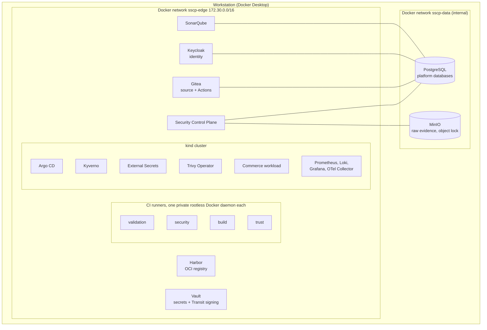

# Architecture overview

This document explains how the platform is put together: which components exist, where
they run, how they are connected and which boundary each one enforces. It is the best
starting point before reading any of the more specific documents.

> **In one sentence:** a change to the commerce application reaches the Kubernetes
> cluster only after isolated CI zones have produced security evidence, the Security
> Control Plane has judged that evidence against a written policy, and the approved image
> has been signed with a key that never leaves Vault — and Kubernetes checks that
> signature again, on its own, before it runs anything.

## The trust chain

Every change travels the same path. Each arrow that crosses into a new stage is guarded
by a different mechanism, so no single component — including CI — can move an image from
"built" to "running" by itself.

```mermaid
flowchart LR
    dev[Developer change] --> pr[Gitea pull request]
    pr -->|validation zone| val[Build and fast tests]
    pr -->|security zone| src[Source scans:<br/>Gitleaks, Semgrep,<br/>Checkov, Hadolint]
    val & src --> merge[Protected main]
    merge -->|build zone| img[Candidate image<br/>commerce-candidates@sha256]
    img --> sbom[SBOM<br/>Syft, CycloneDX]
    img -->|security zone| art[Image scans: Trivy, Grype<br/>Dynamic tests: authorization suite, ZAP<br/>Code quality: SonarQube]
    sbom & art --> cp[Security Control Plane<br/>evidence + trust decision]
    tag[Protected release tag] --> cp
    cp -->|PASS or<br/>PASS_WITH_EXCEPTION| trust[Trust zone: promote,<br/>sign and attest via Vault]
    trust --> gitops[Digest commit in<br/>GitOps repository]
    gitops --> argo[Argo CD sync]
    argo --> kyv[Kyverno admission:<br/>signature, attestations,<br/>workload rules]
    kyv --> run[Running workload<br/>secrets from Vault via ESO]
    run --> obs[Telemetry, alerts,<br/>runtime image rescans]
```

| Stage | Guarded by |
|---|---|
| Code reaches `main` | Gitea branch protection: review by a maintainer plus required status checks |
| Scans are trustworthy | Security pipelines live in the platform repository and run only on platform runners, which application workflows cannot reach |
| An image is built | Build zone with its own Docker daemon, digest-pinned base images, locked NuGet restore |
| An image is judged | The Control Plane parses the raw reports itself and applies the trust policy |
| An image is signed | A single-use signing grant, issued only for an approved release, redeemable only from the trust runner's address |
| An image is deployed | Only a GitOps commit that Argo CD pulls; no CI zone holds cluster credentials |
| An image runs | Kyverno verifies the signature and three attestations against the image digest, and enforces workload security rules |

The full step-by-step story of one change, with every status and state it passes through,
is in [end-to-end-flow.md](end-to-end-flow.md).

## Two runtime tiers

The platform runs entirely on one workstation, in two tiers that share one Docker network.

| Tier | Runs on | Contains | Why it is separate |
|---|---|---|---|
| **Software factory** | Docker Compose (`supply-chain-platform/platform/compose.yaml`, plus Harbor's generated Compose file) | Gitea, four CI runners, Harbor, Vault, Keycloak, Security Control Plane, SonarQube, PostgreSQL, MinIO | It must exist before any cluster does and must survive a cluster being deleted and recreated. |
| **Deployment target** | kind (Kubernetes 1.36, one node) | Argo CD, Kyverno, External Secrets Operator, Trivy Operator, the commerce workload and its data services, the observability stack | This is where enforcement that is independent of CI (admission, RBAC, NetworkPolicy, Pod Security) is demonstrated. |

The kind node joins the `sscp-edge` network, so the cluster pulls from Harbor, reads
secrets from Vault and validates tokens against Keycloak using the same host names as CI.
Platform databases and raw evidence sit on `sscp-data`, an *internal* Docker network that
drops all traffic leaving it; CI runners and the cluster are not attached to it at all.

## Components

| Component | Version | Role | Defined in |
|---|---|---|---|
| Gitea | 1.27.3 | Git hosting, pull requests, branch and tag protection, Actions (CI) | `platform/compose.yaml`, `platform/gitea/source-control.yaml` |
| Gitea Actions runners | runner 3.5.0 (rootless Docker-in-Docker) | Execute pipeline jobs, one runner per trust zone | `platform/compose.yaml`, generated `.local/generated/runners/` |
| Harbor | 2.15.2 | OCI registry: tool mirror, candidate images, trusted images with signatures | `platform/harbor/harbor.yml.template` (Harbor's own generator produces the rest) |
| HashiCorp Vault | 2.1.1 | All runtime secrets, CI zone identities, the non-exportable signing key | `platform/vault/config/vault.hcl`, configured by `sscp` |
| Keycloak | 26.7.4 | Two identity realms: `platform` (Control Plane users and CI zones) and `commerce` (workload users) | `platform/keycloak/realms/*.yaml` |
| **Security Control Plane** | this project (.NET 10) | Evidence store, trust decisions, signing grants, audit log, pipeline dispatch | `supply-chain-platform/src/` |
| SonarQube Community Build | 26.9 | Code-quality gate for main builds | `platform/compose.yaml` (profile `quality`) |
| PostgreSQL | 18.6 | Databases of Gitea, Keycloak, SonarQube and the Control Plane | `platform/compose.yaml`, `platform/postgres/init/` |
| MinIO | Chainguard build | Write-once (object-locked) store for raw evidence reports | `platform/compose.yaml` |
| kind | 0.33.0, node v1.36.4 | Local Kubernetes cluster | `cluster/kind.yaml` |
| Argo CD | chart 10.9.2 | GitOps: applies platform cluster state and the workload | `cluster/helm/argocd.yaml`, `cluster/bootstrap/`, `cluster/platform/argocd.yaml` |
| Kyverno | chart 3.9.1 | Admission control: image signatures, attestations, workload rules | `cluster/helm/kyverno.yaml`, `cluster/platform/policies/` |
| External Secrets Operator | chart 2.11.0 | Copies secrets from Vault into Kubernetes Secrets | `cluster/helm/external-secrets.yaml`, `cluster/platform/secret-stores.yaml` |
| Trivy Operator | chart 0.36.0 | Rescans the images that actually run | `cluster/helm/trivy-operator.yaml` |
| Prometheus, Loki, Grafana, OpenTelemetry Collector | 3.15.0, 3.7.8, 13.0.9, 0.161.0 | Metrics, logs, dashboards, alerting | `cluster/platform/observability/` |

Exact image digests for every component are pinned in
[`versions.yaml`](../supply-chain-platform/versions.yaml); see
[configuration-reference.md](configuration-reference.md).

## Three repositories

The workspace holds three directories, each published as its own Gitea repository with
its own owner and trust level:

| Gitea repository | Workspace directory | Owner | Contents |
|---|---|---|---|
| `commerce/commerce-app` | `commerce-app/` | Commerce team | The .NET workload, its tests, the Dockerfile and its validation workflow. Treated as **untrusted input**. |
| `platform/supply-chain-platform` | `supply-chain-platform/` | Platform team | Security Control Plane, trust policy, the platform-owned pipelines and CI helper, bootstrap automation, cluster security configuration. |
| `platform/commerce-gitops` | `commerce-gitops/` | Platform team and the release bot | The desired Kubernetes state of the workload; images referenced by digest only. |

Why three and not one is explained in [repository-boundaries.md](repository-boundaries.md).
The directory-level map is in [codebase-guide.md](codebase-guide.md).

## Networks and fixed addresses

Fixed addresses matter because Vault binds each CI identity to its runner's address.

| Address | Service | Network |
|---|---|---|
| 172.30.0.10 | Gitea (`gitea.sscp.test`) | sscp-edge (+ sscp-data) |
| 172.30.0.11 | Harbor proxy (`harbor.sscp.test`) | sscp-edge (+ Harbor's internal network) |
| 172.30.0.12 | Vault (`vault.sscp.test`) | sscp-edge |
| 172.30.0.13 | Keycloak (`keycloak.sscp.test`) | sscp-edge (+ sscp-data) |
| 172.30.0.14 | Security Control Plane (`controlplane.sscp.test`) | sscp-edge (+ sscp-data) |
| 172.30.0.15 | SonarQube (`sonarqube.sscp.test`) | sscp-edge (+ sscp-data) |
| 172.30.0.16 | Harbor metrics exporter | sscp-edge |
| 172.30.0.21–24 | Runners: validation, security, build, trust | sscp-edge |
| 172.30.128.0/17 | Dynamic range (kind node, one-off containers) | sscp-edge |
| 172.31.0.10 / .11 | PostgreSQL / MinIO | sscp-data (internal) |

Every port published on the host binds to `127.0.0.1` only; nothing is reachable from
other machines. The endpoint list is in [setup-guide.md](setup-guide.md#4-endpoints).

## Naming conventions

| Concern | Convention |
|---|---|
| Platform DNS zone | `*.sscp.test`. `.test` is reserved for local use and never resolves on the internet. Containers and cluster pods resolve these names through Docker network aliases. |
| Artifact identity | `harbor.sscp.test:8443/<project>/<deployable>@sha256:<digest>` |
| Candidate location | Harbor project `commerce-candidates`, tagged with the commit SHA (a convenience only) |
| Trusted location | Harbor project `commerce-trusted`, tagged with the release tag (`v1.2.3`), tags immutable |
| Release identity | Protected Git tag `v<major>.<minor>.<patch>` on `commerce/commerce-app` |
| Deployables | `commerce-api`, `commerce-gateway`, `notification-worker`, `audit-worker`, `document-worker`, `reporting-worker` |
| Commit statuses set by the platform | `sscp/source-security`, `sscp/trust-decision`, `sscp/release`, `sscp/deployment-security` |

An artifact's digest is the key that ties together its commit, build, SBOM, scan results,
decision, signature, promotion and deployment in the Control Plane. No decision ever reads
a tag.

## Environments

| Environment | Where | Purpose |
|---|---|---|
| Developer workstation | The six services as local processes (`sscp workload start`) against the `workload` Compose profile | Fast inner loop while developing the workload |
| Security test | A throw-away copy of the workload inside the security zone's private Docker daemon, created per main build | Runs the authorization suite and the ZAP scan against the exact candidate digests; destroyed afterwards |
| Cluster (`local`) | kind | The only deployment target; reached exclusively through GitOps |

## Layered enforcement at a glance

| Boundary | Mechanism | Detail |
|---|---|---|
| Untrusted code vs. privileged CI | Runner registration scope | [trust-boundaries.md](trust-boundaries.md) |
| CI zone vs. CI zone | Private Docker daemon, fixed address, Vault AppRole per zone | [trust-boundaries.md](trust-boundaries.md) |
| CI vs. evidence | Run binding, zone permissions, digest binding, server-side parsing | [security-control-plane.md](security-control-plane.md) |
| Evidence vs. trust | Written trust policy, fail-closed rules, approved exceptions only | [trust-policy.md](trust-policy.md) |
| Trust vs. signing | Per-release single-use grant, non-exportable key | [release-signing.md](release-signing.md) |
| Registry projects | One robot account per task and project | [artifact-registry.md](artifact-registry.md) |
| Git vs. cluster | Argo CD projects; no cluster credentials in CI | [gitops-and-admission.md](gitops-and-admission.md) |
| Cluster admission | Kyverno signature/attestation checks, workload rules, Pod Security `restricted` | [gitops-and-admission.md](gitops-and-admission.md) |
| Pod vs. pod | Default-deny NetworkPolicies, no service-account tokens | [kubernetes-security.md](kubernetes-security.md) |
| Secrets | Vault → External Secrets, per-namespace Vault roles | [secret-management.md](secret-management.md) |
| Service vs. service (workload) | Signed integration events, per-module database roles | [messaging-and-data.md](messaging-and-data.md) |

## Where to read next

- [end-to-end-flow.md](end-to-end-flow.md) — one change, from commit to running pod
- [trust-boundaries.md](trust-boundaries.md) — zones, networks and identities
- [threat-model.md](threat-model.md) — the threats and the controls that answer them
- [design-decisions.md](design-decisions.md) — why the architecture looks like this
- [index.md](index.md) — the full documentation map
