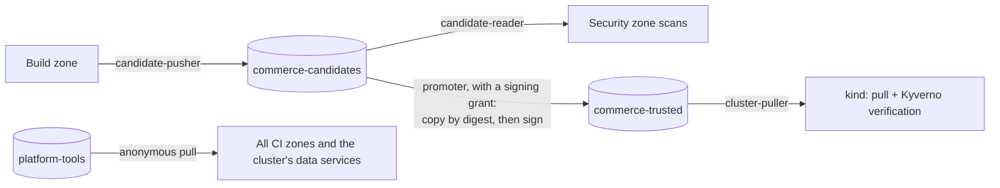

# Artifact registry

Harbor (`https://localhost:8443` from the host, `harbor.sscp.test:8443` inside the platform)
holds every image the platform builds or runs. It is organised so that **where an image is
tells you how far it has come** through the trust process, and so that each CI zone can do
only its own step.

## Projects

| Project | Visibility | Holds | Written by |
|---|---|---|---|
| `platform-tools` | public, read-only | mirrored CI tools and base images; the platform-built `ci-tools` and `sonar-dotnet` images; the Trivy and Grype vulnerability databases | the bootstrap (`sscp up --with ci`, `sscp tools refresh-db`) |
| `commerce-candidates` | private | images exactly as the build zone produced them, before any decision | the build zone's robot `candidate-pusher` |
| `commerce-trusted` | private | signed images promoted after a positive trust decision, with their signatures and attestations | the robot `promoter`, reachable only with a signing grant |



**Tags are a convenience; digests are the identity.** Candidates are tagged with their
commit SHA, but nothing downstream relies on a tag: artifacts are registered, scanned,
decided on, signed and deployed by digest (`repository@sha256:…`).

In `commerce-trusted` each image carries its release tag (`v1.2.3`). Its signature and
attestations are Sigstore bundles stored as **OCI referrers** of the image digest — separate
artifacts that point at the image and are listed by the registry's referrers API (see
[release-signing.md](release-signing.md)). A Harbor **tag-immutability rule** makes every
`v*` tag in this project permanent: once a release tag points at a digest, nobody — not even
the Harbor administrator — can move or delete it.

## Robot accounts

Each robot account can do one thing on one project, and its secret is stored only at the
Vault path of the component that uses it.

| Robot | Permissions | Used by | Delivered through |
|---|---|---|---|
| `robot$candidate-pusher` | push and pull `commerce-candidates` | build zone | `kv/ci/build/harbor` |
| `robot$candidate-reader` | pull `commerce-candidates` | security zone | `kv/ci/security/harbor` |
| `robot$promoter` | pull `commerce-candidates`; push and pull `commerce-trusted` | trust zone, during a release | `kv/ci/trust-signer/harbor`, readable only with a signing grant |
| `robot$cluster-puller` | pull `commerce-trusted` | the cluster: nodes pull trusted images, Kyverno reads their signatures and attestations | `kv/platform/cluster/harbor-pull`, delivered by External Secrets |

No robot used by the build or security zone can write to `commerce-trusted`, so an image
cannot become "trusted" by being pushed there from a pipeline that produced or scanned it.
`sscp` recreates a robot's secret if it no longer matches the stored one (for example
after `.local/` was deleted).

## Tool mirror

Pipelines never pull tools from the internet. `platform-tools` contains the `linux/amd64`
manifest of every image listed under `ciMirror` in `versions.yaml` — scanners, SDK and
runtime base images, Cosign, ORAS, crane, the Docker CLI, the BuildKit frontend, the data
services of the security-test environment and the observability stack. Each is copied with
`crane` and checked to have the expected digest. `.local/generated/tool-images.json` records,
for each tool, the upstream pin and the mirrored reference; the same list is built into the
`ci-tools` image so pipelines refer to tools by name.

Why this matters: pipelines keep working without internet access, a re-pushed upstream tag
cannot change what runs, and every tool traces back to a pin in `versions.yaml`. Copying only
the one platform the workstation needs saves most of the space multi-platform images would
take. (The mirrored digest is the per-platform digest; the mirror records both it and the
upstream index digest and checks how they relate.)

## Vulnerability data

Scanners in the security zone have no internet access to vulnerability feeds. Instead:

| Database | Source | Copy in Harbor | How it is copied |
|---|---|---|---|
| Trivy | `ghcr.io/aquasecurity/trivy-db:2` (OCI artifact) | `platform-tools/trivy-db:2` | `crane copy` when the upstream digest changed |
| Grype | `grype.anchore.io/databases/v6/latest.json` and the archive it names | `platform-tools/grype-db:v6` | download, check against the published SHA-256, push with ORAS |
| Trivy checks (for the Trivy Operator) | `ghcr.io/aquasecurity/trivy-checks:1` | `platform-tools/trivy-checks:1` | `crane copy` |

The copies are as current as the last refresh — `sscp up --with ci` or:

```bash
uv run sscp tools refresh-db
```

The trust policy refuses vulnerability evidence whose database is older than **seven
days**, and `sscp verify registry` fails when a copy is older than that. A forgotten refresh
therefore blocks releases instead of silently weakening them. The Trivy Operator in the
cluster uses the same mirrored database to rescan running images
([observability.md](observability.md)).

## Verification

```bash
uv run sscp verify registry
```

checks against the running Harbor that the build robot can push candidates but not trusted
images, that the security robot can only pull candidates, that candidates are not readable
anonymously while `platform-tools` is readable but not writable, and that both vulnerability
databases are younger than seven days. `uv run sscp verify signing` checks the signatures in
`commerce-trusted` and that release tags cannot be moved.

## Local simplifications

- Harbor's own vulnerability scanner is not installed; scanning happens in the security zone
  so that its results become Control Plane evidence.
- `platform-tools` is public inside the platform networks so runner daemons can pull tools
  without credentials. It contains only public upstream images and platform-built tools.
- Harbor's internal components talk to each other over plain HTTP on Harbor's internal
  Docker network; only its TLS proxy is reachable from the platform.
- No garbage collection or retention rules are configured for `commerce-candidates`;
  candidates accumulate until the platform is reset.

See [production-considerations.md](production-considerations.md#signing-provenance-and-the-registry)
for what production would change.
