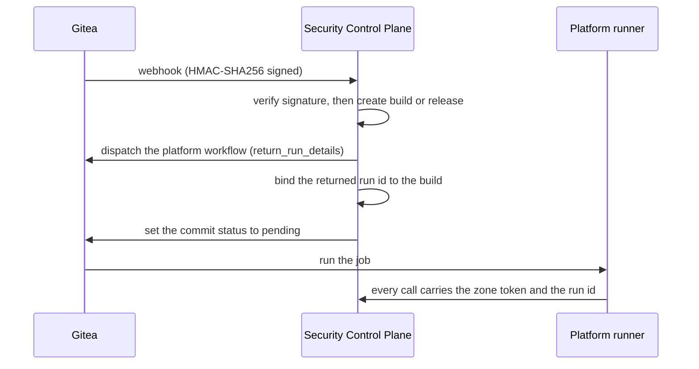
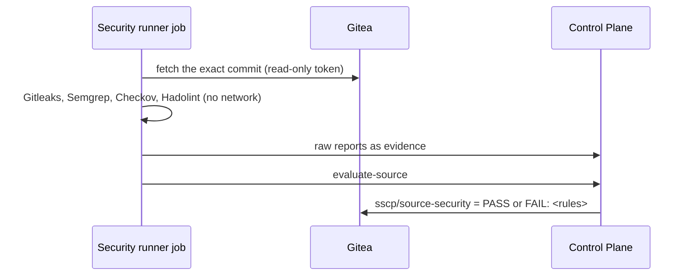
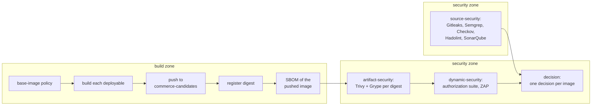

# CI pipelines

Continuous integration runs on Gitea Actions with four runners, one per trust zone (see
[trust-boundaries.md](trust-boundaries.md)). The application repository can use only the
validation runner; everything that produces trust evidence is defined in the platform
repository and started by the Security Control Plane. This document describes each
pipeline, the runners, how jobs get credentials and tools, and the CI helper they call.
What the scanners check and how their reports are judged is in
[security-scanning.md](security-scanning.md).

## The pipelines

| Pipeline | Defined in | Started by | Runs on | Produces |
|---|---|---|---|---|
| `validation` | `commerce-app/.gitea/workflows/validation.yaml` | Gitea, on pull requests and pushes to `main` | validation | locked restore, build, unit and architecture tests; status `validation / build-and-test (<event>)` |
| `pr-pipeline` | `supply-chain-platform/.gitea/workflows/pr-pipeline.yaml` | the Control Plane, when a pull request against `commerce-app` `main` is opened or updated | security | source evidence; the Control Plane sets `sscp/source-security` |
| `main-pipeline` | `…/main-pipeline.yaml` | the Control Plane, when a commit reaches `commerce-app` `main` | security, build | source evidence and code quality; one candidate image per deployable with its SBOM; Trivy and Grype reports per image; authorization tests and a ZAP scan; the decision sets `sscp/trust-decision` |
| `release-pipeline` | `…/release-pipeline.yaml` | the Control Plane, when a release manager pushes a `v*` tag | trust | the final release decision; signed and attested images in `commerce-trusted`; the GitOps commit that deploys them ([release-signing.md](release-signing.md)) |
| `deployment-pipeline` | `…/deployment-pipeline.yaml` | the Control Plane, when a pull request against `commerce-gitops` `main` is opened or updated | security | secret scan and Checkov scan of the rendered Kustomize overlays; the Control Plane sets `sscp/deployment-security` ([gitops-and-admission.md](gitops-and-admission.md#pull-requests-on-the-gitops-repository)) |

Every platform pipeline follows the same pattern: **jobs upload raw reports; the Control
Plane decides.** No job ever reports its own verdict or sets a trust status.

## How the Control Plane starts a pipeline

- **Authentication of webhooks.** Gitea signs every delivery with a secret shared only with
  the Control Plane. A delivery with a wrong or missing signature is refused (`401`) and
  logged as a security event.
- **Run binding.** Dispatch returns the new run's id before any job starts; the Control
  Plane binds it to the build. Evidence from any other run is refused
  (`403 build.run.not-dispatched`), even from the right zone.
- **Idempotency.** A re-delivered webhook for a commit or tag that already has a build or
  release starts nothing.
- **Fail closed.** If dispatch fails, the build is failed and its status set to `error`.
  If a run ends (crash, cancellation, timeout) without completing its build, the Control
  Plane's run watcher fails the build and sets the status to `failure`, so a required
  status is never left pending forever.

## Pull-request pipeline

One job (`source-security`) on the security runner:

The pull-request gate requires `SecretScan`, `StaticAnalysis`, `InfrastructureScan` and
`DockerfileLint`. It cannot require dynamic tests, code quality or image scans, because no
image exists yet. The job marks its build finished successfully whenever the decision step
ran — whatever the decision was — so a `FAIL` keeps its own reason in the commit status;
the build fails only when the pipeline itself could not reach a decision.

A pull request into `commerce-app` can merge only with one approving review from a
maintainer and both required statuses green: `validation / *` and `sscp/source-security`.

## Main pipeline

| Job | Runner | Needs | Steps |
|---|---|---|---|
| `source-security` | security | — | fetch the commit; the four source scanners; SonarQube analysis and quality gate |
| `build` | build | — | fetch the commit; enforce the base-image policy; build, push, register and SBOM every deployable |
| `artifact-security` | security | `build` | Trivy and Grype on every registered candidate, by digest |
| `dynamic-security` | security | `build`, `artifact-security` | start the security-test environment from the candidate digests; run the authorization suite and ZAP; remove the environment ([dynamic-security-testing.md](dynamic-security-testing.md)) |
| `decision` | security | all of the above | ask the Control Plane for a decision per image; complete the build (always runs) |

The source job and the build run in parallel in different zones. Image scanning waits for
the build, and dynamic testing waits for image scanning, so the single security runner runs
one heavy job at a time. The decision job always runs, so a failed earlier job still ends in
a recorded decision rather than a pending status.

The Control Plane sets `sscp/trust-decision` to `success` (`PASS for 6 images` or
`PASS_WITH_EXCEPTION for 6 images`) only when every image passes; otherwise `failure` with
the names of the deployables that failed.

### The build zone

- **Base-image policy.** `sscp-ci check-dockerfile` refuses a Dockerfile whose stages start
  from anything but `${SDK_IMAGE}`, `${RUNTIME_IMAGE}` or its own earlier stages, that copies
  or mounts files from an external image, or that `ADD`s remote content.
- **What is built.** Exactly the deployables registered for the application in
  `policy/applications.yaml`, each from the Dockerfile target of the same name. The
  application repository cannot add one or skip one.
- **How it is built.** BuildKit in the zone's private daemon, with the base images and the
  Dockerfile frontend passed as build arguments (`SDK_IMAGE`, `RUNTIME_IMAGE`,
  `BUILDKIT_SYNTAX`) pointing at the digest-pinned copies in `platform-tools`. NuGet packages
  come from nuget.org through a locked, signature-checked restore. Images get
  `org.opencontainers.image.revision` and `.source` labels. BuildKit's own provenance and
  SBOM attestations are turned off, because the platform produces its own.
- **Push and register.** Each image is pushed to
  `harbor.sscp.test:8443/commerce-candidates/<deployable>:<commit>` with the build zone's
  robot account, and the digest the registry returned is registered with the Control Plane.
  From here on, only the digest is used.
- **SBOM.** Syft reads the pushed image back from the registry by digest (not the local
  build result), so the SBOM describes exactly the registered artifact.

### Where tests run

The validation zone runs the unit and architecture tests on every pull request and push.
The integration and component suites start disposable containers with Testcontainers, so
they run on a workstation with Docker (`dotnet test`) and in the final verification, not in
a CI zone: Testcontainers inside a zone's rootless nested daemon would need its own
networking set-up. See [testing-strategy.md](testing-strategy.md).

## Runners

| Runner | Registered to | Job image | Docker for jobs | Credentials in jobs |
|---|---|---|---|---|
| `sscp-validation` | organisation `commerce` | the .NET SDK (from `platform-tools`) | no | none |
| `sscp-security` | repository `platform/supply-chain-platform` | `ci-tools` | the zone's private daemon | Vault AppRole `ci-security` |
| `sscp-build` | repository `platform/supply-chain-platform` | `ci-tools` | the zone's private daemon | Vault AppRole `ci-build` |
| `sscp-trust` | repository `platform/supply-chain-platform` | `ci-tools` | no | Vault AppRole `ci-trust` |

Each runner is a `gitea/runner` container with its own rootless Docker daemon, a fixed
address on `sscp-edge` (172.30.0.21–24) and a configuration generated by `sscp` into
`.local/generated/runners/<zone>/config.yaml`. Every runner:

- starts jobs in a fresh per-job network inside its private daemon;
- has no action cache (`cache.enabled: false`), so nothing written by one job is read by
  another;
- mounts only the platform CA into job containers (`valid_volumes` allows nothing else);
- waits (up to five minutes) for its private daemon to be ready before it starts taking
  jobs, so it comes up reliably after a host restart.

Jobs that no runner accepts are cancelled by Gitea after 30 minutes
(`ABANDONED_JOB_TIMEOUT`).

## Zone credentials

A zone job receives only its zone's AppRole `role_id` and `secret_id`, from the runner's
configuration. Vault accepts both — and every token they produce — only from that runner's
address (`secret_id_bound_cidrs`, `token_bound_cidrs`). With its Vault token the job reads
`kv/ci/<zone>/*`:

| Secret | Security | Build | Trust |
|---|---|---|---|
| `controlplane`: Keycloak client credentials of the zone client | yes | yes | yes |
| `gitea`: read-only token of `sscp-source-reader` | yes | yes | no |
| `harbor`: robot account (`candidate-reader` pulls candidates, `candidate-pusher` pushes them) | reader | pusher | no |
| `sonarqube`: analysis-only token of the `ci-security` SonarQube account | yes | no | no |
| `commerce-test`: test persona passwords and the identity-admin client secret for the security-test environment | yes | no | no |

The job exchanges the zone's client secret for a five-minute Control Plane token and fetches
a new one shortly before it expires, since one step (building every image, for example) can
run longer than that. Vault tokens live 15 minutes. Nothing is stored in Gitea Actions
secrets, and the application repository has no secrets at all.

The trust zone's own identity can neither sign nor push to the trusted project. It gets
those rights only for one approved release, through a single-use signing grant
([release-signing.md](release-signing.md#who-can-sign)).

## Tool images

Pipelines never pull tools from the internet. `sscp up --with ci` copies the `linux/amd64`
manifest behind each image listed under `ciMirror` in `versions.yaml` into Harbor's public,
read-only `platform-tools` project with `crane`, and checks that the copy has the expected
digest. `.local/generated/tool-images.json` records each tool's upstream pin and mirrored
reference.

The `ci-tools` job image is built from `supply-chain-platform/ci/`: a pinned Python base,
the pinned `docker`, `cosign` and `crane` binaries, the CI helper, the Semgrep and Gitleaks
rules, the tool list and the local CA. It is rebuilt only when one of those inputs changes,
and runners reference it by digest. The `sonar-dotnet` image (the pinned .NET SDK, a pinned
Java runtime and a pinned SonarScanner for .NET) is built the same way.

## The CI helper (`sscp-ci`)

Workflows call a small Python helper instead of long shell scripts, so every pipeline
invokes tools the same way and every change to scanning is reviewed code in the platform
repository.

| Command | Zone | Does |
|---|---|---|
| `fetch-source` | security, build | downloads one exact commit as an archive with the zone's read-only token |
| `scan secrets` / `sast` / `iac` / `dockerfile` / `deployment` | security | runs Gitleaks, Semgrep, Checkov (source, or the rendered GitOps overlays for `deployment`) or Hadolint and submits the raw report |
| `quality` | security | runs the SonarQube analysis and submits the quality gate status |
| `check-dockerfile` | build | enforces the base-image policy |
| `build-images` | build | builds, pushes, registers and SBOMs every registered deployable |
| `scan-images` | security | runs Trivy and Grype on every registered candidate and submits both reports |
| `dynamic` | security | starts the security-test environment, runs the authorization suite and ZAP, submits both reports, removes the environment |
| `submit` | any | uploads a raw report as evidence |
| `evaluate-source` | security | pull-request gate (application and GitOps pull requests); exit status 1 on `FAIL` |
| `evaluate-build` | security | trust decision for every artifact of a main build; exit status 1 on `FAIL` |
| `complete` | any | marks the build finished |
| `evaluate-release` | trust | final release decision; exit status 1 when rejected |
| `publish` | trust | redeems the signing grant, promotes, signs, attests and verifies every image, records signature and promotion, commits the digests to GitOps |
| `fail-release` | trust | marks the release failed with a reason |
| `image` | any | prints a tool's mirrored, digest-pinned image reference |

Every Control Plane call made by the helper:

- uses a Keycloak token for the zone's own client. The token is renewed before it expires,
  so long builds keep working;
- is sent again, up to five times with a short pause, when the Control Plane answers
  `409 concurrency.conflict`. Two jobs of one build updated the same image record at the
  same moment, and the Control Plane stored nothing. Every other refusal fails the step.

## Operating the pipelines

| Task | Command |
|---|---|
| Publish platform repository changes (workflows, rules, helper) | `uv run sscp repo sync -m "…"` |
| Rebuild `ci-tools` and reconfigure the runners after helper or rule changes | `uv run sscp up --with ci` |
| Refresh the offline vulnerability databases (at least weekly) | `uv run sscp tools refresh-db` |
| Build the tip of `main` after a fresh start | `uv run sscp repo build` |
| Re-run a build that failed for infrastructure reasons | `POST /api/builds/{id}/retry` as `paula` ([troubleshooting.md](troubleshooting.md#a-main-build-fails-part-way)) |
| Check the zone boundaries | `uv run sscp verify ci-isolation` |

A retry is an explicit operator action: it creates a new build for the same commit and
dispatches it again; the failed build and its evidence stay on record. A retry cannot turn
a genuine `FAIL` into a pass — the same code produces the same findings.
