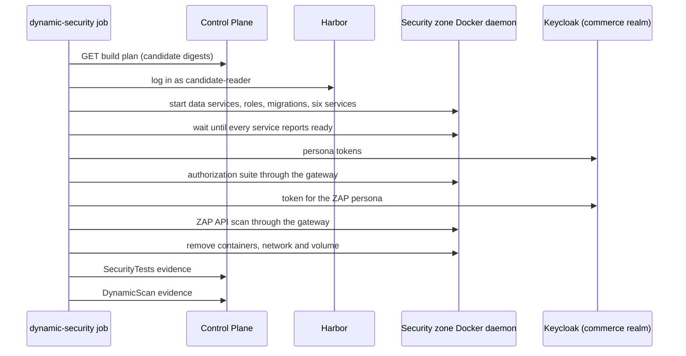
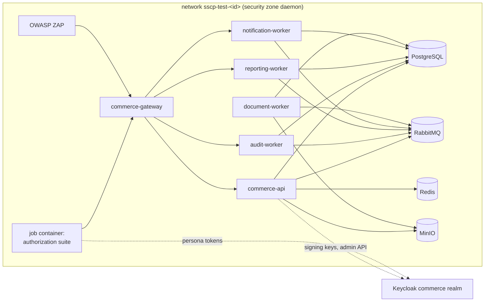

# Dynamic security testing

Static scanners read source code and image contents. **Dynamic tests** exercise the running
application, so they can find problems that only appear when the application runs. Examples
are a route that forgets an authorization check, a missing security header, or an error that
leaks internal details.

Every main build is tested dynamically before it can be trusted. The security zone starts the
build's own candidate images, then runs two kinds of test against them:

- the platform's **authorization suite**, whose report becomes `SecurityTests` evidence;
- an authenticated **OWASP ZAP** API scan, whose report becomes `DynamicScan` evidence.

The trust policy requires both kinds of evidence for every main build
([trust-policy.md](trust-policy.md#mandatory-evidence)).

## Where it runs

The `dynamic-security` job of `main-pipeline.yaml` runs on the **security runner**
(`sscp-security`). It starts only after two other jobs:

- `build`, which registered the candidate images;
- `artifact-security`, which scanned them.

It is allowed 45 minutes and runs two commands:

```yaml
- run: sscp-ci fetch-source --repository "$REPOSITORY" --commit "$COMMIT" --dest src
- run: sscp-ci dynamic --build "$BUILD_ID" --commit "$COMMIT"
```

The source checkout is needed for one file only: `config/publishers.yaml`. It says which
service may publish which event types (see [messaging-and-data.md](messaging-and-data.md)).
The code lives in the platform repository and belongs to the platform team, not to the
application team:

| File | Responsibility |
|---|---|
| `ci/sscp_ci/dynamic.py` | runs the whole job: environment, suite, ZAP, evidence, cleanup |
| `ci/sscp_ci/testenv.py` | starts and removes the throw-away security-test environment |
| `ci/sscp_ci/authz_suite.py` | the authorization and API-security checks |



## The security-test environment

`testenv.py` builds a complete, private copy of the workload inside the security zone's own
rootless Docker daemon. The daemon is the one the zone already uses for scanning. Each run
gets a random 8-character id, and all of its resources are named `sscp-test-<id>-…`.



| Part | How it is set up | Why |
|---|---|---|
| Application | The six candidate images of the build. They are pulled from `commerce-candidates` **by digest** with the zone's read-only robot `candidate-reader`. | The tests must exercise exactly the bytes that may later be signed. |
| Data services | PostgreSQL, Redis, RabbitMQ and MinIO, pulled from the `platform-tools` mirror. | Real dependencies behave like production; mocks would hide faults. |
| Credentials | Every password and both event-signing keys (ECDSA P-256, one each for `commerce-api` and `document-worker`) are generated for this run and thrown away with it. | Nothing from the cluster or Vault's application secrets is reused. |
| Database access | One login role per module and worker, plus a schema owner, exactly as in the cluster. Each service applies its own migrations in `migrate` mode. | Permission mistakes between modules surface here, not in production. |
| Hardening | Every workload container runs `--read-only` with a `/tmp` tmpfs, `--cap-drop ALL` and `no-new-privileges`. | Matches the cluster's security context, so behaviour does not differ. |
| Configuration | `ASPNETCORE_ENVIRONMENT=Production`. The API description (`/openapi/v1.json`) is switched on only here, for the scanner (`OpenApi__Enabled=true`). | The deployed services do not publish their API description. |
| Identity | Services check real tokens issued by the platform Keycloak's `commerce` realm. Persona passwords come from the zone's Vault path `kv/ci/security/commerce-test`. | Authorization is tested with the same token checks that run in production. |
| Readiness | The job waits until every service's `/health/ready` answers (at most 3 minutes each). | Tests never run against a half-started system. |
| Cleanup | Containers, network and volume are removed when the job ends, whatever the outcome. | Nothing stays behind to affect the next run or use disk space. |

The job container joins the environment's network, so the suite can call the gateway by its
name (`http://commerce-gateway:8080`).

**If the environment cannot start** (for example, a migration fails or a service never
becomes ready), the job still submits both kinds of evidence, marked as **failed
executions** with the reason. The trust decision then names the controls that did not run
and is `FAIL`. A missing control is never treated as a passing one.

## Authorization suite

The suite first creates the data it needs through the public API:

- a product with stock;
- profiles for two customers;
- a confirmed order and its invoice.

It then runs **25 checks**, all through the gateway as a real client would. Each check uses
the persona whose access is being tested. The personas are users of the `commerce` realm
(see [identity-and-authorization.md](identity-and-authorization.md)).

| Area | Checks |
|---|---|
| Authentication | anonymous users can browse the catalogue but cannot list orders; a token with a forged signature is rejected; an unsigned token (`alg: none`) is rejected |
| Object-level access | customers cannot read another customer's order (`404`), and cannot download another customer's invoice (`404`); order managers can read any order |
| Function-level access | customers cannot create products, list all orders, look up other customers, read payments, read reports, read the audit trail or toggle feature flags; inventory clerks cannot change prices |
| Separation of duties | administrators cannot issue refunds, and cannot change their own roles |
| Data protection | support agents see customers' personal data masked |
| Audit | auditors can verify that the audit hash chain is intact |
| Business logic | the server prices orders and ignores client-supplied prices; placing an order requires an `Idempotency-Key` |
| Input and transport | uploads whose content does not match their declared type are rejected; request bodies over 1 MiB are rejected at the gateway (`413`); responses carry `X-Content-Type-Options: nosniff`, `X-Frame-Options: DENY` and `Cache-Control: no-store`, and no `Server` header |
| Abuse | anonymous clients are rate limited: 80 quick requests must produce at least one `429` |

The rate-limit check runs last, because it uses up the anonymous request budget for a
minute.

A check that throws an error counts as failed. The job log prints every check as `PASS` or
`FAIL` with the reason. The report looks like this:

```json
{
  "schemaVersion": 1,
  "suite": "commerce-authorization",
  "target": "http://commerce-gateway:8080",
  "results": [
    { "name": "customers cannot read another customer's order", "passed": true, "detail": "404" }
  ]
}
```

The Control Plane reads it itself. A report without results is refused ("proves nothing").
The `security-tests` rule passes only when **every** check passed. The decision names the
checks that failed, for example `2 of 25 failed: …`. Failed checks cannot be covered by a
risk exception.

## ZAP API scan

| Setting | Value |
|---|---|
| Image | `platform-tools/zap`, a mirror of OWASP ZAP 2.17.0 pinned by digest in `versions.yaml` |
| Network | the environment's private network, so ZAP can reach nothing else by name |
| Mode | `zap-api-scan.py -f openapi`: import the API description, then run passive and active scans |
| Target | the description is read from `commerce-api`; every request goes to the gateway (`-O http://commerce-gateway:8080`), as a client's would |
| Authentication | a token for the `ada` persona (administrator, the widest access) from the `commerce-dast` client, whose tokens live 30 minutes so a scan does not lose authentication part-way; ZAP adds it to every request (`ZAP_AUTH_HEADER_VALUE`) |
| Limits | active scanning stops after 10 minutes; `-silent` stops ZAP from making requests of its own, such as update checks |
| Completion | exit codes 0, 1 and 2 mean the scan finished (with or without alerts) and the report exists; anything else is a failed execution, and the job log shows ZAP's last lines |

The JSON report is the `DynamicScan` evidence. The Control Plane converts each alert into a
finding:

| ZAP `riskcode` | Severity | Blocks the release? |
|---|---|---|
| 3 | High | yes (the `dynamic-scan` gate blocks at High) |
| 2 | Medium | no, recorded |
| 1 | Low | no, recorded |
| 0 | Informational | no, recorded |

A finding's fingerprint is `zap|<pluginid>|<alertRef>`, so a risk exception can name one ZAP
alert type ([risk-exceptions.md](risk-exceptions.md)).

A regression test in `commerce-app` keeps one behaviour that ZAP's active scan once flagged
in place. A role change for a malformed or unknown user id must answer `404`, not `500`. The
Identity module only accepts UUIDs on that route and answers `404` when Keycloak does not know
the user.

## Investigating a failure

1. **Open the job log** in Gitea (`platform/supply-chain-platform` → Actions → the main
   pipeline run → `dynamic-security`). It shows:
   - environment start-up, and the logs of any service that did not become ready;
   - each authorization check with its result;
   - the tail of ZAP's output when the scan failed.
2. **Read the decision.** `GET /api/artifacts/{digest}/trace` on the Control Plane shows
   each image's evidence and decisions. A failed rule names the checks or ZAP alert
   fingerprints responsible. The `sscp/trust-decision` commit status in Gitea summarises the
   result.
3. **Download the raw report**: `GET /api/evidence/{id}/report`
   ([security-control-plane.md](security-control-plane.md#api)).
4. **Reproduce locally.** Run the workload as host processes (`uv run sscp up --with
   workload`, then `uv run sscp workload setup` and `uv run sscp workload start`) and call the
   same endpoint as the same persona ([cli-reference.md](cli-reference.md#workload)).

## Limitations

- ZAP scans only the endpoints listed in the API's OpenAPI document. Worker endpoints behind
  the gateway (audit, reporting, notifications) are covered by the authorization suite, not
  by ZAP.
- ZAP scans as one persona, the administrator. Per-role differences are what the
  authorization suite tests.
- The environment's network is a normal Docker bridge network with outbound access, not a
  fully isolated one. The services must reach the platform Keycloak to fetch token-signing
  keys.
- The data services receive their generated passwords as `docker run -e NAME=value`
  arguments. These are visible only inside the job container. The application services
  receive their secrets through the Docker CLI's environment (`-e NAME`) instead.
- Asynchronous flows are awaited by polling with time limits. Examples are order
  confirmation and invoice generation. On a very slow workstation, those checks can fail
  rather than pass.
- A ZAP scan is not a penetration test. It finds common, automatically detectable problems;
  it cannot judge business rules. That is why the suite exists.
