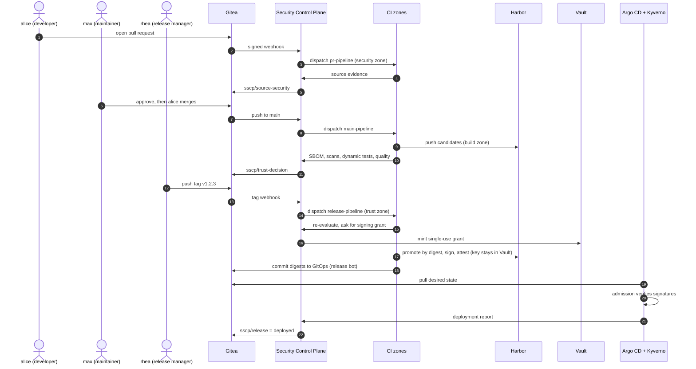
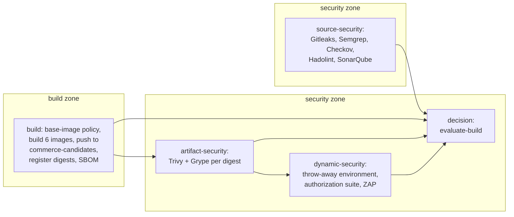

# End-to-end flow: one change from commit to running pod

This document follows a single change through the whole platform. For every step it says
who acts, what runs where, what is recorded and what you can see. It ties together the
more detailed documents, which are linked at each step.

The example uses the platform's personas: **alice** (developer), **max** (maintainer),
**rhea** (release manager) and the machine identities the platform creates. All commands
run from `supply-chain-platform/` with the platform started as described in
[setup-guide.md](setup-guide.md).

## Overview



## Step 1 — A developer opens a pull request

**Who:** alice pushes a branch to `commerce/commerce-app` and opens a pull request.

```bash
uv run sscp repo propose -b feature/better-search -m "Improve catalogue search"
```

Two things now happen in parallel:

| Track | What runs | Where | Result |
|---|---|---|---|
| Application validation | `commerce-app/.gitea/workflows/validation.yaml`: locked restore, build, unit and architecture tests | the **validation** runner (no Docker, no credentials) | status `validation / build-and-test (pull_request)` |
| Platform source gate | Gitea sends a webhook signed with HMAC-SHA256 to the Control Plane, which creates a *pull-request build* and dispatches `pr-pipeline.yaml` | the **security** runner | status `sscp/source-security` |

The source gate's job fetches the exact commit with a read-only token and runs, each in a
network-less sibling container:

- **Gitleaks** (leaked secrets),
- **Semgrep** with the platform's rules (static analysis),
- **Checkov** (Dockerfiles, Kubernetes and Kustomize files),
- **Hadolint** (Dockerfile lint).

The job uploads the raw reports; it never decides anything itself. The Control Plane
parses them, applies the pull-request part of the trust policy and sets
`sscp/source-security` to `PASS` or `FAIL: <rules>`.

Details: [ci-pipelines.md](ci-pipelines.md#pull-request-pipeline),
[security-scanning.md](security-scanning.md).

## Step 2 — Review and merge

**Who:** max reviews and approves; alice merges.

```bash
uv run sscp repo approve -n <number>   # as max
uv run sscp repo merge -n <number>     # as alice
```

Gitea refuses the merge unless **all** of these hold (branch protection on `main`):

- one approving review from the `maintainers` team (stale approvals are dismissed by new pushes),
- every `validation / *` status is green,
- `sscp/source-security` is green.

Nobody, not even an administrator, can push to `main` directly.

## Step 3 — The main pipeline builds and judges the commit

**Trigger:** the merge is a push to `main`. The Control Plane creates a *main build*,
dispatches `main-pipeline.yaml` and sets `sscp/trust-decision` to *pending — security
pipeline running*. The run's id is bound to the build: evidence from any other run is
refused.



| Job | Runner | What it records in the Control Plane |
|---|---|---|
| `source-security` | security | `SecretScan`, `StaticAnalysis`, `InfrastructureScan`, `DockerfileLint`, `CodeQuality` evidence for the commit |
| `build` | build | one registered **candidate** per deployable (`commerce-candidates/<name>@sha256:…`) and its `Sbom` evidence |
| `artifact-security` | security | `VulnerabilityScan` (Trivy) and `SecondaryVulnerabilityScan` (Grype) evidence per digest |
| `dynamic-security` | security | `SecurityTests` (authorization suite) and `DynamicScan` (ZAP) evidence for the commit |
| `decision` | security | one **trust decision per image**; the build is marked complete |

The Control Plane then sets `sscp/trust-decision`:

- `success` — `PASS for 6 images` (or `PASS_WITH_EXCEPTION for 6 images`), or
- `failure` — `FAIL: <deployables that failed>`.

Each candidate's state becomes `Approved`, `ApprovedWithException` or `Rejected`. On this
workstation the whole pipeline takes about 30 minutes.

Details: [ci-pipelines.md](ci-pipelines.md#main-pipeline),
[dynamic-security-testing.md](dynamic-security-testing.md),
[trust-policy.md](trust-policy.md).

## Step 4 — A release manager cuts a release

**Who:** rhea, the only member of `release-managers`, pushes a protected tag.

```bash
uv run sscp repo tag -t v1.2.3            # tip of main
uv run sscp repo tag -t v1.2.4 --commit <sha>
```

The Control Plane checks that the tagged commit has a *successful* main build with an
artifact for every registered deployable. If not, it sets `sscp/release` to
`release refused: …` and stops. Otherwise it creates a release, dispatches
`release-pipeline.yaml` to the **trust** runner, and sets `sscp/release` to
*pending — release v1.2.3 running*.

## Step 5 — The trust zone re-evaluates, signs and promotes

The release pipeline never builds or scans anything. In order:

1. **Final decision.** The Control Plane re-evaluates every image *now*: an exception
   may have expired or a vulnerability's remediation window may have closed since the
   main build. A `FAIL` rejects the release (`sscp/release = FAIL: release v1.2.3
   rejected`) and nothing is signed.
2. **Signing grant.** The job asks for a grant. The Control Plane mints a single-use,
   response-wrapped Vault `secret_id` for the `trust-signer` role. It can be redeemed once,
   within minutes, only from the trust runner's address.
3. **Promote.** `crane` copies each candidate manifest unchanged to
   `commerce-trusted/<deployable>:v1.2.3`. The digest does not change: what was scanned
   is what gets signed.
4. **Sign and attest.** Cosign signs the digest through Vault's Transit engine (the
   private key never leaves Vault) and attaches three signed attestations: SLSA-format
   provenance, the trust decision and the SBOM. The Control Plane supplies their content.
5. **Verify.** The job verifies every signature and attestation with the public key,
   exactly as admission control will.
6. **Record.** Signatures and promotions are recorded per image; the release moves to
   `Signed`, then `Promoted`.
7. **Commit to GitOps.** One commit to `platform/commerce-gitops`
   (`overlays/local/kustomization.yaml` and `release.yaml`) pins all six digests. It is made
   by `sscp-gitops-bot`, whose token is readable only with the signing grant. The release
   becomes `GitOpsUpdated`.

Details: [release-signing.md](release-signing.md).

## Step 6 — Argo CD deploys and Kubernetes checks the signatures

Argo CD polls the GitOps repository every minute and applies the new revision in waves:

| Wave | What is applied |
|---|---|
| 0 | ConfigMaps, `ExternalSecret`s (secrets arrive from Vault), data services |
| 1 | the `commerce-migrations` Job: each service's image runs its schema migrations as the schema-owner role |
| 2 | the six Deployments |

Before any pod is created, admission control checks it:

- **Kyverno `verify-commerce-images`** fetches the Sigstore bundles through the registry's
  referrers API and checks the signature, a positive trust-decision attestation,
  provenance from the platform's main pipeline and a signed SBOM — all bound to the image
  digest.
- **Kyverno workload policies** and **Pod Security `restricted`** refuse root, privilege,
  host access, writable root file systems, mounted service-account tokens, missing limits
  and more.

Details: [gitops-and-admission.md](gitops-and-admission.md),
[kubernetes-security.md](kubernetes-security.md).

## Step 7 — The platform confirms the deployment

When the application is synced and healthy on the new revision, Argo CD's notifications
controller reports it to the Control Plane. The Control Plane does **not** trust Argo
CD's summary: it reads the revision's `kustomization.yaml` from Gitea itself and compares
the pinned images with the digests in its own records. Only an exact match marks the
release and its artifacts `Deployed` and sets:

> `sscp/release` = `release v1.2.3 deployed to local`

Any difference is recorded as `deployment.mismatch` in the audit log and raises the
`DeploymentDoesNotMatchRelease` alert.

## Step 8 — Runtime

- Every trace, metric and log line of the running services carries the release tag,
  commit, namespace, pod and image (see [observability.md](observability.md)).
- The Trivy Operator rescans the images that actually run with the mirrored vulnerability
  database; new critical vulnerabilities raise alerts.
- Security events (failed logins, denied requests, rejected integration messages) are
  counted and alerted on.

## Following a change yourself

| Question | Where to look |
|---|---|
| Did the gates pass? | Commit statuses on the commit in Gitea (`https://localhost:3000`) |
| What ran? | Gitea → `platform/supply-chain-platform` → Actions |
| What did the Control Plane decide, and why? | `GET /api/builds`, `GET /api/builds/{id}`, `GET /api/artifacts/{digest}/trace` (see [security-control-plane.md](security-control-plane.md#api)) |
| Is it deployed? | `kubectl --kubeconfig ../.local/generated/kubeconfig -n argocd get applications`; Argo CD UI at `https://127.0.0.1:8444` |
| How is it behaving? | Grafana at `http://127.0.0.1:3300` |

A quick trace of the running API image, from the workspace root:

```bash
cd supply-chain-platform
TOKEN=$(uv run python -c "from sscp.services import controlplane; print(controlplane.user_token('victor'))")
DIGEST=$(kubectl --kubeconfig ../.local/generated/kubeconfig -n commerce get deploy commerce-api \
  -o jsonpath='{.spec.template.spec.containers[0].image}' | cut -d@ -f2)
curl -s --cacert ../.local/pki/ca.crt --ssl-no-revoke -H "Authorization: Bearer $TOKEN" \
  "https://localhost:7443/api/artifacts/$DIGEST/trace"
```

The answer lists, for that digest: the commit and build, every evidence record, every
decision, the signatures, promotions, releases and deployments.

## What stops a bad change

| If… | …then | Stopped at |
|---|---|---|
| the change leaks a secret | `sscp/source-security` fails; the merge is refused | Step 1–2 |
| a scanner crashes | its evidence is recorded as not completed; the decision fails | Step 1 or 3 |
| an image has a critical, fixable vulnerability | the image's decision is `FAIL`; a release of the commit is rejected before signing | Step 3 / 5 |
| the authorization suite finds a broken access rule | `SecurityTests` fails; the decision is `FAIL` | Step 3 |
| an exception has expired since the main build | the release re-evaluation rejects it | Step 5 |
| someone pushes an unsigned image into the trusted project | Kyverno refuses the pod | Step 6 |
| someone points the GitOps repository at other images | Kyverno refuses unsigned ones; the Control Plane records a mismatch for signed ones | Step 6–7 |

The complete list of failure modes and how each is proven is in
[failure-and-recovery.md](failure-and-recovery.md).
