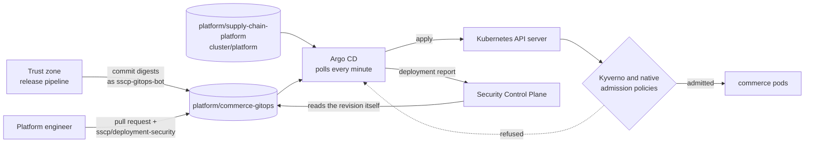
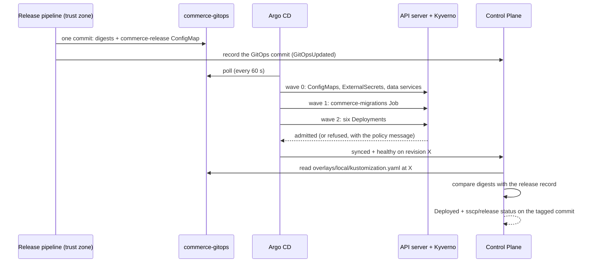

# GitOps deployment and admission control

This document explains how a release gets into the Kubernetes cluster, and how the cluster
checks every image again when it arrives.

Two rules hold:

1. **The cluster runs exactly what Git describes.** No CI zone holds Kubernetes credentials.
   The only way to change the cluster is a commit that Argo CD pulls.
2. **The cluster decides again for itself.** When a pod is created, admission control
   checks that each commerce image is signed with the release key. It also checks that the
   image carries signed evidence of a positive trust decision. CI and Argo CD are not
   trusted to have checked this.

Some terms used below:

- **GitOps**: the desired state of the cluster is kept in a Git repository, and a
  controller in the cluster keeps the cluster matching it.
- **Argo CD**: the GitOps controller used here.
- **Admission control**: checks the Kubernetes API server runs before it stores a new or
  changed object. A refused object is never created.
- **Kyverno**: a policy engine that plugs into admission control.



## What lives where

| Repository and path | Changed by | Contents | Applied by |
|---|---|---|---|
| `platform/commerce-gitops` `base/commerce` | platform engineers, through pull requests | the six services (Deployments, Services, ConfigMaps), their `ExternalSecret`s, the messaging configuration and the migrations Job | Argo CD application `commerce` |
| `platform/commerce-gitops` `base/commerce-data` | platform engineers, through pull requests | PostgreSQL, Redis, RabbitMQ and MinIO from Harbor's mirror, pinned by digest | Argo CD application `commerce` |
| `platform/commerce-gitops` `overlays/local` | the release bot | `kustomization.yaml` with the released image digests; `release.yaml` with the `commerce-release` ConfigMap, which names the release. The services add it to their telemetry ([observability.md](observability.md#release-identity-on-runtime-telemetry)) | Argo CD application `commerce` |
| `platform/supply-chain-platform` `cluster/platform` | platform engineers | namespaces, service accounts, network policies, secret stores, admission policies, the observability stack, the `commerce` Argo CD project and application | Argo CD application `platform-cluster` |
| `platform/supply-chain-platform` `cluster/bootstrap` | platform engineers | the `platform` Argo CD project and the `platform-cluster` application | `sscp up --with cluster`, once |

The workload manifests name images by a logical name, such as `image: commerce-api`. The
overlay replaces each one with
`harbor.sscp.test:8443/commerce-trusted/<deployable>@sha256:…`.

Before the first release, the overlay pins nothing (`images: []`). Admission control
therefore refuses the placeholder images. **The application namespaces stay empty rather
than run something unverified.**

The application team has no write access to either GitOps path. How the three repositories
divide ownership is described in [repository-boundaries.md](repository-boundaries.md).

## How a release reaches the cluster



1. **Commit.** The release pipeline promotes, signs and attests every image
   ([release-signing.md](release-signing.md)). It then commits all the new digests to
   `overlays/local` in **one commit**, as `sscp-gitops-bot`. The bot's token can be read
   only with the release's signing grant. The pipeline records the commit in the Control
   Plane, and the release becomes `GitOpsUpdated`.
2. **Sync.** Argo CD polls the repository every minute. There is no inbound webhook from
   Gitea into the cluster. Argo CD applies resources in **sync waves**, so each step finds
   what it needs already in place:

   | Wave | Resources | Why this order |
   |---|---|---|
   | 0 | ConfigMaps, `ExternalSecret`s, registry access, data services | configuration, secrets and databases must exist first |
   | 1 | `commerce-migrations` Job (a sync hook, recreated for every sync) | each service's schema must exist before the service starts. The Job runs one init container per service to apply migrations with the schema-owner role, then creates the documents bucket |
   | 2 | the six Deployments | start the services on an up-to-date schema |

3. **Admission.** Kyverno checks every pod before it is created. Through *autogen*,
   Kyverno also checks the Deployment, StatefulSet or Job that will create the pod, so a
   bad manifest is refused at once rather than failing pod by pod.
4. **Report.** When the application is synced and healthy on the new revision, Argo CD's
   notifications controller reports it to the Control Plane (`POST /api/deployments/argocd`).
   The report carries a shared token that External Secrets delivers from Vault.
5. **Confirm.** The Control Plane does not take Argo CD's word for which images run. It
   reads that revision's `overlays/local/kustomization.yaml` from Gitea itself. It then
   compares the pinned digests with its own records for the release:
   - **Exact match**: the release and its artifacts become `Deployed`, a deployment record
     is written, and the `sscp/release` status on the tagged commit reads
     *release vX deployed to local*.
   - **Any difference**: recorded as `deployment.mismatch` in the audit log; the release is
     not marked deployed.

**Why read Git instead of Argo CD's summary?** Argo CD's image summary can lag behind, or
list images of pods that are shutting down. A Git revision is content-addressed, so reading
it gives the exact desired state that Argo CD applied.

**Revisions that no release wrote** are reported the same way. An example is a reviewed
configuration change merged through a pull request. Such a revision may run synced and
healthy while pinning exactly the digests of the release already deployed. In that case its
deployment record is linked to that release, so the running revision stays traceable from
the image digest (`GET /api/artifacts/{digest}/trace`). Any other revision is only recorded
as observed (`deployment.observed` in the audit log).

## Argo CD projects

An Argo CD **project** limits what its applications may deploy, and where.

| Project | Source repository | Destinations | Allowed kinds |
|---|---|---|---|
| `platform` | the platform repository | any namespace | cluster-wide: Namespace, Kyverno policies, native admission policies and bindings, ClusterRole and ClusterRoleBinding (read-only access for the OpenTelemetry Collector). In namespaces: ServiceAccount, Service, ConfigMap, Deployment, StatefulSet, NetworkPolicy, SecretStore, ExternalSecret, AppProject, Application |
| `commerce` | the GitOps repository | `commerce`, `commerce-data` | Deployment, StatefulSet, Job, Service, ConfigMap, ExternalSecret, PodDisruptionBudget. Nothing cluster-wide |
| `default` | none | none | none. Every application must belong to one of the two projects above |

A change to the GitOps repository therefore **cannot**:

- create RBAC rules, Secrets, network policies, service accounts or secret stores;
- create anything cluster-wide;
- target another namespace. `sscp verify cluster` proves this with a probe application.

| Application | Project | Sync policy |
|---|---|---|
| `commerce` | `commerce` | automatic, **prune** (removed manifests are deleted), self-heal (manual changes are reverted) |
| `platform-cluster` | `platform` | automatic, self-heal, **no prune** |

`platform-cluster` does not prune on purpose. Removing a platform control, such as a policy
or namespace, is a deliberate manual step. A wrong path or branch can then never delete the
platform's controls all at once.

Both applications retry a failed sync up to five times, starting after 20 seconds and
waiting at most 5 minutes between attempts.

## Admission policies

All policies live in `supply-chain-platform/cluster/platform/policies/`. They apply to the
`commerce` and `commerce-data` namespaces; image signature checks apply to `commerce` only.
They use Kyverno's CEL policy types (`ImageValidatingPolicy`, `ValidatingPolicy`) and one
native Kubernetes `ValidatingAdmissionPolicy`.

Every policy is set to:

- `failurePolicy: Fail`: if the policy engine cannot answer, the request is refused
  (**fail closed**);
- the `Deny` action: a violation refuses the request, rather than only logging it.

Both namespaces also enforce the Kubernetes **Pod Security Standard `restricted`**, a
built-in baseline for pod hardening.

| Policy | Refuses | Why |
|---|---|---|
| `verify-commerce-images` | a `commerce-trusted` image (in a container or an init container) that lacks any of: a signature by the release key; a signed trust-decision attestation with outcome `PASS` or `PASS_WITH_EXCEPTION`; signed SLSA provenance whose builder is the platform's `main-pipeline.yaml@refs/heads/main`; a signed SBOM | an image pushed by hand, re-tagged or never approved cannot run, even if it reaches the trusted project or the GitOps repository |
| `restrict-image-sources` | in `commerce`, images outside `commerce-trusted`; in `commerce-data`, images outside the `platform-tools` mirror; images not pinned by digest; the `latest` tag | what runs is exactly the bytes that were checked |
| `workload-security` | host namespaces, host paths or host ports; running as root; privilege escalation or privileged mode; missing `drop: [ALL]` or any added capability; a writable root file system; a seccomp profile other than `RuntimeDefault`; a mounted service-account token; running as the `default` or `vault-secrets` service account | limits what a compromised container can do |
| `workload-operability` | Deployments, StatefulSets and Jobs without CPU and memory requests and a memory limit; long-running containers without liveness and readiness probes; pods without the `app.kubernetes.io/name` and `app.kubernetes.io/part-of` labels | one workload cannot starve the others, and network policies and dashboards rely on the labels |
| `restrict-secret-writers` | any create, update or delete of a Secret by anyone except External Secrets. Kubernetes' garbage collector and namespace controller may still delete Secrets | every runtime secret comes from Vault; none can be committed to Git or created with `kubectl` |
| `restrict-service-exposure` | NodePort or LoadBalancer Services and external IPs, except the platform's `commerce-gateway-external` NodePort | a GitOps change cannot open another way in |
| `no-ephemeral-containers` (native) | debug containers added with `kubectl debug` | a debug container could run any image next to the workload |

Each refusal names the rule that failed, for example `image has no signed, positive trust
decision from the Security Control Plane`.

### How signatures are checked

1. The public half of the release key is read from the `cosign-commerce` ConfigMap in the
   `kyverno` namespace. The bootstrap writes it there from Vault. It cannot be committed to
   Git, because each installation creates its own key.
2. Kyverno fetches the image's Sigstore bundles through the registry's **referrers API**.
   It uses the pull-only `cluster-puller` robot account.
3. It verifies each bundle **offline** against the key. There is no public transparency log,
   so those checks are switched off; the signature itself is always checked.
4. It checks that each attestation names the image's digest, and reads the decision outcome
   and the provenance builder from the signed content.

Registry lookups happen only at admission time. Background scans of existing resources are
switched off for this policy, so Kyverno does not keep calling the registry.

### Why a native policy for debug containers

Ephemeral containers are added through a special part of the pod API (the
`pods/ephemeralcontainers` subresource). Kyverno's CEL policy types are not called for it.
A native `ValidatingAdmissionPolicy` is evaluated by the API server itself, so it closes
this gap.

## Pull requests on the GitOps repository

A person's change reaches `main` of `platform/commerce-gitops` only through a pull request
with:

- one approval from a platform engineer, and
- a passing `sscp/deployment-security` commit status.

For every pull request, the Control Plane starts `deployment-pipeline.yaml` on the security
runner. The pipeline:

1. runs Gitleaks on the repository, which becomes `SecretScan` evidence;
2. renders every overlay with Kustomize and runs Checkov on the result, which becomes
   `DeploymentConfigScan` evidence;
3. asks the Control Plane for a decision against the policy's `deploymentChange` evidence
   set and the infrastructure gate ([trust-policy.md](trust-policy.md#mandatory-evidence)).

To propose a change from the workspace:

```bash
cd supply-chain-platform
uv run sscp repo propose --repo commerce-gitops -b change/api-replicas -m "Two API replicas"
```

`propose` takes the release-managed overlay files from `main`. A proposal made from the
workspace therefore never reverts the digests that the release bot committed.

## Operating

All `kubectl` commands below run from the workspace root.

| Task | How |
|---|---|
| Open the Argo CD UI | `https://127.0.0.1:8444` (self-signed certificate). User `admin`; the password is shown below. Users other than `admin` are read-only (`policy.default: role:readonly`). |
| Call the gateway | `http://127.0.0.1:8088` |
| Watch the sync | `kubectl --kubeconfig .local/generated/kubeconfig -n argocd get applications` |
| See why a pod was refused | `kubectl --kubeconfig .local/generated/kubeconfig -n argocd get application commerce -o jsonpath="{.status.operationState.message}"` |
| Check the whole deployment path | `uv run sscp verify cluster` (from `supply-chain-platform/`) |
| Re-send a deployment report that Argo CD could not deliver, for example while the Control Plane was down | `kubectl --kubeconfig .local/generated/kubeconfig -n argocd annotate application commerce notified.notifications.argoproj.io-`. This removes Argo CD's record of what it already sent. The report for the current revision is sent again within a minute |

The Argo CD admin password (base64-decoded):

```bash
kubectl --kubeconfig .local/generated/kubeconfig -n argocd get secret argocd-initial-admin-secret -o jsonpath="{.data.password}" | base64 -d
```

### What `sscp verify cluster` checks

It runs 28 checks against the running cluster:

- **Signed releases**:
  - the signed release image is admitted;
  - an unsigned image pushed into `commerce-trusted` is refused;
  - the same digest pulled from `commerce-candidates` is refused;
  - the release tag used instead of a digest is refused.
- **Pod hardening**:
  - seven insecure pod settings are refused;
  - a Deployment without limits is refused;
  - a new NodePort, a hand-made Secret and a debug container are refused.
- **Network**:
  - from outside the application namespaces, only the gateway is reachable;
  - in a throw-away copy of the network policies, the east-west matrix allows exactly the
    declared paths ([kubernetes-security.md](kubernetes-security.md#network-paths)).
- **Identity**:
  - workload identities have no Kubernetes API access, and pods carry no token;
  - one namespace's secret store cannot read another namespace's Vault paths;
  - a CI zone cannot use the cluster API.
- **Scope**:
  - the `commerce` project cannot deploy elsewhere;
  - the running release is traceable from its digest to the cluster.

## Limitations

- Argo CD polls Git every minute rather than receiving a webhook, so a release takes up to
  a minute longer to start syncing.
- The Control Plane learns about deployments from Argo CD's notification. If the
  notification is lost, the release stays `GitOpsUpdated` until the report is re-sent (see
  [Operating](#operating)).
- One environment (`overlays/local`). There is no staged rollout across environments.
- Production changes are listed in
  [production-considerations.md](production-considerations.md).
