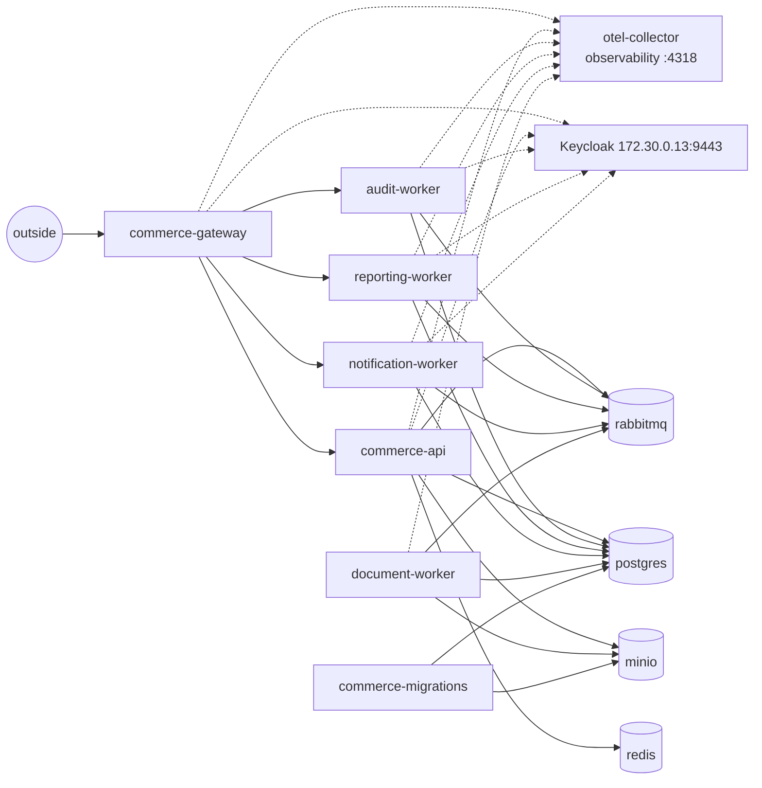

# Kubernetes security boundaries

The local kind cluster is the only deployment target. This document describes how workloads
are separated inside it:

- namespaces and their Pod Security level;
- the identity each workload runs as;
- the network paths that are allowed;
- the ways into the cluster.

Two related topics have their own documents:

- what may be created at all (admission control): [gitops-and-admission.md](gitops-and-admission.md);
- how secrets reach pods: [secret-management.md](secret-management.md).

## The cluster

| Item | Value |
|---|---|
| Created by | `sscp up --with cluster` (`automation/src/sscp/cluster.py`) from `supply-chain-platform/cluster/kind.yaml` |
| Kubernetes | kind 0.33.0 with a node image for Kubernetes v1.36.4, pinned by digest in `versions.yaml` |
| Nodes | one control-plane node that also runs the workloads |
| Network | The node joins the `sscp-edge` Docker network (dynamic range 172.30.128.0/17). It therefore reaches Harbor, Vault and Keycloak under their platform names. Pods resolve those names through CoreDNS. |
| Registry trust | containerd, the node's container runtime, trusts the platform CA for `harbor.sscp.test:8443` only (`/etc/containerd/certs.d`) |
| Network policy | enforced by kind's default network plugin (kindnet, with network-policy support) |
| Access | The kubeconfig is written to `.local/generated/kubeconfig`. Only the automation and the operational tests use it; no CI zone has a copy. |
| Add-ons | Argo CD 10.9.2, Kyverno 3.9.1, External Secrets 2.11.0 and Trivy Operator 0.36.0, installed by Helm at pinned chart versions (`cluster/helm/*.yaml`) |

### Published ports

kind publishes four node ports on the workstation's loopback address only (`127.0.0.1`), so
nothing is reachable from other machines:

| Workstation address | NodePort | Service |
|---|---|---|
| `http://127.0.0.1:8088` | 30080 | commerce gateway |
| `https://127.0.0.1:8444` | 30444 | Argo CD UI and API |
| `http://127.0.0.1:3300` | 30300 | Grafana |
| `http://127.0.0.1:9990` | 30990 | Prometheus |

## Namespaces

A **namespace** groups related resources and is the unit that policies, secrets and network
rules are scoped to.

| Namespace | Contents | Pod Security Standard | Platform admission policies |
|---|---|---|---|
| `commerce` | the six commerce services and the migrations Job | `restricted` (enforce, audit, warn) | all ([list](gitops-and-admission.md#admission-policies)) |
| `commerce-data` | PostgreSQL, Redis, RabbitMQ, MinIO | `restricted` | all except image-signature checks. These are third-party images from the platform mirror, so they are pinned by digest but not signed by the release key |
| `observability` | OpenTelemetry Collector, Prometheus, Loki, Grafana ([observability.md](observability.md)) | `restricted` | none |
| `argocd`, `kyverno`, `external-secrets`, `trivy-system` | platform add-ons installed by Helm | not labelled | none |
| `kube-system`, `local-path-storage` | kind's own components | not labelled | none |

The **Pod Security Standard `restricted`** is Kubernetes' built-in strictest profile. It
requires non-root users, no privilege escalation, dropped capabilities and a seccomp
profile. Kyverno's `workload-security` policy adds stricter rules on top: a read-only root
file system, no service-account token, and a dedicated service account.

## Workload identities

A **service account** is the identity a pod presents to the Kubernetes API and to other
systems that trust Kubernetes, such as Vault.

Every workload has its own service account. The accounts are defined in
`cluster/platform/service-accounts.yaml`, in the platform repository rather than the GitOps
repository, so a GitOps change cannot create or change them.

| Rule | Effect |
|---|---|
| No account is bound to a Role or ClusterRole | the accounts have no rights in the Kubernetes API |
| Every account and pod sets `automountServiceAccountToken: false` | no Kubernetes credential is placed in the container at all |
| `workload-security` refuses a pod that mounts a token, or that runs as `default` or `vault-secrets` | a mistake in a manifest cannot bring the token back |

Application code therefore has **no credentials for the Kubernetes API**. A compromised
service cannot list secrets, start pods or read other workloads' configuration.
`sscp verify cluster` checks this from inside a running pod.

The `vault-secrets` account in each namespace is the identity External Secrets presents to
Vault for that namespace. Vault maps it to a role that can read only that namespace's paths
([secret-management.md](secret-management.md)). Pods may not run as it.

One platform component has cluster read access. The OpenTelemetry Collector's ClusterRole
can `get`, `list` and `watch` pods, namespaces, events and ReplicaSets, so it can label
telemetry with the pod that produced it. It cannot change anything.

## Network paths

Both application namespaces **deny all ingress and egress by default**. Each needed path is
then opened explicitly, for exactly the services that need it
(`cluster/platform/network-policies.yaml`):

| From | To | Port | Why |
|---|---|---|---|
| anywhere | `commerce-gateway` | 8080 | the single entry point |
| `commerce-gateway` | API and the three HTTP workers | 8080 | the gateway routes requests |
| API, workers, migrations | `postgres` | 5432 | each uses its own database role |
| API and all workers | `rabbitmq` | 5672 | events between modules |
| `commerce-api` only | `redis` | 6379 | caching and idempotency keys |
| API, document worker, migrations | `minio` | 9000 | document storage |
| gateway, API, HTTP workers | Keycloak `172.30.0.13` | 9443 | token-signing keys; the API also uses the admin API for role changes |
| every commerce service | `otel-collector` in `observability` | 4318 | traces, metrics and logs over OTLP/HTTP |
| every pod | cluster DNS | 53 | name resolution |

Nothing else is allowed. For example:

- the gateway cannot open a connection to PostgreSQL;
- a worker cannot call another worker or the API;
- nothing in `commerce-data` can start a connection anywhere.

`sscp verify cluster` checks this with real connections:

- from a probe namespace, only the gateway answers;
- in a throw-away copy of the two namespaces carrying the exact same policies, probe pods
  playing the gateway, the API and two workers reach exactly the declared services, and
  nothing more.

## Ways in

| Way | Status |
|---|---|
| The commerce gateway | The only external entry point to the workload: a platform-owned NodePort Service (`cluster/platform/exposure.yaml`), published by kind on `127.0.0.1:8088`. |
| Argo CD, Grafana and Prometheus | Platform-owned NodePort Services, published on the loopback address only. |
| Other NodePort, LoadBalancer or external-IP Services in the application namespaces | Refused by `restrict-service-exposure`. |
| `kubectl debug` (ephemeral containers) | Refused by the native `no-ephemeral-containers` policy. |
| `kubectl exec` into a pod | Possible for cluster administrators. The chiseled .NET images contain no shell, so there is little to run. |
| The Kubernetes API from CI | No CI zone holds credentials. An anonymous request from a zone runner is refused (checked by `sscp verify cluster`). |

## Limitations

These are local simplifications. [production-considerations.md](production-considerations.md)
lists what production would change.

- **One node.** Workloads share one machine: there is no scheduling isolation, and a
  compromised node exposes every namespace.
- **A full cluster administrator exists.** The automation's kubeconfig can change anything,
  including admission policies. Argo CD restores the policies from Git, but only until
  someone changes them in Git.
- **Add-on images come from upstream registries** at pinned chart versions. They are not
  taken from the platform's mirror by digest.
- **Platform namespaces are not default-deny.** `observability`, `kyverno`,
  `external-secrets` and `trivy-system` have no network policies. Loki, for example,
  accepts connections from any pod. `argocd` has only the policies Argo CD's Helm chart
  creates for its own pods.
- **etcd skips disk syncs** (`unsafe-no-fsync`) so the API server stays responsive on
  slow disks. An unclean Docker stop can lose the last moments of cluster state, which
  Argo CD then re-applies from Git.
