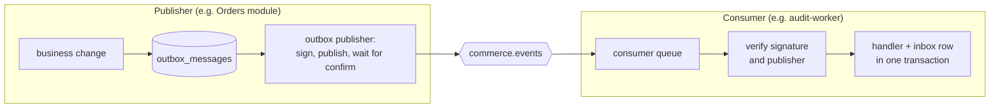
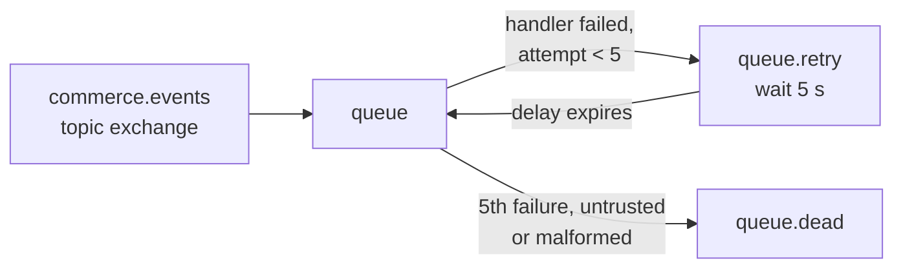

# Messaging and data

This document explains how the commerce workload stores data and how its parts talk to
each other through events. It covers:

- who owns which data;
- how events are published reliably, and processed only once;
- how events are signed, so a compromised service cannot forge messages from another;
- how the tamper-evident audit trail works.

The code lives in `commerce-app/src/BuildingBlocks/Commerce.BuildingBlocks/`, mainly in the
`Messaging/`, `Persistence/` and `Auditing/` folders.

## Data ownership

There is one PostgreSQL database with **one schema per module or worker**, and **one runtime
database role per schema**:

| Schema | Owning deployable | Runtime role | Row privileges |
|---|---|---|---|
| `identity`, `customers`, `catalog`, `inventory`, `orders`, `payments`, `documents`, `administration` | `commerce-api` (one role per module) | `commerce_<schema>` | select, insert, update, delete |
| `notifications` | `notification-worker` | `commerce_notification_worker` | select, insert, update, delete |
| `reporting` | `reporting-worker` | `commerce_reporting_worker` | select, insert, update, delete |
| `document_processing` | `document-worker` | `commerce_document_worker` | select, insert, update, delete |
| `audit` | `audit-worker` | `commerce_audit_worker` | **select and insert only** |

Schemas and tables are created by **migrations**. These run as a separate role,
`commerce_owner`, in a separate step: the `migrate` start argument, used by the Kubernetes
migrations Job. After migrating, the runner grants each runtime role row access to its own
schema only. Runtime roles therefore:

- cannot create, change or drop tables (no DDL rights);
- cannot see any other schema;
- cannot touch the migrations history table.

The integration tests connect as these roles and confirm this
(`tests/Commerce.IntegrationTests/Persistence/SchemaOwnershipTests.cs`).

**Why so strict?** If one module has a bug, or an attacker gains control of it, the damage
stays inside that module's data. For example, a flaw in the Catalog module cannot read
payments.

## Events between modules

Modules and workers never call each other's databases. When something happens that others
care about, the owner publishes an **integration event**, such as `orders.order-confirmed.v1`.
Events travel through RabbitMQ on the `commerce.events` topic exchange.

### Transactional outbox

A module never publishes directly. It writes the event into its own `outbox_messages` table
**in the same database transaction** as the business change. Either both are saved, or
neither is. The event cannot be lost after the change was saved, and it cannot be sent for
a change that was rolled back.

A background publisher for each schema then:

1. takes a PostgreSQL advisory lock for that schema, so only one publisher works on each
   outbox, even with several replicas;
2. reads unprocessed rows in time order;
3. signs each message and publishes it, waiting for RabbitMQ's publisher confirmation;
4. marks a row processed only after the broker confirmed it.

If the process crashes between steps 3 and 4, the message is sent again. The consumer's
inbox makes that harmless.

### Inbox and idempotent consumers

RabbitMQ delivers *at least once*, so a message may arrive twice. Each consumer therefore
processes a message inside one transaction that also inserts `(message_id, consumer)` into
its `inbox_messages` table. A second delivery finds the row and is acknowledged without
effect.

Handlers change entities but never save them themselves. The processor saves the handler's
changes and the inbox row together, so "processed" and "effect applied" cannot disagree.

### Retries and dead letters

| Situation | What happens |
|---|---|
| A handler throws (for example, the database is briefly unavailable) | The message is republished to `<queue>.retry` with an attempt counter (`x-sscp-attempt`). After 5 seconds it returns to the queue. |
| The 5th attempt fails | The message goes to `<queue>.dead` with the reason `max-attempts` in the `x-sscp-dead-reason` header. |
| The message cannot be parsed | Dead-lettered at once as `malformed-envelope`. |
| The signature or publisher check fails | Dead-lettered at once with the reason (see below). |

A dead-letter queue is a "parking lot": messages there are kept for a person to inspect and
are never lost silently.

## Signed integration events

The two publishers, `commerce-api` and `document-worker`, each sign their messages with
their own **ECDSA P-256** private key. The signature covers:

- the message id, type, source, time and correlation id;
- the SHA-256 hash of the exact payload bytes.

Consumers hold only **public** keys. The keys come from
[`config/publishers.yaml`](../commerce-app/config/publishers.yaml), which also lists the
event types each publisher may send:

| Publisher | May send |
|---|---|
| `commerce-api` | identity, customer, catalogue, inventory, order, payment, feature-flag and audit events, and `documents.generation-requested.v1` |
| `document-worker` | `documents.document-generated.v1`, `documents.generation-failed.v1` only |

A unit test checks that every contract event has exactly one publisher in this file.

| A consumer rejects a message when | Reason recorded |
|---|---|
| the signature does not match the content | `InvalidSignature` |
| the key id is unknown | `UnknownKey` |
| the message claims a different publisher than the key belongs to | `SourceMismatch` |
| the publisher is not allowed to send that event type | `TypeNotAllowedForPublisher` |
| the message is not valid JSON | `malformed-envelope` |

Rejected messages are dead-lettered and reported as `integration.message_rejected` security
events ([identity-and-authorization.md](identity-and-authorization.md#security-events)).

**Why sign messages inside a private network?** The document worker can reach the broker.
Without signatures, a compromised document worker could publish a fake
`payments.payment-captured.v1` and have an unpaid order shipped. With per-publisher keys and
type lists, it can only send the two document events it owns.

Consumers deserialise only event types registered from the contract assemblies. The .NET
type to create never comes from the message itself, which closes a known class of
deserialisation attacks.

Where the keys come from:

| Environment | Keys |
|---|---|
| Kubernetes | generated once per installation by `sscp up --with cluster`, stored in Vault, delivered by External Secrets ([secret-management.md](secret-management.md)) |
| Dynamic test environment | generated for each run and discarded ([dynamic-security-testing.md](dynamic-security-testing.md)) |
| Host development | generated by `sscp workload setup` |

## Read model for reporting

The reporting worker builds four tables **from events only**:

- `order_summaries`;
- `daily_sales`;
- `product_sales`;
- `stock_levels`.

It never reads another schema's transactional tables. Order summaries ignore events older
than the last one applied, so late or re-delivered events cannot move an order backwards.

## Audit trail

Modules publish `audit.recorded.v1` events through their outbox. An audit entry therefore
exists exactly when the audited change was committed, and never for a change that was
rolled back.

The audit worker appends the entries to a **hash chain**: each entry stores the SHA-256 hash
of the previous entry together with its own content, in a fixed canonical form. The
canonical form uses:

- timestamps at the microsecond precision PostgreSQL stores;
- details as sorted JSON text.

Changing, deleting or reordering any entry breaks every hash after it.

- `GET /api/audit/verify` (role `auditor` or `admin`) recomputes the chain. It reports the
  first modified, removed or re-ordered entry.
- The worker's database role cannot update or delete audit rows, so even the worker itself
  cannot rewrite history.

The platform's Security Control Plane uses the same idea for its own audit log
([security-control-plane.md](security-control-plane.md)).

## Other stores

| Store | Used for | Notes |
|---|---|---|
| Redis | catalogue listing cache (versioned keys); idempotency keys (kept 24 hours) | Losing Redis loses only the cache and the replay-protection window. Only `commerce-api` can reach it. |
| MinIO bucket `commerce-documents` | uploaded attachments, generated invoices | Object keys are generated by the server, never taken from file names. Downloads always force "save as", never display inline. |

**Idempotency keys**: placing an order needs an `Idempotency-Key` header. If a client retries
with the same key within 24 hours, it receives the stored first response. The order is not
placed twice.

## How this is tested

| Behaviour | Test |
|---|---|
| Envelope signing and all rejection reasons | `tests/Commerce.UnitTests/Messaging/EnvelopeSigningTests.cs` |
| Every event has exactly one allowed publisher | `tests/Commerce.UnitTests/Messaging/PublisherConfigurationTests.cs` |
| Outbox delivery, duplicate delivery applied once, tampered messages dead-lettered, against real PostgreSQL and RabbitMQ | `tests/Commerce.IntegrationTests/Messaging/OutboxInboxTests.cs` |
| Schema isolation of runtime roles | `tests/Commerce.IntegrationTests/Persistence/SchemaOwnershipTests.cs` |
| Audit chain detects modified, deleted and re-ordered entries | `tests/Commerce.UnitTests/Security/SecurityPolicyTests.cs` |
| Object storage behaviour | `tests/Commerce.IntegrationTests/Storage/ObjectStorageTests.cs` |

## Limitations

- **Single database instance.** The schemas share one PostgreSQL server. That isolates data
  logically, but not the load: one heavy module slows the others.
- **Dead letters are not replayed automatically.** Someone must inspect `<queue>.dead` and
  re-publish messages by hand.
- **Key rotation is manual.** A new publisher key must reach every consumer before the
  publisher starts using it.
