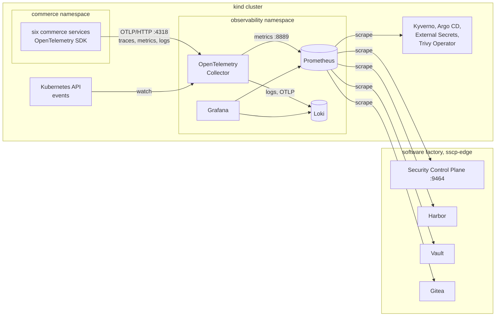

# Observability

The platform watches both halves of the supply chain from one place: what the software
factory decided (evidence, trust decisions, signing, promotion, deployment) and what then
happens in the cluster (admission refusals, GitOps state, secret delivery, vulnerabilities
of running images and the workload's own security events). Every workload signal carries
the release that produced it, so a change in runtime behaviour can be traced back to a
release, its commit and the Control Plane's records for its digests.

Terms used below:

- **Metrics** are numbers measured over time, such as "trust decisions per outcome". They
  are stored in **Prometheus**.
- **Logs** are timestamped text records. They are stored in **Loki**.
- **Traces** follow one request through several services. Here they are turned into
  request metrics.
- **OpenTelemetry (OTel)** is the vendor-neutral standard the commerce services use to
  emit all three. The **OpenTelemetry Collector** receives, enriches and forwards them.
- **Grafana** draws dashboards from Prometheus and Loki.
- An **alert rule** is a Prometheus query that "fires" while its condition holds.

All components run in the `observability` namespace of the kind cluster. They are defined
in `supply-chain-platform/cluster/platform/observability/` and kept in sync by Argo CD's
`platform-cluster` application, like the rest of the cluster's security configuration.



## Components

| Component | Version (pinned by digest in `versions.yaml`) | Role | Storage |
|---|---|---|---|
| OpenTelemetry Collector (contrib) | 0.161.0 | the single entry point for workload telemetry; adds Kubernetes metadata; turns traces into request metrics; reads Kubernetes events | none |
| Prometheus | 3.15.0 | scrapes every metrics source, evaluates the alert rules | 4 GiB volume, 7 days |
| Loki | 3.7.8 | stores workload logs (including security events) and Kubernetes events | 2 GiB volume, 7 days |
| Grafana | 13.0.9 | provisioned, read-only data sources and dashboards | in memory (nothing to keep) |
| Trivy Operator | chart 0.36.0 (namespace `trivy-system`) | scans the images that actually run, and the workload objects' configuration | reports as Kubernetes resources |

Images come from Harbor's `platform-tools` mirror like every other image in the cluster.
The namespace enforces the `restricted` Pod Security level; every component runs as a
non-root user with a read-only root file system and no Kubernetes API token, except the
collector, which has read-only access to pods, namespaces, ReplicaSets and events (the
`sscp-otel-collector` ClusterRole).

## Signals and where to find them

| Question | Signal | Source | Where to look |
|---|---|---|---|
| Did the Control Plane approve or refuse trust, and why? | `sscp_trust_decisions_total{outcome, scope}` | Control Plane | dashboard *Supply chain trust*; alert `TrustDecisionFailed` |
| Did a scanner fail, or was evidence refused? | `sscp_scanner_failures_total{kind}`, `sscp_evidence_rejected_total{reason}` | Control Plane | *Supply chain trust*; alerts `ScannerDidNotComplete`, `EvidenceRejected` |
| Which artifacts were signed, promoted, deployed? | `sscp_artifacts{state}`, `sscp_signatures_total`, `sscp_promotions_total`, `sscp_deployments_total{result}` | Control Plane | *Supply chain trust*; alert `DeploymentDoesNotMatchRelease` |
| Did a pipeline break before reaching a decision? How long do pipelines take? | `sscp_builds_completed_total{kind, status}`, `sscp_build_duration_seconds` | Control Plane | *Supply chain trust*; alert `PipelineFailed` |
| Which risk exceptions are about to expire? | `sscp_exceptions{status}`, `sscp_exceptions_expiring_7d` | Control Plane | *Supply chain trust*; alert `RiskExceptionsExpiringSoon` |
| What did admission control refuse? | `kyverno_validating_policy_results_total{result="fail"}` by `policy_name` | Kyverno | *Deployment and runtime security*; alert `AdmissionRefused` |
| Does the cluster match Git? | `argocd_app_info{sync_status, health_status}`, `argocd_app_sync_total{phase}` | Argo CD | *Deployment and runtime security*; alerts `GitOpsApplicationDegraded`, `GitOpsApplicationOutOfSync` |
| Are secrets being delivered from Vault? | `externalsecret_status_condition`, `externalsecret_sync_calls_error` | External Secrets | *Deployment and runtime security*; alert `SecretDeliveryFailing` |
| Do running images have (new) vulnerabilities or embedded secrets? | `trivy_image_vulnerabilities{severity}`, `trivy_image_exposedsecrets`, `trivy_resource_configaudits` | Trivy Operator | *Deployment and runtime security*; alerts `RunningImageHasCriticalVulnerabilities`, `RunningImageContainsSecrets`; `kubectl get vulnerabilityreports -n commerce` |
| Is the workload being attacked? | `commerce_security_events_total{type}` and log lines `Security event …` | commerce services | *Deployment and runtime security*; alerts `TamperedIntegrationMessages`, `AuthorizationDenialsSpike`, `AuthenticationFailuresSpike` |
| How is the workload behaving, per release? | `http_server_request_duration_seconds`, trace-derived `traces_span_metrics_*` | commerce services, collector | *Deployment and runtime security* |
| What happened in the cluster? | Kubernetes events of `commerce`, `commerce-data`, `argocd`, `kyverno`, `external-secrets` | Kubernetes API | Loki: `{service_name="kubernetes-events"}` |
| Is a platform component down or Vault sealed? | `up`, `vault_core_unsealed` | Prometheus, Vault | alerts `ComponentUnreachable`, `VaultSealed` |

## Alert reference

The 17 alert rules are in `cluster/platform/observability/alerts.yaml`. There is no
Alertmanager: firing alerts are shown in Prometheus (http://127.0.0.1:9990/alerts) and on
the dashboards, and nothing is sent anywhere.

| Alert | Severity | Fires when | First step |
|---|---|---|---|
| `TrustDecisionFailed` | warning | the Control Plane refused trust in the last 30 minutes | read the failing rules in the build's decision ([trust-policy.md](trust-policy.md#decision-rules)) |
| `ScannerDidNotComplete` | warning | a scanner failed to run; its gate fails closed | open the pipeline job log ([troubleshooting.md](troubleshooting.md)) |
| `EvidenceRejected` | warning | the Control Plane refused a report (wrong run, digest, format…) | the `reason` label names the refusal ([security-control-plane.md](security-control-plane.md)) |
| `PipelineFailed` | warning | a pipeline finished without reaching a decision | retry the build once the cause is fixed |
| `DeploymentDoesNotMatchRelease` | critical | a running GitOps revision pins digests the Control Plane did not approve for its release | compare the revision with the release ([gitops-and-admission.md](gitops-and-admission.md#how-a-release-reaches-the-cluster)) |
| `RiskExceptionsExpiringSoon` | info | an approved exception expires within seven days | fix the finding or request a new decision ([risk-exceptions.md](risk-exceptions.md)) |
| `AdmissionRefused` | warning | a Kyverno policy refused a request | the `policy_name` label names the rule |
| `GitOpsApplicationDegraded` | warning | an Argo CD application has been unhealthy for 10 minutes | `kubectl -n argocd get applications` |
| `GitOpsApplicationOutOfSync` | warning | an application has not matched Git for 15 minutes | look at the application's last sync message |
| `SecretDeliveryFailing` | warning | External Secrets has not delivered a secret for 10 minutes | check that Vault is unsealed and reachable |
| `RunningImageHasCriticalVulnerabilities` | warning | the Trivy Operator found critical vulnerabilities in a running image | `kubectl get vulnerabilityreports -n <namespace>` |
| `RunningImageContainsSecrets` | critical | a running release image contains an embedded secret | rotate the secret, then release a clean image |
| `TamperedIntegrationMessages` | critical | a service rejected messages with an invalid or untrusted signature | inspect the dead-letter queue ([messaging-and-data.md](messaging-and-data.md)) |
| `AuthorizationDenialsSpike` | warning | more than 20 denied requests in 10 minutes | query the security event log in Loki |
| `AuthenticationFailuresSpike` | warning | more than 20 failed authentications in 10 minutes | query the security event log in Loki |
| `ComponentUnreachable` | critical | a metrics source has not answered for 5 minutes | `uv run sscp status` |
| `VaultSealed` | critical | Vault has been sealed for 2 minutes; secrets and signing stop | `uv run sscp up` unseals it |

## Release identity on runtime telemetry

Three pieces make every workload signal say which release produced it:

1. The release pipeline writes `overlays/local/release.yaml` in the GitOps repository: a
   ConfigMap `commerce-release` with the release tag, commit and Control Plane release id,
   committed together with the release's digests.
2. Each commerce Deployment reads the tag and commit from that ConfigMap into
   `OTEL_RESOURCE_ATTRIBUTES` (`sscp.release.tag`, `sscp.release.commit`). The
   OpenTelemetry SDK attaches these to every trace, metric and log record. A new release
   always changes the image digests, so the pods restart and pick up the new values.
3. The collector's Kubernetes metadata processor adds the namespace, pod, Deployment and
   the running image (name and repository digest) from the pod that sent the data. This
   comes from the Kubernetes API, not from the application, so a pod cannot misreport
   which image it runs.

In Prometheus these resource attributes become labels (`sscp_release_tag`,
`sscp_release_commit`, `service_name`, `k8s_namespace_name`, `k8s_deployment_name`,
`k8s_pod_name`, `container_image_name`). The collector exports only this list; other
resource attributes (process, SDK, host details) would only multiply the number of
series. In Loki, `service_name`, `k8s_namespace_name` and `sscp_release_tag` are index
labels; everything else is kept as structured metadata on each line.

From a digest seen in telemetry, the Control Plane's trace endpoint
(`GET /api/artifacts/{digest}/trace`) returns the build, evidence, decision, signature,
promotion and deployment records for it.

## Metrics sources

Prometheus uses fixed targets (Kubernetes service names inside the cluster, platform
host names over `sscp-edge` outside it) rather than service discovery, which would need
cluster-wide read access for Prometheus.

| Job | Target | Notes |
|---|---|---|
| `workload` | `otel-collector:8889` | workload metrics converted from OTLP; `honor_labels` keeps the service as `job` |
| `kyverno` | `kyverno-svc-metrics:8000`, `kyverno-reports-controller-metrics:8000` | admission and policy results |
| `argocd` | `argocd-application-controller-metrics:8082` | application sync and health |
| `external-secrets` | `external-secrets-metrics:8080` | secret delivery |
| `trivy-operator` | `trivy-operator.trivy-system:8080` | vulnerability, exposed-secret and configuration-audit summaries |
| `controlplane` | `controlplane.sscp.test:9464` | the Control Plane's separate management port; the API port does not serve metrics |
| `harbor` | `harbor.sscp.test:9090` | Harbor's exporter |
| `vault` | `https://vault.sscp.test:8200/v1/sys/metrics` | Vault allows unauthenticated metrics reads from the listener; nothing else is readable without a token |
| `gitea` | `https://gitea.sscp.test:3000/metrics` | bearer token delivered from Vault (`kv/platform/cluster/observability/gitea-metrics`) |

## Dashboards

Both dashboards are JSON files in `cluster/platform/observability/dashboards/`,
provisioned read-only into the Grafana folder *Supply chain security platform*.

- **Supply chain trust** (`sscp-supply-chain`): trust decisions by outcome and scope,
  artifacts by state, signatures, promotions and deployments, deployments that did not
  match their release, evidence and scanner failures, findings by severity, pipeline
  duration, risk exceptions.
- **Deployment and runtime security** (`sscp-runtime`): admission refusals by policy,
  Argo CD application state and syncs, undelivered secrets, vulnerabilities and
  configuration findings of running images, request rate and errors by service and
  release, security events, the security event log and Kubernetes warning events.

## Access

| What | Address | Sign-in |
|---|---|---|
| Grafana | http://127.0.0.1:3300 | `admin`, password `grafana.admin` in `.local/secrets/bootstrap.json` |
| Prometheus | http://127.0.0.1:9990 | none (published on the loopback interface only) |

Loki has no published port; query it through Grafana (*Explore*, data source *Loki*).
Some useful queries:

```text
{service_name="commerce-gateway"} |= "Security event"
{k8s_namespace_name="commerce", sscp_release_tag="v1.0.0"}
{service_name="kubernetes-events"} | json | object_type="Warning"
```

The Grafana administrator password is generated at bootstrap, stored in Vault
(`kv/platform/cluster/observability/grafana`) and delivered to Grafana by External
Secrets; it never appears in Git.

## Changing the configuration

The collector, Prometheus, Loki and Grafana configurations, the alert rules and the
dashboards are plain files under `cluster/platform/observability/` (`config/`,
`alerts.yaml`, `dashboards/`). The platform kustomization packs them into ConfigMaps
whose names carry a hash of their content, so committing a change to the platform
repository (`sscp repo sync`) makes Argo CD roll out exactly the component that reads it.
Superseded ConfigMaps are left behind, because the `platform-cluster` application never
prunes automatically. They carry Argo CD's `IgnoreExtraneous` option, so they do not mark
the application out of sync, and they can be deleted once the new pods run:

```bash
kubectl --kubeconfig .local/generated/kubeconfig -n observability get configmaps
```

## Verification

`sscp verify observability` (with a release deployed) checks the whole path with real
signals:

- every metrics source is scraped, and the committed alert rules are loaded and evaluate;
- requests with a forged token at the gateway appear in
  `commerce_security_events_total` labelled with the deployed release tag, commit,
  namespace and trusted image, and as log lines in Loki (queried through Grafana);
- a pod refused by `restrict-image-sources` is counted in Kyverno's metrics;
- every running commerce workload has a Trivy vulnerability report;
- Grafana reaches both data sources and serves the committed dashboards.

## Limitations

- **No trace store.** Traces are converted into request metrics by the collector and then
  dropped. Following a single request across services is not possible.
- **No notifications.** Alerts are only visible in Prometheus and Grafana.
- **Single, local instances.** Prometheus and Loki keep seven days on small local
  volumes; losing the cluster loses the history. See
  [production-considerations.md](production-considerations.md).
- **Factory telemetry needs the cluster.** Prometheus runs in kind, so Control Plane,
  Harbor, Vault and Gitea metrics are only collected while the cluster is up.
- **Refusals by the native policy are not in Kyverno's metrics.** Ephemeral debug
  containers are refused by a Kubernetes `ValidatingAdmissionPolicy`
  (see [gitops-and-admission.md](gitops-and-admission.md)); the API server counts those
  refusals, and its metrics are not scraped.
- **Scans are sequential.** The Trivy Operator runs one scan job at a time to spare the
  workstation, so reports for a new release appear over several minutes.
- **Third-party images are reported, not fixed.** The data services' mirrored images
  (`commerce-data`) carry known vulnerabilities, and `RunningImageHasCriticalVulnerabilities`
  fires for them until their pins in `versions.yaml` are updated. The PostgreSQL image
  contains Debian's generated `ssl-cert-snakeoil.key`; PostgreSQL runs with TLS off, so the
  key is unused. It is listed in the exposed-secret report and on the dashboard, while the
  `RunningImageContainsSecrets` alert covers only the release images in `commerce`,
  which passed the secret scan in CI.
