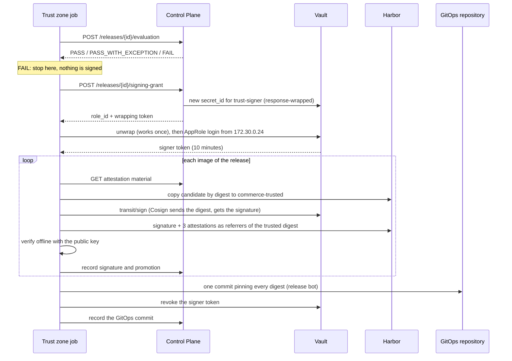

# Release signing and promotion

A release turns images that the main pipeline built and the Security Control Plane
approved into **signed, attested images in the trusted registry project**, and hands their
digests to GitOps. This document explains what starts a release, who is allowed to sign,
what is attached to each image, where signatures live and how they are checked. Admission
control in the cluster relies on exactly these signatures and attestations.

## Key ideas

- **Build once, promote the exact digest.** Nothing is rebuilt at release time. The trust
  zone copies the scanned candidate unchanged to the trusted project, so what was scanned
  is byte-for-byte what is signed and what runs.
- **The key never leaves Vault.** Signing happens inside Vault's Transit engine; no file,
  pipeline or person ever holds the private key.
- **Signing rights exist only per release.** The trust zone has no standing right to sign.
  It receives a single-use grant for one approved release and uses it within minutes.
- **The Control Plane writes the claims; the trust zone only signs them.** Provenance and
  the trust decision come from the Control Plane's own records, not from the zone that
  signs.

## What starts a release

A release manager (`rhea`, the only member of `release-managers`) pushes a `v*` tag on
`commerce/commerce-app`; Gitea's tag protection refuses the tag from anyone else. The push
webhook reaches the Control Plane, which:

1. looks up the tagged commit's successful main build — no build, no release;
2. creates a release covering every deployable image of that build;
3. dispatches `release-pipeline.yaml` to the trust runner and binds the run to the release.

```bash
cd supply-chain-platform
uv run sscp repo tag -t v1.2.3                 # tags the tip of main as rhea
uv run sscp repo tag -t v1.2.4 --commit <sha>  # tags another built commit
```

## The release pipeline

`supply-chain-platform/.gitea/workflows/release-pipeline.yaml` has one job on the trust
runner. It never builds or scans anything.



1. **Final decision.** The Control Plane re-evaluates every image, because time has passed
   since the main build: a risk exception may have expired, or a vulnerability's remediation
   window may have closed. A `FAIL` rejects the release and nothing is signed.
2. **Signing grant.** See [who can sign](#who-can-sign).
3. **Promote.** `crane` copies each candidate manifest (same digest) to
   `commerce-trusted/<deployable>:<tag>`.
4. **Sign and attest.** Cosign signs the trusted digest and attaches three signed
   attestations. It uses the key `hashivault://cosign-commerce`: Cosign sends the digest to
   Vault's Transit engine and receives the signature.
5. **Verify.** The job verifies every signature and attestation offline with the public
   key, the same way admission control will, before reporting anything.
6. **Record.** Each image's signature (with the digests of its Sigstore bundles, read
   through the registry's referrers API) and promotion are recorded in the Control Plane.
   The release moves `Approved → Signed → Promoted` once every image has its own signature
   and promotion for this release.
7. **Commit to GitOps.** One commit to `overlays/local` of `platform/commerce-gitops` pins
   all the release's digests and updates the `commerce-release` ConfigMap (tag, commit,
   release id), made by `sscp-gitops-bot`, whose token is readable only with the signing
   grant. The release becomes `GitOpsUpdated`. Argo CD deploys it, and the Control Plane
   marks it `Deployed` after checking the running revision
   ([gitops-and-admission.md](gitops-and-admission.md#how-a-release-reaches-the-cluster)).

If any step fails, the job marks the release `Failed` with the reason; if the run ends
without finishing, the Control Plane's run watcher does it. A later tag on the same commit
is a new release of the same build: it is re-evaluated, signed and attested again under its
own records, and adds its own tag in the trusted project.

## Who can sign

The signing key `cosign-commerce` is a Vault Transit key (ECDSA P-256) created with
`exportable=false` and `allow_plaintext_backup=false`: no API can return the private key.

| Identity | Can | Cannot |
|---|---|---|
| `trust-signer` AppRole | `transit/sign/cosign-commerce`; read the key's public part; read the promoter robot and the GitOps bot token (`kv/ci/trust-signer/*`) | anything else |
| Control Plane AppRole (`controlplane`, only from 172.30.0.14) | create `secret_id`s for `trust-signer`; read its `role_id` | sign; read any secret |
| Trust zone AppRole (`ci-trust`) | read `kv/ci/trust/*` (its Control Plane client) | sign; read the promotion or GitOps credentials |
| Security and build zone AppRoles | read their own `kv/ci/<zone>/*` | sign |
| Bootstrap token (`sscp`) | administer Vault, create keys and roles | sign (`transit/sign/*` is explicitly denied) |

Nobody holds a standing `trust-signer` credential. For each approved release the Control
Plane mints one **signing grant**:

| Property | Value | Why |
|---|---|---|
| Issued to | the trust zone, and only the run bound to this release | a grant is tied to one positive decision |
| Issued when | the release is `Approved` or `ApprovedWithException` | rejected, failed or already-signed releases get nothing (`409 release.not-approved`) |
| Form | `role_id` plus a **response-wrapped** `secret_id` (wrapping time-to-live 5 minutes) | the Control Plane never sees the `secret_id` itself; unwrapping works once, so an intercepted grant is noticed when the real job cannot unwrap it |
| `secret_id` | single use, valid 10 minutes, accepted only from the trust runner (172.30.0.24) | useless after the job logged in, and useless anywhere else |
| Signer token | valid 10 minutes (at most 15), bound to 172.30.0.24, revoked by the job when done | limits what a compromised job could do afterwards |
| Records | `signing.grant-issued` in the Control Plane audit log with Vault's wrapping accessor; Vault's audit device logs the login and every sign call | each signature traces to a release and a run |

If Vault cannot issue a grant, the Control Plane answers `503 signing.unavailable`, the job
fails and the release stays unsigned.

## What is attached to each image

The signature and the attestations are **Sigstore bundles**, each stored in the registry as
an **OCI 1.1 referrer** of the image — a separate artifact that points at the image digest
and is listed through the registry's referrers API. All are signed with `cosign-commerce`,
and every attestation names the image digest as its subject.

| Attestation (`--type`) | Content | Assembled by |
|---|---|---|
| SLSA provenance v1 (`https://slsa.dev/provenance/v1`) | source repository, ref and commit (`resolvedDependencies` with `gitCommit`), deployable and Dockerfile target, Control Plane build id, builder id (the platform's `main-pipeline.yaml@refs/heads/main`), invocation id (the main pipeline run URL), start and finish times | the Control Plane, from its own build records |
| Trust decision (`https://sscp.test/attestations/trust-decision/v1`) | decision id and outcome, policy version, evaluation time, release id and tag, application, deployable, commit, digest, applied exceptions, every evidence record used (tool, version, report SHA-256) | the Control Plane, from the decision made for this release |
| SBOM (`https://cyclonedx.org/bom`) | the CycloneDX SBOM Syft produced for this digest in the build zone | stored evidence; its SHA-256 is re-checked before it is handed out |

The trust zone fetches this material from
`GET /api/releases/{id}/artifacts/{artifactId}/attestations?runId=…`. It did not observe the
build, so it does not write any of it.

Cosign runs **offline**: `--tlog-upload=false --use-signing-config=false
--new-bundle-format=true` when signing, and `--insecure-ignore-tlog=true
--new-bundle-format=true` with the public key when verifying. "Ignore tlog" means Cosign
does not look for an entry in a public transparency log (Rekor); the signature itself is
still fully checked against the key.

### Why "SLSA-style"

The provenance uses the SLSA v1 provenance format and records real build facts, but the
platform does **not** claim a SLSA Build level. The provenance is assembled and signed after
the build by the trust zone from the Control Plane's records, not generated and signed by
the build platform itself while the build runs, and the build zone's isolation is described
in this documentation rather than independently attested.

## Checking signatures

The public key is written to `.local/generated/cosign-commerce.pub` by `sscp up`. It is not
secret: admission control and any verifier use it. Kyverno reads the same key from the
`cosign-commerce` ConfigMap in the `kyverno` namespace
([gitops-and-admission.md](gitops-and-admission.md#admission-policies)).

```bash
cd supply-chain-platform
uv run sscp verify signing
```

checks, against the running platform:

- the release key is ECDSA P-256, not exportable and not backed up in plain text;
- the trust zone's own identity can neither sign nor read the promotion credentials;
- a grant works once and only on the trust runner: unwrap, log in and sign succeed; a
  second login with the same `secret_id` and a second unwrap fail; a grant opened in another
  container on the same network cannot log in;
- the newest release of `commerce-api` in `commerce-trusted` verifies with the public key,
  and its trust-decision attestation names the same digest with a positive outcome;
- an unsigned image fails verification ("no signatures found");
- release tags in `commerce-trusted` cannot be moved to another image.

The Control Plane's rules for grants and attestation material (who gets a grant, what the
material contains, Vault outages) are covered by
`tests/Sscp.ControlPlane.ComponentTests/SigningTests.cs`.

## Limitations

- **No transparency log or timestamp authority.** A signature proves the key signed the
  image, not when. The local record of when is the Control Plane audit log and Vault's
  audit device.
- **Key rotation is manual.** Rotating the Transit key creates a new key version, and the
  new public key must be distributed to admission control. Images signed with the old
  version keep verifying only while the old public key is accepted.
- **Signed copies of failed releases stay.** A release that fails after promoting some
  images leaves signed, positively decided copies in `commerce-trusted`. They are never
  referenced by the GitOps repository, and the next release uses a new tag.

Production differences are listed in
[production-considerations.md](production-considerations.md#signing-provenance-and-the-registry).
