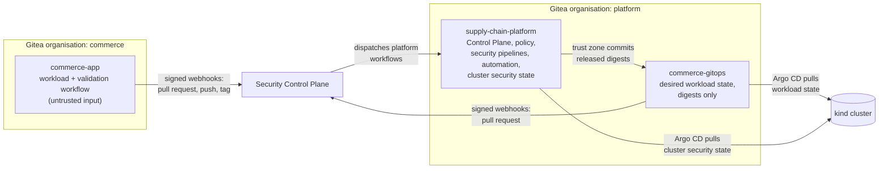

# Repository boundaries

The platform uses three Git repositories in its local Gitea. They are separate because
they have different owners, change at different rates and — most importantly — deserve
different levels of trust. This document explains what each repository may contain, who
may change it and what each part of the system is allowed to write.

## Why the separation matters

The central idea: **the people whose code is being checked must not be able to change the
checks.** If the security pipelines lived in the application repository, a pull request
could edit them — skip a scanner, fake a report, or add a job that runs on a privileged
runner and reads its credentials. Moving every trust-producing workflow into a repository
that application developers cannot write to turns "who may change the security pipeline"
into an ordinary, reviewable repository permission.

The same reasoning separates desired cluster state (GitOps) from the platform's own
cluster security configuration: a change to the workload's manifests must not be able to
weaken admission control.

## `commerce/commerce-app` — the application repository

| Aspect | Rule |
|---|---|
| Contents | The .NET modular monolith, the gateway, four workers, their tests, one Dockerfile with a target per deployable, and the application's validation workflow |
| Who can change `main` | Nobody pushes to `main`. Developers push branches and open pull requests. |
| Merge requirements | One approval from the `maintainers` team (`max`); stale approvals dismissed on new commits; blocked by any rejecting review; all `validation / *` statuses and `sscp/source-security` green; administrators cannot override |
| Release tags | `v*` tags are protected: only the `release-managers` team (`rhea`) may create them |
| Runners it can use | Only the **validation** runner, registered at the `commerce` organisation. The security, build and trust runners are registered to another repository, so workflows defined here have no runner that will accept a job on them. |
| Secrets | None. The repository has no Actions secrets, and its jobs receive no credentials. |

The repository is treated as **untrusted input**. Its workflow files belong to the commerce
team and may change in any pull request, so nothing that produces trust evidence or holds
credentials is defined here.

## `platform/supply-chain-platform` — the platform repository

| Aspect | Rule |
|---|---|
| Contents | Security Control Plane, trust policy, the platform pipelines (`.gitea/workflows`) and CI helper, scanner rules, the Compose platform, the cluster security state (admission policies, namespaces, network policies, secret stores, Argo CD projects), bootstrap automation |
| Who can change `main` | Only the `platform-engineers` team (`pat`); administrators cannot override the protection |
| Runners it can use | the **security**, **build** and **trust** runners, all registered at this repository's scope |
| How its workflows start | Only by dispatch from the Security Control Plane (the `sscp-controlplane` account may start runs but cannot change code), in response to signed Gitea webhooks. Each run receives the target repository and commit as inputs. |

This mirrors the "required workflow" or "compliance pipeline" model used by larger
organisations: developers change application code; a separate team owns how that code is
scanned, built, judged and signed.

> **Limitation:** changes to this repository are not reviewed by a second person in the
> local setup — any platform engineer can push. See
> [production-considerations.md](production-considerations.md#source-control-and-review).

## `platform/commerce-gitops` — the GitOps repository

| Aspect | Rule |
|---|---|
| Contents | Kustomize `base/` for the workload (`commerce`) and its data services (`commerce-data`), and the `overlays/local` overlay that pins released images by digest |
| Direct pushes to `main` | Only the `gitops-writers` team, whose only member is the release bot `sscp-gitops-bot`. Its token is readable only with a release's signing grant. |
| Changes by people | Through pull requests: one approval from `platform-engineers` or `gitops-reviewers` (`omar`), stale approvals dismissed, and the required status `sscp/deployment-security` (secret scan plus Checkov on the rendered manifests) |
| Consumer | Argo CD, through the read-only `sscp-argocd` account |

Argo CD's `commerce` project may create only namespaced workload resources in the
`commerce` and `commerce-data` namespaces. Cluster-wide security configuration comes from
the platform repository through a separate Argo CD project, so a GitOps change cannot
weaken admission control, create RBAC or reach other namespaces
([gitops-and-admission.md](gitops-and-admission.md#argo-cd-projects)).

## What each part of the system may write

| Component | May write | Must never write |
|---|---|---|
| Validation runner jobs | their own job logs and commit statuses | Harbor, Vault, the Control Plane, the cluster |
| Security runner jobs | evidence to the Control Plane | Harbor (push), signing keys, GitOps, the cluster |
| Build runner jobs | candidate images in `commerce-candidates`; artifact registrations and SBOM evidence in the Control Plane | `commerce-trusted`, signing keys, GitOps, the cluster |
| Trust runner jobs | signatures and attestations (through Vault), images in `commerce-trusted`, the GitOps commit — all only with a signing grant | the cluster (no Kubernetes credentials exist anywhere in CI) |
| Security Control Plane | its own database and evidence bucket, workflow dispatch, commit statuses, signing grants | Harbor, GitOps, the cluster, signing keys (it authorises signing but never signs) |
| Argo CD | resources allowed by its projects, in their allowed namespaces | anything outside its projects |

## Machine accounts in Gitea

| Account | Access | Used by |
|---|---|---|
| `sscp-controlplane` | start workflow runs in the platform repository; set commit statuses in `commerce-app` and `commerce-gitops`; read the GitOps repository | the Security Control Plane |
| `sscp-source-reader` | read `commerce-app` and `commerce-gitops` | the security and build zones, to fetch exact commits |
| `sscp-gitops-bot` | push to `commerce-gitops` `main` | the trust zone, during a release only |
| `sscp-argocd` | read `supply-chain-platform` and `commerce-gitops` | Argo CD |

Each account's token is generated by `sscp` and stored in Vault or passed only to the
component that uses it.
