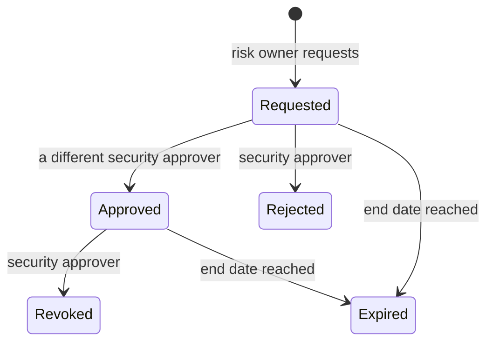

# Risk exceptions

Sometimes a finding cannot be fixed right away — a vulnerable library has no compatible
upgrade yet, or a Checkov check does not fit a particular design. A **risk exception** lets
exactly one known finding pass its gate for a limited time, after a second person has
agreed. This document explains the rules, the lifecycle, how exceptions are applied and
how to request and decide one through the Control Plane API.

## The rules

| Rule | Value |
|---|---|
| Scope | one application, optionally one deployable, **one finding** (identified by its fingerprint) |
| Kinds that can be excepted | `VulnerabilityScan`, `StaticAnalysis`, `InfrastructureScan`, `DockerfileLint`, `DynamicScan` |
| Never excepted | leaked secrets (`SecretScan`); missing or failed evidence; tampered evidence; the quality gate; the security tests |
| Justification | at least 20 characters; compensating controls can be recorded |
| Duration | must end in the future and at most **90 days** ahead — there are no permanent suppressions |
| Who requests | a person with the `risk-owner` role (`rita`, `sean`) |
| Who decides | a person with the `security-approver` role (`sean`) who is **not** the requester |

These rules come from the `exceptions` section of
[`policy/trust-policy.yaml`](../supply-chain-platform/policy/trust-policy.yaml) and the
`RiskException` domain model; the API refuses anything else with a specific error code.

## Lifecycle



An exception **applies only while it is `Approved` and not past its end date**. The trust
evaluator checks the clock itself, so an exception stops working at the exact moment it
expires; a background job then records the `Expired` status (within a minute) and writes
it to the audit log. Every state change is audited with its actor and note, and counted in
`sscp_exception_events_total`.

## How an exception is applied

1. A finding blocks a decision — the decision lists the failing rule and the finding's
   fingerprint, for example `vulnerabilities` with
   `CVE-2018-1285|pkg:nuget/log4net@2.0.9`.
2. A risk owner requests an exception for that fingerprint, application (and optionally
   deployable) and kind.
3. A different security approver approves it.
4. The next evaluation of an affected image finds the covering exception, lets the
   finding through and records the decision as **`PASS_WITH_EXCEPTION`** with the
   exception's id. The trust-decision attestation signed onto the released image carries
   the applied exceptions too, so the acceptance travels with the artifact.
5. Evaluations happen at the main build and again, **immediately before signing**, at
   every release. An exception that expired in between therefore stops the release:
   the release is rejected and nothing is signed.

A vulnerability matches an exception only if the exception's kind is
`VulnerabilityScan`; only Trivy's findings gate (Grype's are recorded evidence), so
exceptions are needed only for the fingerprints Trivy reports.

## Requesting and deciding through the API

The examples run from `supply-chain-platform/` in a POSIX shell (Git Bash, Linux, macOS).
`--ssl-no-revoke` is needed only by Windows' built-in curl, which otherwise tries to check
certificate revocation for the platform's local CA; other curl builds accept and ignore it.

```bash
CP=https://localhost:7443
CA=../.local/pki/ca.crt
RITA=$(uv run python -c "from sscp.services import controlplane; print(controlplane.user_token('rita'))")
SEAN=$(uv run python -c "from sscp.services import controlplane; print(controlplane.user_token('sean'))")
EXPIRES=$(date -u -d "+30 days" +%Y-%m-%dT%H:%M:%SZ)   # macOS: date -u -v+30d +%Y-%m-%dT%H:%M:%SZ
```

**1. Request** (as rita, a risk owner):

```bash
curl -s --cacert "$CA" --ssl-no-revoke -X POST "$CP/api/exceptions" \
  -H "Authorization: Bearer $RITA" -H "Content-Type: application/json" \
  -d "{\"application\": \"commerce\", \"deployable\": \"commerce-gateway\",
       \"finding\": \"CVE-2018-1285|pkg:nuget/log4net@2.0.9\",
       \"kind\": \"VulnerabilityScan\",
       \"justification\": \"No compatible upgrade until the logging rework ships.\",
       \"compensatingControls\": \"The affected XML parser is never reached from request input.\",
       \"expiresAt\": \"$EXPIRES\"}"
```

The answer is `201 Created` with the exception, including its `id` and
`"status": "Requested"`.

**2. Approve** (as sean, a different person):

```bash
curl -s --cacert "$CA" --ssl-no-revoke -X POST "$CP/api/exceptions/<id>/approval" \
  -H "Authorization: Bearer $SEAN" -H "Content-Type: application/json" \
  -d '{"note": "Accepted until the logging rework ships."}'
```

`204 No Content` on success. Rejection (`/rejection`) and revocation (`/revocation`) take
the same body.

**3. List**:

```bash
curl -s --cacert "$CA" --ssl-no-revoke -H "Authorization: Bearer $SEAN" \
  "$CP/api/exceptions?application=commerce&status=Approved"
```

### Refusals you may see

| Attempt | Answer |
|---|---|
| approving your own request | `403 exception.approval.self` |
| approving without the `security-approver` role | `403` |
| an exception for a leaked secret (`"kind": "SecretScan"`) | `400 exception.kind.not-allowed` |
| a justification shorter than 20 characters | `400 exception.justification.too-short` |
| an end date in the past | `400 exception.expiry.past` |
| an end date more than 90 days ahead | `400 exception.expiry.too-long` |
| an unknown evidence kind | `400 exception.kind.invalid` |

## Watching exceptions

- The **Supply chain trust** dashboard in Grafana shows exceptions by status and those
  expiring within seven days.
- The `RiskExceptionsExpiringSoon` alert fires while any approved exception expires within
  seven days, so the owner can fix the finding or ask for a new decision in time
  ([observability.md](observability.md)).
- `GET /api/audit?subjectType=exception&subjectId=<id>` shows the full history of one
  exception.

## Why exceptions work this way

- **Two people.** The person who carries the risk cannot also accept it on the
  organisation's behalf.
- **One finding.** An exception names a fingerprint, not a rule or a package, so it cannot
  quietly cover new findings.
- **Always expiring.** A permanent suppression is a forgotten one. Expiry forces a new
  decision, and the release-time re-evaluation makes sure an expired exception can never
  be used for signing.
- **Secrets never.** A leaked secret must be rotated and removed; accepting it would leave
  a working credential in the history.

The behaviour is covered by `tests/Sscp.ControlPlane.UnitTests/Domain/LifecycleTests.cs`
(the state machine and its rules) and by
`TrustFlowTests.Approved_exception_turns_the_failure_into_pass_with_exception_until_it_expires`
(an exception applied at the build and rejected at release after expiry).
