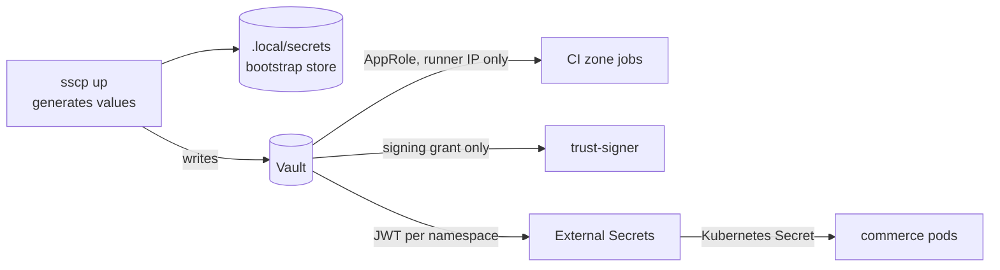
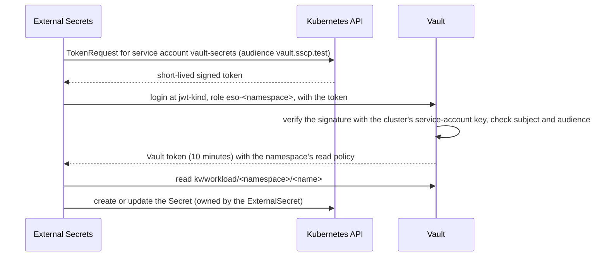

# Secret management

A **secret** is any value that grants access, such as a password, a token, a private key or
a connection string with credentials in it. This document explains where every secret in
the platform comes from, where it is stored, who can read it and how it reaches the program
that uses it.

The rules in short:

- **Nothing secret is committed** to any of the three repositories. Repository files hold
  only the *structure*: users, roles, clients and paths.
- **Vault is the single runtime source.** Running components read their secrets from
  HashiCorp Vault, each with an identity that can read only its own paths.
- **In the cluster, only External Secrets writes Secrets.** Every Kubernetes Secret in the
  application namespaces is a copy of a Vault value made by External Secrets Operator (ESO).
  An admission policy refuses any other writer.
- **Bootstrap material stays on the workstation.** It lives in the git-ignored `.local/`
  directory, and no container mounts it.



## Kinds of secrets and where they live

| Secret | Created by | Stored in | Read by |
|---|---|---|---|
| Vault unseal key shares (3, any 2 unseal) | `sscp up` (Vault initialisation) | `.local/secrets/vault-init.json` only | the automation, to unseal Vault after a restart |
| Vault root token | Vault initialisation | used once to create the bootstrap token, then **revoked** | nobody |
| Vault bootstrap token (`sscp-bootstrap` policy, which **denies** `transit/sign/*`) | `sscp up` | `.local/secrets/bootstrap.json` | the automation only |
| Administrator and bootstrap credentials: Gitea users and admin, Keycloak admin and personas, Harbor admin, database owners, MinIO root | `sscp up` | `.local/secrets/bootstrap.json` | the automation only |
| CI zone identities: AppRole `role_id` and `secret_id` | `sscp up --with ci` | Vault. The `secret_id` is also in the zone runner's configuration under `.local/generated/runners/` | that zone's jobs, only from the runner's address |
| CI zone secrets: Control Plane client secret, Gitea read token, Harbor robot, SonarQube token, test persona passwords | `sscp up --with ci` | Vault `kv/ci/<zone>/*` | that zone's jobs |
| Release signing key | `sscp up` | Vault Transit key `cosign-commerce`, **not exportable** | only through a signing grant ([release-signing.md](release-signing.md#who-can-sign)) |
| Promotion robot and GitOps bot token | `sscp up --with ci` | Vault `kv/ci/trust-signer/*` | only through a signing grant |
| Control Plane runtime secrets: database password of its runtime role, evidence-bucket key, Gitea token, webhook secret, its own Vault AppRole, the Argo CD notification token | `sscp up` | the Control Plane container's environment, set by Docker Compose from the git-ignored `.local/generated/compose.env` | the Control Plane |
| Workload runtime secrets: database roles, broker, cache, object storage, event-signing keys, Keycloak admin client secret | `sscp up --with cluster` | Vault `kv/workload/commerce/*` and `kv/workload/commerce-data/*` | pods, through ESO |
| Cluster add-on secrets: Argo CD repository token, notification token, registry pull robot | `sscp up --with ci,cluster` | Vault `kv/platform/cluster/*` | Argo CD and Kyverno, through ESO |
| Observability secrets: Grafana admin password, Gitea metrics token | `sscp up --with ci,cluster` | Vault `kv/platform/cluster/observability/*` | Grafana and Prometheus, through ESO |

Every generated value is kept in the local store, so re-running `sscp up` writes the **same**
values again instead of breaking running components. Vault is where running components read
them.

Vault writes every request to its **audit device** (`/vault/logs/audit.log` inside the Vault
container), with secret values hashed. Every login and every signing operation is therefore
recorded.

## CI zones

Each CI zone that needs secrets (security, build, trust) has a Vault **AppRole**, a
machine login made of a public `role_id` and a secret `secret_id`:

- the zone's runner passes both to its job containers as environment variables;
- the job's CI helper logs in to Vault, reads `kv/ci/<zone>/*` and keeps values in memory;
- Vault accepts the `secret_id` and the resulting token **only from the runner's fixed
  address** (`secret_id_bound_cidrs`, `token_bound_cidrs`).

The validation zone, which runs the application team's own workflow, has no Vault identity
at all. How the zones are separated is described in [trust-boundaries.md](trust-boundaries.md).

## From Vault into the cluster



1. **Vault trusts the cluster's signatures, not its network.** Vault's `jwt-kind` auth
   method is configured with the cluster's service-account public key, which the bootstrap
   reads from the node, and with the cluster's token issuer. Vault checks tokens offline. It
   needs no credentials for the cluster and no network path into it.
2. **One store and one identity per namespace.** Each namespace has one `SecretStore`
   named `vault` and one `vault-secrets` service account. Its Vault role matches only that
   exact account (`system:serviceaccount:<namespace>:vault-secrets`) and audience:

   | Namespace | Vault role | Readable paths |
   |---|---|---|
   | `commerce` | `eso-commerce` | `kv/workload/commerce/*`, `kv/platform/cluster/harbor-pull` |
   | `commerce-data` | `eso-commerce-data` | `kv/workload/commerce-data/*` |
   | `argocd` | `eso-argocd` | `kv/platform/cluster/argocd/*` |
   | `kyverno` | `eso-kyverno` | `kv/platform/cluster/harbor-pull` |
   | `observability` | `eso-observability` | `kv/platform/cluster/observability/*` |

3. **Who owns what.**
   - The `ExternalSecret`s for the workload are in the GitOps repository. They only
     *name* Vault paths.
   - The secret stores and service accounts are platform-owned, in
     `cluster/platform/`. A GitOps change therefore cannot point a store at other Vault
     roles.
4. **Only ESO writes.** The `restrict-secret-writers` policy refuses any create, update or
   delete of a Secret in the application namespaces by anyone except ESO. A GitOps change
   or a person with `kubectl` cannot introduce a secret there.
5. **Refresh.** Workload secrets are re-read every 5 minutes; platform add-on secrets every
   hour.
6. **Use.** Pods read their Secret as environment variables (`envFrom`), which the .NET
   configuration system binds directly. For example, `ConnectionStrings__orders` becomes
   `ConnectionStrings:orders`.

### Least privilege inside the workload

The workload's secrets are split by service, so no service holds another's credentials:

| Secret path | Holds |
|---|---|
| `kv/workload/commerce/commerce-api` | a separate database login for each of its eight modules; broker, Redis and MinIO credentials; its event-signing private key; the Keycloak admin client secret for role changes |
| `kv/workload/commerce/<worker>` | the worker's own database login and broker credentials; the document worker also has MinIO credentials and its event-signing key |
| `kv/workload/commerce/commerce-migrations` | the schema-owner login. Only the migrations Job has DDL rights (it can create and change tables); running services cannot |
| `kv/workload/commerce-data/*` | the data services' own administrator passwords and the database initialisation script that creates the roles |

The gateway has no secrets at all.

## Checking it

```bash
cd supply-chain-platform
uv run sscp verify cluster
```

This checks, among other things:

- a namespace's secret store cannot read another namespace's Vault paths;
- a hand-made Secret is refused;
- pods carry no service-account token.

`uv run sscp verify ci-isolation` checks that each zone reads only its own Vault paths, and
only from its own runner. `uv run sscp verify signing` checks the signing grant.

## Boundaries and limits

- **The namespace is the secret boundary.** Any `ExternalSecret` in `commerce` can read any
  path under `kv/workload/commerce/`, and any pod in `commerce` could reference any Secret
  there. Separation between services in the same namespace rests on reviewed GitOps changes.
- **Rotation is manual.** A new value in Vault reaches the Kubernetes Secret within five
  minutes. Running pods keep the old environment until they restart, however. PostgreSQL role
  passwords are set only when the database is first initialised.
- **Secrets as environment variables** are visible to anything that can read the process
  environment inside the container. Mounting them as files needs an application change. The
  trust policy records this as an accepted weakness (Checkov `CKV_K8S_35`,
  [trust-policy.md](trust-policy.md#checkov-downgrades)).
- **Bootstrap material is plaintext on the workstation.** `.local/secrets` is never mounted
  into containers or copied into repositories. Production would keep unseal keys in an
  offline or hardware-protected store, or use automatic unsealing.
- **Some bootstrap-time secrets are passed as container environment variables** by Docker
  Compose. Examples are the Control Plane's database password and the MinIO root user.
  Anyone with access to the workstation's Docker daemon can read them.

Production changes are listed in
[production-considerations.md](production-considerations.md).
