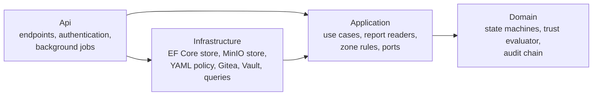

# Security Control Plane

The Security Control Plane is the .NET service at the centre of the platform. It decides
whether an artifact can be trusted. CI pipelines send it raw scanner reports; it stores
them write-once, parses them itself, ties them to the exact commit and image digest, applies
the trust policy, and records every step in a tamper-evident audit log. Signing and
promotion can happen only after it has recorded a positive decision — and it never signs
anything itself.

This document covers what the service does, who may call it, its API, its storage and how
it behaves when things fail. The rules it applies are in [trust-policy.md](trust-policy.md).

## Responsibilities

| Responsibility | How |
|---|---|
| Start security pipelines | Receives signed Gitea webhooks and dispatches the matching platform workflow |
| Collect evidence | Accepts raw reports only from the pipeline run it dispatched, from a zone allowed to submit that kind |
| Judge artifacts | Applies the trust policy per image digest: `PASS`, `PASS_WITH_EXCEPTION` or `FAIL` |
| Report results | Sets the commit statuses developers see (`sscp/source-security`, `sscp/trust-decision`, `sscp/release`, `sscp/deployment-security`) |
| Authorise signing | Issues single-use signing grants for approved releases and supplies the attestation content |
| Confirm deployment | Checks Argo CD's reports against the GitOps revision and its own records |
| Manage accepted risk | Risk exceptions with distinct requester and approver, always expiring |
| Keep history | Hash-chained audit log; the service cannot delete or rewrite its own history |

## Where it runs

| Item | Value |
|---|---|
| Source | `supply-chain-platform/src/Sscp.ControlPlane.*` (.NET 10) |
| Image | `sscp/controlplane:local`, built by `sscp up` from `platform/controlplane/Dockerfile`; the trust policy files are copied in |
| Container | Compose service `controlplane`: read-only root file system, all Linux capabilities dropped, `no-new-privileges`, non-root user, 512 MiB memory limit |
| API | HTTPS on port 8443 inside the network: `https://controlplane.sscp.test:8443` from `sscp-edge`, `https://localhost:7443` from the host |
| Management | plain HTTP on port 9464, only inside the Docker networks: `/health/live`, `/health/ready`, `/metrics` |
| Networks | `sscp-edge` (fixed address 172.30.0.14, where CI runners call it) and the internal `sscp-data` (PostgreSQL, MinIO) |
| Database | PostgreSQL database `controlplane`, schema `trust`, runtime role `controlplane_app` |
| Evidence store | MinIO bucket `evidence` with object lock |
| Identity provider | Keycloak realm `platform` |
| Pipeline platform | Gitea Actions, as the `sscp-controlplane` account (dispatch in the platform repository, statuses on the application and GitOps repositories) |
| Vault | AppRole `controlplane`, accepted only from 172.30.0.14; can only mint `secret_id`s for the `trust-signer` role |

The management port serves nothing but health and metrics, and the API port serves neither.
Unauthenticated endpoints therefore never share a listener with the API, and bearer tokens
never travel over plain HTTP.

## Internal structure



- **Domain** holds rules that depend on nothing else: the artifact, build and release
  state machines, risk exceptions, the pure `TrustEvaluator` and the audit hash chain.
- **Application** holds the use cases (submit evidence, evaluate, manage releases and
  exceptions, orchestrate pipelines), the scanner report readers and the rules about which
  CI zone may do what. It talks to the outside world only through ports
  (`IControlPlaneStore`, `IEvidenceStore`, `IPolicyProvider`, `IApplicationCatalog`,
  `IPipelinePlatform`, `IDesiredStateReader`, `ISigningGrantIssuer`).
- **Infrastructure** implements those ports with PostgreSQL (EF Core), MinIO (S3 API),
  YAML policy files, Gitea and Vault, and provides read-only queries for the traceability
  views.
- **Api** is the host: HTTP endpoints, token validation, background jobs, health and
  metrics.

The dependency direction is enforced by `tests/Sscp.ControlPlane.ArchitectureTests`.

## Who can call it

Every token must come from the Keycloak `platform` realm, be signed with RS256 and carry
the `controlplane-api` audience. A request without a valid token gets `401`.

| Caller | Token | Treated as |
|---|---|---|
| Security zone pipelines | client credentials of `ci-security-zone` | zone `Security` |
| Build zone pipelines | client credentials of `ci-build-zone` | zone `Build` |
| Trust zone pipelines | client credentials of `ci-trust-zone` | zone `Trust` |
| People | password grant through the public `sscp-cli` client | a person with roles `platform-viewer`, `risk-owner`, `security-approver` and/or `platform-admin` |

A token counts as a zone only if it carries exactly one zone role **and** was issued to the
client of the same name. A person's account given a zone role by mistake is still just a
person, and a zone token is never treated as a person — so pipelines cannot approve
exceptions or read the traceability views. (The realm also defines a `cluster-reporter`
client; no component currently uses it.)

### Run binding

A valid zone token is not enough. Every pipeline call names the Gitea Actions run it comes
from, and the Control Plane accepts it only if that run is the one it dispatched for the
build or release. Evidence from any other run is refused with
`403 build.run.not-dispatched`, even from the right zone.

### What each zone may do

| Action | Security | Build | Trust |
|---|---|---|---|
| Register a candidate artifact | | ✔ | |
| Submit SBOM evidence | | ✔ | |
| Submit secret, static-analysis, quality, IaC, Dockerfile, deployment-config, vulnerability, DAST and security-test evidence | ✔ | | |
| Ask for a build or pull-request evaluation; complete a build | ✔ (bound run) | ✔ (bound run) | ✔ (bound run) |
| Evaluate a release; receive a signing grant and attestation material; record signatures, promotions and the GitOps commit | | | ✔ (bound run) |

In particular, the build zone cannot upload a "clean" vulnerability scan for the image it
built itself.

## Starting pipelines

| Gitea event | Control Plane action |
|---|---|
| Pull request against `commerce-app` `main` opened, updated or reopened | creates a pull-request build for the head commit, dispatches `pr-pipeline`, sets `sscp/source-security` to pending |
| Push to `commerce-app` `main` | creates a main build, dispatches `main-pipeline`, sets `sscp/trust-decision` to pending |
| `v*` tag pushed on `commerce-app` | requests a release for the tagged commit (refused, with a failed `sscp/release` status, if the commit has no successful main build) and dispatches `release-pipeline` |
| Pull request against `commerce-gitops` `main` | creates a deployment-change build, dispatches `deployment-pipeline`, sets `sscp/deployment-security` to pending |

Webhooks are authenticated by an HMAC-SHA256 signature over the body with a secret shared
only by Gitea and the Control Plane; anything else is refused (`401`) and logged as a
security event. Dispatch uses Gitea's `return_run_details` option so the new run's id is
bound before any job starts. Handling is idempotent: a re-delivered webhook for a commit or
tag that already has a build or release starts nothing.

After each decision the Control Plane sets the matching commit status itself — `success`
for `PASS` and `PASS_WITH_EXCEPTION`, `failure` for `FAIL` — and pipelines cannot set
these statuses.

## API

All paths are relative to `https://localhost:7443` (host) or
`https://controlplane.sscp.test:8443` (inside `sscp-edge`). Errors are RFC 9457 problem
responses with a stable `code`, for example `evidence.zone.not-allowed`,
`evidence.report.invalid` or `release.not-approved`, so a pipeline can report exactly why a
step was refused.

### Unauthenticated by token (other authentication)

| Method and path | Authentication | Purpose |
|---|---|---|
| `POST /api/webhooks/gitea` | HMAC-SHA256 signature of the body | Gitea events |
| `POST /api/deployments/argocd` | shared bearer token delivered from Vault to Argo CD | deployment reports: application, revision, sync and health status ([gitops-and-admission.md](gitops-and-admission.md#how-a-release-reaches-the-cluster)) |

### Pipeline endpoints (zone tokens, bound run id in every request)

| Method and path | Purpose |
|---|---|
| `GET /api/builds/{id}/plan` | the deployables to build (the platform's list, not the repository's) and the candidates registered so far |
| `POST /api/builds/{id}/artifacts` | register a candidate image `repository@sha256:…` for a deployable |
| `POST /api/builds/{id}/evidence` | upload a raw report (`multipart/form-data`: `report` file plus `runId`, `kind`, `execution`, `commit`, optional `deployable`, `digest`, `executionError`, `metadata` JSON) |
| `POST /api/builds/{id}/evaluation` | evaluate every artifact of a main build; one decision per artifact |
| `POST /api/builds/{id}/source-evaluation` | pull-request gate on source evidence |
| `POST /api/builds/{id}/completion` | mark the build succeeded or failed |
| `GET /api/releases/{id}/plan` | the release's images (by digest) and the trusted repository they go to |
| `POST /api/releases/{id}/evaluation` | re-evaluate all artifacts of a release immediately before signing |
| `POST /api/releases/{id}/signing-grant` | trust zone, approved release only: a single-use, response-wrapped Vault `secret_id` (`Cache-Control: no-store`) |
| `GET /api/releases/{id}/artifacts/{artifactId}/attestations?runId=` | the provenance, trust-decision and SBOM predicates to sign for one image |
| `POST /api/releases/{id}/signatures` | record one artifact's Cosign signature |
| `POST /api/releases/{id}/promotions` | record one artifact's copy to the trusted repository |
| `POST /api/releases/{id}/gitops` | record the GitOps commit that deploys the release |
| `POST /api/releases/{id}/failure` | mark the release failed |

### People endpoints

| Method and path | Role | Purpose |
|---|---|---|
| `GET /api/builds?application=&limit=` | any platform role | recent builds |
| `GET /api/builds/{id}` | any platform role | a build with its artifacts and evidence summaries |
| `GET /api/artifacts/{digest}/trace` | any platform role | commit → build → evidence → decisions → signatures → promotions → releases → deployments for one digest |
| `GET /api/releases/{id}` | any platform role | release state |
| `GET /api/evidence/{id}/report` | any platform role | the raw report, returned only if it still matches its recorded SHA-256 |
| `GET /api/audit?subjectType=&subjectId=&limit=` | any platform role | audit entries |
| `GET /api/audit/verification` | any platform role | recompute the whole audit hash chain |
| `GET /api/policy` | any platform role | the active policy and its version |
| `GET /api/exceptions?application=&status=` | any platform role | risk exceptions |
| `POST /api/exceptions` | risk-owner | request an exception for one finding |
| `POST /api/exceptions/{id}/approval`, `/rejection`, `/revocation` | security-approver | decide or revoke; nobody can approve their own request |
| `POST /api/builds/{id}/retry` | platform-admin | re-run a finished build's pipeline as a new build (the old one stays on record) |

Example — the active policy, as `victor`, from `supply-chain-platform/`:

```bash
TOKEN=$(uv run python -c "from sscp.services import controlplane; print(controlplane.user_token('victor'))")
curl -s --cacert ../.local/pki/ca.crt --ssl-no-revoke -H "Authorization: Bearer $TOKEN" https://localhost:7443/api/policy
```

Risk exceptions have their own guide with worked examples:
[risk-exceptions.md](risk-exceptions.md).

## Evidence ingestion

Every submission is checked before anything is stored: the zone may submit that kind, the
run is the dispatched one, the commit and digest belong to the build, and the report
parses and names the same digest. Accepted reports go to MinIO write-once and get a record
with the SHA-256 the Control Plane computed itself, normalised findings and an audit entry.
Refusals are audited too (`evidence.rejected`) and counted in
`sscp_evidence_rejected_total`. The full sequence and the list of refusals are in
[security-scanning.md](security-scanning.md#from-raw-report-to-decision).

## Persistence

EF Core maps the domain to the `trust` schema:

| Kind | Tables |
|---|---|
| Records with a lifecycle | `builds`, `artifacts`, `releases`, `risk_exceptions` |
| History (append-only) | `evidence`, `findings`, `trust_decisions`, `signatures`, `promotions`, `deployments`, `audit_log` |

Optimistic concurrency on lifecycle records turns two simultaneous changes to the same
artifact into a `409 concurrency.conflict` instead of a lost update.

Migrations run with the database **owner** role in a one-off container during `sscp up`.
The same step grants the long-running **runtime** role `controlplane_app`:

- `SELECT, INSERT, UPDATE` on lifecycle tables;
- `SELECT, INSERT` on history tables;
- no `DELETE` or `TRUNCATE` anywhere.

The migrator refuses to finish if a table exists in neither list, so a new table cannot
silently get the wrong privileges. The running container only ever holds the runtime
role's password.

## Evidence storage

Raw reports go to the MinIO bucket `evidence`, which has object locking with a default
GOVERNANCE retention of 30 days. The Control Plane's MinIO user may put, get and list, but
not delete. The report's SHA-256 is checked again:

- at every evaluation — a report whose stored bytes no longer match makes the decision
  `FAIL` with rule `integrity.<Kind>`;
- on every download through the API — a mismatch returns `409 evidence.integrity`.

## Audit log

Every state change and every refusal writes an entry to `trust.audit_log`. Each entry
stores the hash of the previous entry and its own SHA-256 over a canonical text form
(timestamp at microsecond precision, actor, action, subject, details, correlation id).
Entries queued during a request are written in the same transaction as the change they
describe, under a PostgreSQL advisory lock, so concurrent requests still produce one
unbroken chain. `GET /api/audit/verification` recomputes the chain and reports the first
entry that does not match.

The runtime role cannot update or delete audit entries at all; the chain additionally
exposes changes made with higher database privileges.

## Background jobs

| Job | Interval | What it does |
|---|---|---|
| Exception expiry | 60 s | marks approved or pending exceptions past their end date as `Expired` and audits it; the evaluator already stops applying them at that moment because it checks the clock itself |
| State gauges | 30 s | refreshes the counts behind the `sscp_artifacts`, `sscp_exceptions` and `sscp_exceptions_expiring_7d` metrics |
| Run watcher | 30 s | fails builds and releases whose pipeline run ended (crash, cancellation, timeout) without finishing them, and sets their commit status to `failure` |

All three log failures and retry on the next tick; a database outage does not stop the
service.

## Metrics

Exported in Prometheus format on the management port and scraped by Prometheus in the
cluster:

| Metric | Meaning |
|---|---|
| `sscp_evidence_ingested_total{kind,execution}` | accepted evidence |
| `sscp_evidence_rejected_total{reason}` | refused submissions |
| `sscp_scanner_failures_total{kind}` | scanners that did not complete |
| `sscp_findings_total{kind,severity}` | normalised findings ingested |
| `sscp_trust_decisions_total{outcome,scope}` | decisions (`source`, `build`, `release`) |
| `sscp_signatures_total`, `sscp_promotions_total` | recorded signatures and promotions |
| `sscp_exception_events_total{status}` | exception requests, approvals, expiries, … |
| `sscp_builds_completed_total{kind,status}` | pipelines that finished (`succeeded`: a decision was reached; `failed`: the pipeline broke) |
| `sscp_build_duration_seconds{kind,status}` | histogram: time from build request to completion |
| `sscp_deployments_total{result}` | deployment reports: `deployed`, `alreadydeployed`, `unmatched`, `mismatch` |
| `sscp_artifacts{state}`, `sscp_exceptions{status}`, `sscp_exceptions_expiring_7d` | current state |

Every counter series with a fixed set of label values is published at 0 when the service
starts. Prometheus computes increases from the difference between samples, so a series
that first appeared with its first event would hide that event from alerts and dashboards.
Standard ASP.NET Core and .NET runtime metrics are exported as well. See
[observability.md](observability.md).

## Failure behaviour

| Situation | Behaviour |
|---|---|
| PostgreSQL or MinIO unavailable | `/health/ready` reports unhealthy; requests fail with `500`; nothing is half-written, because each use case commits in one transaction |
| Keycloak unavailable | callers cannot obtain new tokens; the service keeps validating existing tokens with the signing keys it has cached until they expire (5 minutes) |
| Two pipeline steps change the same artifact at once | the later one gets `409 concurrency.conflict`, nothing is stored, and the CI helper sends it again (up to five attempts) |
| Stored report modified after ingestion | evaluation fails with `integrity.<Kind>`; download returns `409 evidence.integrity` |
| Vault unavailable or refusing | signing grants fail with `503 signing.unavailable`; the release pipeline stops before anything is signed and the release is marked failed |
| The service itself is down | no webhook is processed and no decision is made, so nothing can become trusted; the required statuses are never set, so merges stay blocked (fail closed). Events missed during the outage are not replayed: push a new commit, or re-send the push event with `sscp repo build` |
| Container restart | comes back healthy; state and the audit chain are in PostgreSQL |

See [failure-and-recovery.md](failure-and-recovery.md) for how these are proven.

## Tests

| Suite | Covers |
|---|---|
| `tests/Sscp.ControlPlane.UnitTests` (85) | trust evaluator rules, SLA, exceptions, state machines, every report reader against recorded tool output, metrics initialisation |
| `tests/Sscp.ControlPlane.ArchitectureTests` (3) | layer dependencies |
| `tests/Sscp.ControlPlane.IntegrationTests` (9) | runtime-role privileges, audit chain under concurrency, tamper detection — real PostgreSQL |
| `tests/Sscp.ControlPlane.ComponentTests` (29) | the API with real PostgreSQL and MinIO: zone boundaries, run binding, digest binding, `PASS` / `FAIL` / `PASS_WITH_EXCEPTION` flows, expired exception at release, tampered evidence, webhook signatures, dispatch and statuses, run watcher, retry, signing grants and attestation material, GitOps pull requests, deployment reports |
| `sscp verify controlplane` | the deployed service: real Keycloak tokens, port separation, database role, container hardening, restart recovery |

```bash
cd supply-chain-platform
dotnet test
uv run sscp verify controlplane
```
