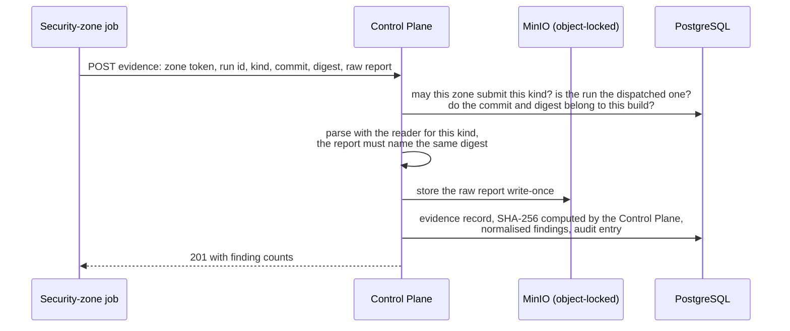

# Security scanning and evidence

This document explains which security tools run, what each one looks for, how it is run
so that it can be trusted, and how the Security Control Plane turns its raw report into a
decision. Which pipeline runs which scanner is in [ci-pipelines.md](ci-pipelines.md);
the rules that decide pass or fail are in [trust-policy.md](trust-policy.md).

## Scanners at a glance

| Evidence kind | Tool (version) | Looks for | Input | Describes | Zone | Required for |
|---|---|---|---|---|---|---|
| `SecretScan` | Gitleaks 8.30.1 | leaked credentials, keys and tokens | the source tree of one commit | the commit | security | pull requests, main builds, GitOps pull requests |
| `StaticAnalysis` | Semgrep 1.178.0 (platform rules only) | insecure code patterns in C# | the source tree | the commit | security | pull requests, main builds |
| `InfrastructureScan` | Checkov 3.3.19 | insecure Dockerfiles and Kubernetes/Kustomize files | the source tree | the commit | security | pull requests, main builds |
| `DockerfileLint` | Hadolint 2.15.1 | Dockerfile mistakes and bad practices | the `Dockerfile` | the commit | security | pull requests, main builds |
| `DeploymentConfigScan` | Checkov 3.3.19 (`kustomize`) | insecure rendered Kubernetes manifests | the GitOps overlays | the commit | security | GitOps pull requests |
| `CodeQuality` | SonarQube Community Build 26.9 | reliability, security and maintainability issues; duplication | a compiled analysis of the commit | the commit | security | main builds |
| `Sbom` | Syft 1.52.0 (CycloneDX) | the components inside an image | the pushed image, by digest | the image digest | build | main builds |
| `VulnerabilityScan` | Trivy 0.74.0 (**gating**) | known vulnerabilities in the image | the pushed image, by digest | the image digest | security | main builds |
| `SecondaryVulnerabilityScan` | Grype 0.119.0 (recorded, not gating) | a second opinion on vulnerabilities | the pushed image, by digest | the image digest | security | main builds |
| `SecurityTests` | the platform's authorization suite | broken access control and API-security rules | the running candidates | the commit | security | main builds |
| `DynamicScan` | OWASP ZAP 2.17.0 | vulnerabilities found by attacking the running API | the running candidates | the commit | security | main builds |

Every kind in the "Required for" column is **mandatory**: if it is missing, or its tool did
not complete, the decision fails. The dynamic tests are described in
[dynamic-security-testing.md](dynamic-security-testing.md).

Why two vulnerability scanners with only one gating: two gating scanners with different
databases produce contradictory results and double the exception work for little extra
assurance. Trivy decides; Grype must still run and complete, and its findings are kept as
evidence for comparison (design decision DD-09 in
[design-decisions.md](design-decisions.md)).

## How a scanner is run

Scanners read untrusted code, so they run in a deliberately small box. The CI helper
(`ci/sscp_ci/tools.py`):

1. copies the fetched commit into a **job-private Docker volume** (never the job's own
   working directory);
2. **deletes scanner configuration the repository ships** from that copy, so the code
   under review cannot tune its own scanner: `.gitleaks.toml`, `.gitleaksignore`,
   `.checkov.yaml`, `.checkov.yml`, `.hadolint.yaml`, `.hadolint.yml`, `.semgrepignore`,
   `.trivyignore`, `.trivyignore.yaml`;
3. starts the scanner as a sibling container on the zone's private daemon with
   **`--network none`**, all Linux capabilities dropped and `no-new-privileges`;
4. copies the report out and removes the volume.

Image scanners (Syft, Trivy, Grype) need the registry, so they run on a network but read
the image **from Harbor by digest** with the zone's read-only robot, never a locally built
copy. All scanner images come from the platform's mirror in Harbor, pinned by digest.

## Code authors cannot suppress findings

Each tool normally honours suppressions written into the code it scans. Here, none of them
count:

| Tool | Suppression mechanism | How it is neutralised |
|---|---|---|
| Gitleaks | `.gitleaks.toml`, `.gitleaksignore`, `gitleaks:allow` comments | files deleted; the platform's own configuration (`--config ci/rules/gitleaks/gitleaks.toml`); `--ignore-gitleaks-allow`; `--gitleaks-ignore-path` points at the platform rules |
| Semgrep | `// nosemgrep`, `.semgrepignore` | `--disable-nosem`; file deleted; only the platform rules in `ci/rules/semgrep` are used |
| Checkov | `.checkov.yaml`, inline `checkov:skip` | file deleted; Checkov runs without `--quiet` so skipped checks stay in the report, and the Control Plane **counts every skipped check as failed** |
| Hadolint | `.hadolint.yaml`, `# hadolint ignore=` | files deleted; `--disable-ignore-pragma` |
| Trivy | `.trivyignore` | files deleted |

The only ways to let a finding through are a **time-limited, separately approved risk
exception** ([risk-exceptions.md](risk-exceptions.md)) or a reviewed change to the
platform-owned rules or policy. When a pattern is safe by construction, the platform rules
recognise it explicitly — for example, SQL that must embed schema and role names is built
only by `PrivilegeStatements` from validated `SqlIdentifier` values, and the raw-SQL rule
accepts statements from there — and each such exception is covered by a rule test.

## The scanners in detail

### Gitleaks — leaked secrets

- Keeps every default Gitleaks rule and adds one narrow allowlist: lines that assign
  integration event type names in messaging configuration (for example
  `Messaging__TrustedPublishers__commerce-api-key__AllowedTypes__0: orders.order-placed.v1`),
  which otherwise look like tokens.
- Runs with `--redact`. The Control Plane **refuses unredacted reports**, so the evidence
  store never becomes a second copy of a leaked secret.
- Every finding is `Critical`, and leaked secrets can never be accepted as risk.

### Semgrep — static analysis

Only the platform's own rules (`ci/rules/semgrep/dotnet-security.yaml`) run, with
`--metrics off` and no rule downloads:

| Rule | Severity | Finds |
|---|---|---|
| `sscp.dotnet.raw-sql-from-non-constant` | High | SQL built from non-constant strings |
| `sscp.dotnet.insecure-deserialization` | High | deserialisers that can instantiate arbitrary types |
| `sscp.dotnet.tls-validation-disabled` | High | code that turns off certificate validation |
| `sscp.dotnet.token-validation-weakened` | High | JWT validation with issuer, audience, lifetime or signature checks disabled |
| `sscp.dotnet.weak-hash` | Medium | MD5 or SHA-1 |
| `sscp.dotnet.sensitive-data-logging` | Medium | EF Core sensitive data logging switched on |
| `sscp.dotnet.process-start-non-constant` | Medium | starting processes from non-constant input |
| `sscp.dotnet.anonymous-endpoint` | Low | endpoints that allow anonymous access (for review) |

SARIF levels map to severities as `error` → High, `warning` → Medium, `note` → Low.
The rules have their own tests: `ci/rules/semgrep/dotnet-security.cs` marks each line a
rule must or must not report. Run them with:

```bash
docker run --rm --network none -v "$PWD/supply-chain-platform/ci/rules/semgrep:/rules:ro" \
  semgrep/semgrep:1.178.0-nonroot semgrep --test --metrics off /rules
```

Semgrep's C# parser does not yet understand some recent syntax (for example primary
constructors on classes); it reports those regions as partially parsed and skips them.

### Checkov — infrastructure as code

- Source scan: frameworks `dockerfile`, `kubernetes` and `kustomize` over the whole commit.
- GitOps scan: framework `kustomize` over `overlays/` — Checkov renders each overlay with
  Kustomize and checks the result.
- `--skip-download` (no rule downloads).
- Checkov's free edition does not grade its checks, so every failed check counts as
  **High** unless the trust policy downgrades it with a written reason
  ([trust-policy.md](trust-policy.md#checkov-downgrades)).

### Hadolint — Dockerfile lint

JSON output, `--disable-ignore-pragma`, never fails the step itself. Levels map as
`error` → High, `warning` → Medium, `info` → Low.

### SonarQube — code quality

The `sonar-dotnet` image compiles the commit with the SonarQube analysis attached and
sends it to `http://sonarqube.sscp.test:9000` with an analysis-only token. The helper waits
for SonarQube to process it and submits the quality gate status. The platform gate `sscp`
checks **new code**: security, reliability and maintainability ratings must be A and
duplication at most 3 %. Coverage is not part of the gate, because this step compiles but
does not run the tests. The Community Build analyses `main` only (it has no pull-request
analysis), so pull requests rely on Semgrep for fast static feedback.

### Syft — SBOM

Syft reads the pushed image from the registry by digest and writes CycloneDX JSON. The
Control Plane accepts it only if its top-level component is that digest and it lists
components. The SBOM later becomes a signed attestation on the trusted image.

### Trivy and Grype — vulnerabilities

| | Trivy (gating) | Grype (secondary) |
|---|---|---|
| Database | `platform-tools/trivy-db:2`, downloaded once per job into the cache volume `sscp-trivy-cache` | `platform-tools/grype-db:v6`, pulled with ORAS and imported into `sscp-grype-cache` |
| Mode | `trivy image --image-src remote --scanners vuln`, with `--skip-db-update --offline-scan` | `grype registry:<image>@<digest>`, `GRYPE_DB_AUTO_UPDATE=false` |
| Judged by | the vulnerability SLA ([trust-policy.md](trust-policy.md#vulnerability-sla)) | completion only |

Scanners have no internet access to vulnerability feeds: they use the copies the platform
mirrors into Harbor (`sscp tools refresh-db`). Trivy's database version and build time are
sent with the evidence, and the Control Plane refuses vulnerability evidence from a
database **older than seven days** — a forgotten refresh blocks releases instead of
quietly weakening them. See [artifact-registry.md](artifact-registry.md#vulnerability-data).

## From raw report to decision



What the Control Plane checks on every submission:

| Check | Refusal |
|---|---|
| the calling zone may submit this kind (the build zone cannot submit a "clean" vulnerability scan of its own image) | `403 evidence.zone.not-allowed` |
| the run is the one dispatched for this build | `403 build.run.not-dispatched` |
| the commit is the build's commit | `400 evidence.commit.mismatch` |
| the digest is an artifact of this build (image evidence) | `400 evidence.digest.unknown` |
| the report parses and names the submitted digest (image evidence) | `400 evidence.report.invalid` |
| a completed scan includes its report | `400 evidence.report.empty` |

Each reader normalises the tool's findings into one shape — severity, rule, location,
package, installed and fixed version — and gives each a stable **fingerprint** (for
example `CVE-2018-1285|pkg:nuget/log4net@2.0.9` for Trivy, or
`gitleaks|<rule>|<file>|<line>`), so a finding can be followed across builds and matched
by an exception. The Control Plane computes the report's SHA-256 itself and re-checks it
at every evaluation: a report changed in storage after ingestion makes the decision fail
with `integrity.<Kind>`.

## When a scanner fails

A scanner that crashes, times out or cannot reach its database still submits evidence,
marked `execution=Failed` with the error. The decision then fails with
`evidence.<Kind>: <Kind> scanner did not complete: <error>`, naming exactly the control
that did not run. A missing report fails the same way. This is counted in
`sscp_scanner_failures_total` and raises the `ScannerDidNotComplete` alert
([observability.md](observability.md)). A failed scanner is **never** evidence of safety.
