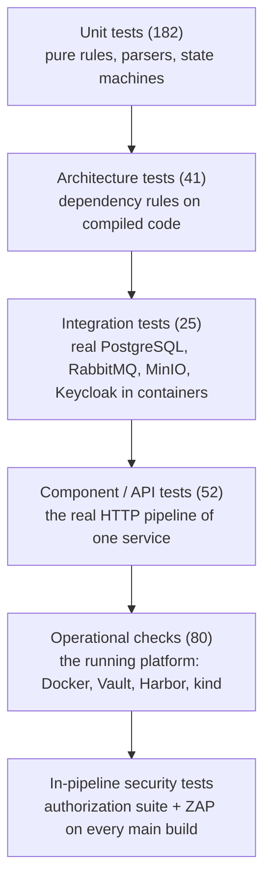

# Testing strategy

This document explains how the platform and its workload are tested:

- which layers of tests exist;
- what each layer protects;
- why each behaviour is tested at the layer it is;
- how to run every suite.

The guiding rule is to test each important behaviour at the **cheapest layer that can prove
it reliably**, and not to repeat the same proof at several layers. The count of tests is not
a goal. Each test exists because it protects a behaviour, a contract or a failure mode that
matters.

## The layers at a glance



| Layer | Count | Runs against | Speed |
|---|---|---|---|
| Unit | 182 (85 Control Plane, 81 commerce, 16 Python) | nothing external | seconds |
| Architecture | 41 (3 Control Plane, 38 commerce) | compiled assemblies | seconds |
| Integration | 25 (9 Control Plane, 16 commerce) | disposable containers started by Testcontainers | a minute or two |
| Component / API | 52 (29 Control Plane, 15 commerce API, 8 gateway) | one service in memory, with real databases in containers | a few minutes |
| Operational | 80 checks in 8 suites | the running platform | minutes; `recovery` restarts services |
| In-pipeline | 25 authorization checks + a ZAP scan per main build | the build's own candidate images | part of every main build |

There is **no separate end-to-end test suite**. The real end-to-end flow is the platform
itself: a pull request, a main build, a release tag and a deployment. The operational suites
then check the result that flow produced. They check that the released image is signed and
admitted, and that its digest traces back to its commit and evidence. Scripting a second
copy of that flow would be slow, and it would test nothing the real flow does not already
prove.

## Where each behaviour is tested, and why there

### Unit tests

Unit tests cover logic that has no infrastructure: rules, calculations, parsers and state
machines. They are fast and exact, so they carry most of the detailed cases.

| Project | Protects |
|---|---|
| `supply-chain-platform/tests/Sscp.ControlPlane.UnitTests` (85) | every trust-policy rule and the vulnerability SLA; exceptions (applied, expired, wrong deployable); artifact, release and exception state machines; **every report reader against real, recorded tool output** in `Fixtures/` (Gitleaks, Semgrep, Checkov, Hadolint, SonarQube, Syft, Trivy, Grype, ZAP, the authorization suite); metric series initialisation |
| `commerce-app/tests/Commerce.UnitTests` (81) | domain rules and the order state machine; the permission table and masking; upload validation; the audit hash chain; envelope signing and every rejection reason; the publisher list |
| `supply-chain-platform/ci/tests` (12) | the CI helper: the Dockerfile base-image policy, Control Plane token renewal, the retry of `409 concurrency.conflict` |
| `supply-chain-platform/automation/tests/test_pins.py` (4) | the pinning-policy check behind `sscp doctor`: it reports tag-only images, an unpinned cluster node image and downloads without a SHA-256 |

**Why recorded tool output?** The Control Plane decides trust from scanner reports. A
reader tested against invented JSON could pass while failing on the real format. The
fixtures are real reports produced by the pinned tool versions, and their file names carry
the versions (for example `trivy-0.74.0-commerce-api.json`).

### Architecture tests

These check dependency rules on the compiled code with ArchUnitNET. Examples are "the domain
does not use EF Core" and "a module uses another module only through its contracts". Such
rules erode silently in code review, and a test catches the first violation.

| Project | Protects |
|---|---|
| `Sscp.ControlPlane.ArchitectureTests` (3) | Domain → Application → Infrastructure → Api layering |
| `Commerce.ArchitectureTests` (38) | module boundaries, layer rules inside each module, contracts free of implementation types, workers and gateway using modules only through contracts |

### Integration tests

Integration tests are for behaviour that depends on real infrastructure. They start
disposable containers with **Testcontainers**, so the tests run the same on every machine
that has Docker. Real PostgreSQL privileges, RabbitMQ delivery and Keycloak token validation
cannot be mocked faithfully.

| Project | Protects |
|---|---|
| `Sscp.ControlPlane.IntegrationTests` (9, PostgreSQL) | the runtime role cannot delete or rewrite history; the audit chain stays unbroken under concurrent writers; tampering is detected at the modified entry |
| `Commerce.IntegrationTests` (16: PostgreSQL, RabbitMQ, MinIO, Keycloak) | each runtime role sees only its own schema; outbox delivery exactly once, duplicate delivery applied once, tampered messages dead-lettered; object storage; real Keycloak tokens: audience, tampering, missing token |

### Component and API tests

A component test runs one service's real HTTP pipeline in memory (ASP.NET Core's
`WebApplicationFactory`) against real databases in containers. External systems the service
*calls*, such as Gitea, Vault and the Keycloak admin API, are replaced by recording fakes.
The tests can then assert exactly what the service asked for.

| Project | Protects |
|---|---|
| `Sscp.ControlPlane.ComponentTests` (29, PostgreSQL + MinIO) | zone boundaries and run binding; digest binding; `PASS`, `FAIL` and `PASS_WITH_EXCEPTION` flows end to end through the API; exception expiry at release; tampered evidence; webhook signatures; dispatch and commit statuses; the run watcher; retries; signing grants and attestation material; GitOps pull requests; deployment reports |
| `Commerce.ComponentTests` (15, PostgreSQL + RabbitMQ + Redis) | authentication and deny-by-default; record-level rules; separation of duties; masking; role changes; security events |
| `Commerce.Gateway.ComponentTests` (8) | the gateway's anonymous allow-list, rate limits, body-size limits and forwarded-header handling |

These tests are fewer than unit tests on purpose. They prove that the pieces are wired
together correctly. The detailed rule cases are already covered below them.

### Operational checks

Much of the platform's security is configuration of real systems: Vault policies, Harbor
robots, runner registration, admission policies, network policies. A unit test of a YAML
file would prove little. Operational checks observe the **running** platform and attempt the
forbidden action for real. Examples:

- log in with a zone's credentials from another container;
- push an unsigned image into the trusted project;
- open a connection the network policies should block.

| Suite | Checks | Examples |
|---|---|---|
| `foundation` | 18 | TLS from the local CA; published ports bound to loopback only; data network unreachable from the edge; Vault root token revoked; the bootstrap token cannot sign; evidence cannot be deleted |
| `controlplane` | 8 | real Keycloak tokens; people cannot call pipeline endpoints; metrics only on the internal port; restricted database role; read-only, non-root container; restart with an intact audit chain |
| `ci-isolation` | 7 | runner scopes; an application workflow cannot reach a platform runner; validation jobs have no Docker socket or credentials; zone identities useless away from their runner; unsigned webhooks refused |
| `registry` | 4 | robot permissions; private candidates; fresh vulnerability databases |
| `signing` | 6 | non-exportable key; single-use grant only on the trust runner; released images verify; unsigned images do not; release tags immutable |
| `cluster` | 28 | signed release admitted; unsigned, candidate and by-tag images refused; insecure pods, missing limits, new exposure, hand-made Secrets and debug containers refused; network paths; workload identities; per-namespace Vault access; no CI access to the cluster API; traceability from digest to cluster |
| `observability` | 7 | every metrics source scraped; alert rules loaded; security events and logs carry the release identity; admission refusals counted; running images scanned; dashboards served |
| `recovery` | 2 | Control Plane and Vault outages fail closed and recover |

`cluster`, `signing` and `observability` need a deployed release.

### In-pipeline security tests

Every main build runs the platform's authorization suite (25 checks) and an authenticated
ZAP scan against the build's own candidate images
([dynamic-security-testing.md](dynamic-security-testing.md)). They test the *built images*
rather than the source, so they catch problems that only exist in the packaged application.
Their results are evidence: a failure blocks trust for that build.

## What is deliberately not tested

| Not tested | Why |
|---|---|
| Kubernetes and Compose YAML files as text | the real platform validates them better. Operational checks exercise the result |
| Third-party tools' own correctness (Trivy finding the right CVEs, Kyverno's CEL engine) | outside the platform's control. The platform tests how it *uses* their output |
| Getters, DTOs, simple mappings | no behaviour worth protecting |
| Harbor and Argo CD outages | restarting them repeatedly is too heavy for one workstation. The recovery procedure is documented instead ([failure-and-recovery.md](failure-and-recovery.md)) |

## Running the tests

The prerequisites are in [setup-guide.md](setup-guide.md). Integration and component tests
need a running Docker daemon, but not the platform.

**The .NET suites must run from inside their repository directory.** Each repository's
`global.json` selects the Microsoft Testing Platform test runner, and `dotnet test` only
reads it from the current directory.

```bash
cd supply-chain-platform
dotnet test
```

```bash
cd commerce-app
dotnet test
```

One project at a time, for example only the fast unit tests:

```bash
cd supply-chain-platform
dotnet test --project tests/Sscp.ControlPlane.UnitTests
```

Python unit tests (the CI helper and the automation), from `supply-chain-platform/`:

```bash
uv run pytest
```

Operational checks, from `supply-chain-platform/`, against the running platform:

```bash
uv run sscp verify                          # every suite
uv run sscp verify foundation controlplane  # chosen suites
```

Run the operational suites while no pipeline is running. On a slow disk, a running build can
make timing-sensitive checks fail ([troubleshooting.md](troubleshooting.md)).

## Where tests run automatically

| Where | What runs |
|---|---|
| `commerce-app` validation workflow (validation runner, every pull request) | restore in locked mode, build, commerce unit and architecture tests |
| Platform source pipeline (security runner, every pull request) | Gitleaks, Semgrep, Checkov, Hadolint |
| Platform main pipeline (every merge to `main`) | the scanners above, SonarQube, image build, Syft, Trivy, Grype, the authorization suite, ZAP |
| On the workstation | the full .NET and Python suites and the operational checks |

The commerce integration and component tests need Docker, and the validation runner gives
jobs no Docker socket ([trust-boundaries.md](trust-boundaries.md)). They therefore run on
the workstation, not in the validation workflow.
