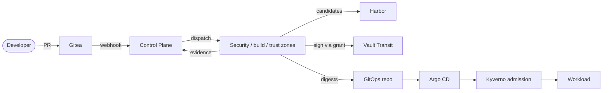

# Threat model

A **threat model** is a structured list of the ways an attacker could harm a system, and the
controls that stop each one. This one covers the **software factory**: everything between a
developer's change and a running workload. The factory includes source control, CI, the
registry, signing, GitOps and the cluster.

The method is **STRIDE**, which sorts threats into six kinds:

| Letter | Threat kind | Example here |
|---|---|---|
| **S** | Spoofing (pretending to be someone else) | a job claiming to be the trust zone |
| **T** | Tampering (changing data or code) | editing a scan report after upload |
| **R** | Repudiation (denying an action) | a signature with no record of who authorised it |
| **I** | Information disclosure | stealing the signing key |
| **D** | Denial of service | a scanner that is down being skipped |
| **E** | Elevation of privilege | a pull request reaching deployment credentials |

Every threat is numbered `T-xx` and every control `C-xx`. Each control answers at least one
threat, and each attack scenario is backed by an automated test that reproduces the attack
and asserts that it is blocked. How the zones and networks are separated is described in
[trust-boundaries.md](trust-boundaries.md).

## Assets

| Asset | Why it matters |
|---|---|
| Signing key (Vault Transit `cosign-commerce`) | anyone who can sign can make the cluster run their image |
| Trusted registry project (`commerce-trusted`) | the cluster admits commerce images only from here |
| GitOps repository `main` | defines what Argo CD deploys |
| Security evidence and trust decisions | decide whether an artifact may be signed |
| Risk exceptions | let known risk through the gate |
| Runtime secrets | database, broker, object storage and event-signing keys of the workload |
| Audit trails | needed to reconstruct who changed what, and when |

## Adversaries considered

| Adversary | Capability assumed |
|---|---|
| Malicious or compromised developer | write access to feature branches of `commerce-app`; can open pull requests containing any code **and any workflow file** |
| Compromised dependency | a NuGet package, base image or scanner image that behaves maliciously |
| Compromised CI job | arbitrary code execution inside a job container on one runner |
| Registry attacker | stolen registry credentials or direct registry access; can push or re-tag images |
| GitOps attacker | able to get a commit into the GitOps repository |
| Cluster attacker | able to submit workloads to the cluster, or run code in one pod |

**Out of scope:** a compromised workstation administrator, physical access, and supply-chain
attacks against Docker Desktop itself. These are listed as residual risks below.

Every arrow in this picture crosses a trust boundary, and every boundary has at least one
control in the catalogue below.

## Threats by component

| ID | Component | STRIDE | Threat | Controls |
|---|---|---|---|---|
| T-01 | Gitea repository | T | unreviewed code reaches `main` | C-01, C-02 |
| T-02 | Gitea repository | S, R | someone creates a release tag they are not entitled to | C-03, C-30 |
| T-03 | Pull requests | E | a malicious pull request runs code that reaches signing, registry-write or cluster credentials | C-04, C-05, C-06 |
| T-04 | Workflow definitions | T | a pull request edits a workflow to skip or fake security scans | C-04, C-07 |
| T-05 | CI runners | E | a job escapes to the host Docker daemon or another zone | C-06, C-08, C-44 |
| T-06 | CI runners | I | a zone credential is stolen and used elsewhere | C-09, C-10 |
| T-07 | Build cache | T | a cache poisoned by an untrusted job affects a release build | C-08, C-11 |
| T-08 | Dependencies | T | a malicious or substituted NuGet package or base image | C-11, C-12, C-13, C-45 |
| T-09 | BuildKit | T | a build uses unexpected inputs or build arguments | C-12, C-14, C-45 |
| T-10 | Harbor | T, S | an image is pushed or re-tagged to look legitimate | C-15, C-16, C-17, C-25, C-50 |
| T-11 | Harbor | E | the build zone writes directly into the trusted project | C-15 |
| T-12 | Evidence | T | evidence forged, replayed from another artifact, or edited after upload | C-07, C-18, C-19, C-20, C-43, C-46, C-51 |
| T-13 | Evidence | D | a scanner is unavailable and the pipeline silently skips it | C-21, C-44, C-47, C-48 |
| T-14 | SBOM and provenance | T | the SBOM or provenance describes a different artifact | C-19, C-22, C-26, C-46, C-49, C-50 |
| T-15 | Signing identity, Vault | I, E | the signing key is stolen, or used by a job outside the trust zone | C-09, C-23, C-24 |
| T-16 | Signing identity, Vault | R | a signature is produced without a record of why | C-24, C-30, C-49 |
| T-17 | Control Plane | T, E | a trust decision is forced or bypassed | C-20, C-27, C-28 |
| T-18 | Risk exceptions | E | a permanent or self-approved suppression of a finding | C-29, C-43 |
| T-19 | GitOps repository | T | a commit points the cluster at an unapproved image | C-16, C-25, C-31, C-53, C-54 |
| T-20 | Argo CD | E | GitOps content creates cluster-wide resources or weakens policy | C-31, C-32, C-54 |
| T-21 | Kyverno | D, E | the admission webhook is unavailable and workloads are admitted unchecked | C-25, C-33 |
| T-22 | Kubernetes | E | a workload gains host access, privileges or API access | C-34, C-35, C-52 |
| T-23 | Kubernetes | I | lateral movement between workloads | C-36 |
| T-24 | Secrets | I | plaintext secrets committed, or created outside secret management | C-37, C-38, C-39, C-55 |
| T-25 | Integration events | S, T | a forged or tampered message on the broker | C-40, C-57 |
| T-26 | Audit trails | R, T | lifecycle events missing, or audit records altered | C-30, C-41 |
| T-27 | Running workload | I, R | a vulnerability published after approval, or an attack on the running release, goes unnoticed | C-56, C-57 |

## Attack scenarios and how they are stopped

Each scenario below is reproduced by an automated test that performs the attack, or feeds
the platform the attack's result, and asserts that it is blocked. Where tests are named:

- operational suites run with `uv run sscp verify <suite>`;
- `.NET` classes are in `supply-chain-platform/tests`;
- `commerce` classes are in `commerce-app/tests`.

See [testing-strategy.md](testing-strategy.md) for how to run them.

| Attack | Where it is stopped | Proven by |
|---|---|---|
| **Malicious pull request or workflow** | Platform runners accept jobs only from the platform repository (C-04). The application repository has no secrets (C-05). Validation jobs get no Docker socket and no credentials (C-06). | `ci-isolation`: `test_application_workflow_cannot_reach_a_platform_runner`, `test_validation_jobs_get_no_docker_socket_and_no_credentials`, `test_runners_are_registered_at_their_documented_scope` |
| **Committed secret** | Gitleaks in the platform-owned source gate. The required status blocks the merge. Leaked secrets can never be excepted, and in-repository suppression files are removed before scanning (C-01, C-07, C-39, C-51). | `.NET` `OrchestrationTests.Source_gate_decision_becomes_the_required_commit_status`; `TrustEvaluatorTests.A_secret_fails_even_when_an_exception_exists_for_it`; `SourceReaderTests.Unredacted_gitleaks_report_is_refused_so_secrets_never_reach_the_evidence_store` |
| **Vulnerable dependency** | Locked, signature-checked restore (C-11, C-13). Trivy's blocking gate with the remediation SLA, re-evaluated immediately before signing (C-21, C-27). | `.NET` `TrustFlowTests.Critical_fixable_vulnerability_fails_and_the_release_cannot_be_signed`; `TrustEvaluatorTests.A_fixable_critical_vulnerability_blocks_immediately` |
| **Insecure Kubernetes or IaC change** | Checkov on the source and on rendered GitOps manifests; required statuses; inline `checkov:skip` counts as failed (C-07, C-51, C-54). | `.NET` `OrchestrationTests.GitOps_pull_request_gets_the_deployment_gate_on_its_rendered_manifests`; `SourceReaderTests.Checkov_checks_skipped_by_an_inline_comment_still_count_as_failed` |
| **Secret theft from CI** | Credentials never stored in Gitea; zone identities work only from the runner's address (C-05, C-09). | `ci-isolation`: `test_zone_identity_is_useless_away_from_its_runner`, `test_zone_identity_reads_only_its_own_secrets` |
| **Runner escape or compromise** | A private rootless Docker daemon per zone, no host socket, no standing signing rights (C-06, C-08, C-23). | `ci-isolation`: `test_each_zone_has_a_private_docker_daemon_without_the_host_socket`; `signing`: `test_trust_zone_identity_alone_cannot_sign_or_read_promotion_credentials` |
| **A zone vouching for its own work** | Each evidence kind is accepted only from the zone that owns it; the build zone cannot submit vulnerability scans (C-27). | `.NET` `ZoneBoundaryTests.Build_zone_cannot_vouch_for_its_own_image_with_a_vulnerability_scan`, `Security_zone_cannot_register_artifacts` |
| **Evidence forgery, replay or tampering** | Evidence is bound to the dispatched run, commit and digest; stored with its hash and re-hashed at evaluation (C-18, C-19, C-20). | `.NET` `ZoneBoundaryTests.Evidence_from_a_run_the_control_plane_did_not_dispatch_is_refused`, `Vulnerability_report_for_a_different_digest_is_refused`; `TrustFlowTests.Evidence_changed_in_storage_after_ingestion_blocks_trust` |
| **Skipped or broken scanner** | A mandatory scanner that did not complete fails the decision; a stale vulnerability database fails it too (C-21, C-47). | `.NET` `TrustEvaluatorTests.A_scanner_that_did_not_complete_fails_closed`, `A_stale_vulnerability_database_fails`; `registry`: `test_offline_vulnerability_databases_are_fresh_enough_for_the_policy` |
| **Forged webhook** | The Control Plane checks Gitea's webhook signature before acting (C-07). | `.NET` `OrchestrationTests.Webhook_with_a_wrong_signature_starts_nothing`; `ci-isolation`: `test_control_plane_refuses_unsigned_webhooks` |
| **Registry or tag tampering** | Deployment by digest only; the signature is bound to the digest; release tags are immutable (C-16, C-17, C-25). | `cluster`: `test_images_outside_the_trusted_project_or_by_tag_are_refused`; `signing`: `test_release_tags_in_the_trusted_project_are_immutable`; `registry`: `test_build_zone_robot_pushes_candidates_but_never_trusted_images` |
| **Unsigned or manually pushed image** | Kyverno verifies the signature and attestations, regardless of what GitOps says (C-25). | `cluster`: `test_an_unsigned_image_pushed_into_the_trusted_project_is_refused`; `signing`: `test_unsigned_images_do_not_verify` |
| **Signing-key theft or misuse** | Non-exportable Transit key; single-use grants bound to one approved release and the trust runner's address (C-23, C-24). | `signing`: `test_release_key_cannot_be_exported_from_vault`, `test_signing_grant_works_once_and_only_on_the_trust_runner`; `foundation`: `test_bootstrap_token_cannot_sign`; `.NET` `SigningTests.Grants_are_refused_before_approval_and_to_any_other_run_or_zone` |
| **GitOps manipulation** | Argo CD project limits; Kyverno re-checks every image; a deployment counts only when its digests match the release (C-25, C-31, C-53). | `cluster`: `test_the_commerce_project_cannot_deploy_outside_its_namespaces`; `.NET` `DeploymentTests.A_revision_pinning_other_digests_than_the_release_approved_does_not_count_as_deployed` |
| **Admission bypass** | `failurePolicy: Fail`; signature rules cannot be excluded by workload labels; debug containers refused by a native policy (C-33, C-52). | `cluster`: `test_debug_containers_are_refused`, `test_insecure_pod_settings_are_refused`, `test_new_external_exposure_is_refused` |
| **Broken authorization in the workload** | The platform's authorization suite and authenticated ZAP scan against the exact candidate digests; failures make the decision `FAIL` (C-42, C-48). | `commerce` `ApiSecurityTests`; `.NET` `TrustEvaluatorTests.A_failed_gate_fails`, `Blocking_dast_alerts_fail_the_artifact`; the authorization suite in every main build ([dynamic-security-testing.md](dynamic-security-testing.md)) |
| **Self-approved or expired risk exception** | Exceptions need a different approver and always expire; expiry re-evaluates trust before signing (C-29). | `.NET` `ZoneBoundaryTests.Nobody_approves_their_own_risk_exception`; `TrustFlowTests.Approved_exception_turns_the_failure_into_pass_with_exception_until_it_expires` |
| **Tampered integration event** | Consumers verify each message's signature, publisher and allowed event type (C-40). | `commerce` `EnvelopeSigningTests`; `OutboxInboxTests.A_tampered_message_is_dead_lettered_and_never_applied` |
| **Lateral movement, service-account abuse** | Default-deny network policies; token-less workload identities; per-namespace Vault access (C-35, C-36, C-55). | `cluster`: `test_east_west_traffic_follows_the_declared_paths`, `test_workload_identities_have_no_kubernetes_api_access`, `test_a_namespace_cannot_read_another_namespaces_secrets_from_vault` |
| **Hand-made Kubernetes Secret** | Only External Secrets may write Secrets (C-38). | `cluster`: `test_secrets_in_application_namespaces_come_only_from_external_secrets` |
| **Audit record rewriting** | Hash-chained audit logs; the runtime role cannot update or delete history (C-30, C-41). | `.NET` `AuditTamperDetectionTests.Rewriting_an_audit_entry_breaks_the_chain_at_that_entry`; `HistoryProtectionTests.Runtime_role_cannot_delete_or_rewrite_history`; `foundation`: `test_evidence_cannot_be_deleted_with_the_control_plane_credentials` |

## Control catalogue

| ID | Control | Answers |
|---|---|---|
| C-01 | protected `main` on `commerce-app`: pull request, one approving review, required checks | T-01, committed secret |
| C-02 | stale approvals dismissed when new commits are pushed | T-01 |
| C-03 | protected `v*` tags, creatable only by `release-managers` | T-02 |
| C-04 | security, build and trust runners registered to the platform repository only | T-03, T-04 |
| C-05 | no Actions secrets in `commerce-app`; zone credentials delivered by Vault, not Gitea | T-03, T-06 |
| C-06 | jobs never receive the host Docker socket; validation jobs get no Docker socket at all | T-03, T-05 |
| C-07 | security pipelines are platform-owned and dispatched by the Control Plane after a signed webhook | T-04, T-12 |
| C-08 | one private rootless Docker daemon per zone; no cache shared between zones | T-05, T-07 |
| C-09 | a Vault AppRole per zone, with `secret_id_bound_cidrs` and `token_bound_cidrs` set to the runner's address | T-06, T-15 |
| C-10 | short-lived Vault tokens and Keycloak client-credential tokens | T-06 |
| C-11 | NuGet lock files, locked-mode restore and package source mapping | T-07, T-08 |
| C-12 | base images, SDK, scanners and tools pinned by digest in `versions.yaml` | T-08, T-09 |
| C-13 | NuGet package signatures required, from trusted nuget.org certificates only | T-08 |
| C-14 | fixed Dockerfile build arguments; builds run from a clean checkout of an exact commit | T-09 |
| C-15 | one Harbor robot account per job; only the promoter can push to `commerce-trusted` | T-10, T-11 |
| C-16 | every decision and deployment uses `repository@sha256:digest`; tags are never trusted | T-10, T-19 |
| C-17 | Harbor tag immutability for `v*` tags in `commerce-trusted` | T-10 |
| C-18 | raw evidence stored by the Control Plane with its SHA-256, re-hashed before evaluation; the evidence bucket is object-locked | T-12 |
| C-19 | evidence must name the exact commit and image digest it describes; the Control Plane reads the report itself | T-12, T-14 |
| C-20 | evidence accepted only from the workflow run the Control Plane dispatched for that build | T-12, T-17 |
| C-21 | a missing mandatory scan, or a scanner failure, fails closed | T-13 |
| C-22 | SBOM and provenance attached to the digest as signed attestations | T-14 |
| C-23 | the signing key is a non-exportable Vault Transit key; the bootstrap token is denied signing | T-15 |
| C-24 | signing grants: single-use, response-wrapped, bound to one approved release and the trust runner, audited | T-15, T-16 |
| C-25 | Kyverno verifies the Cosign signature and attestations at admission | T-10, T-19, T-21 |
| C-26 | provenance records source, commit, builder, workflow run and digest | T-14 |
| C-27 | trust policy evaluated centrally by the Control Plane; each evidence kind accepted only from its zone; CI only enforces the answer | T-17 |
| C-28 | explicit artifact and release state machines; illegal transitions are rejected | T-17 |
| C-29 | risk exceptions need a different approver and an expiry of at most 90 days; expiry forces re-evaluation | T-18 |
| C-30 | an audit record for every lifecycle transition, with actor and correlation id, in a hash chain | T-02, T-16, T-26 |
| C-31 | Argo CD projects restrict destinations and forbid cluster-scoped resources for GitOps content | T-19, T-20 |
| C-32 | cluster security configuration comes from the platform repository only | T-20 |
| C-33 | Kyverno policies fail closed (`failurePolicy: Fail`, `Deny`) | T-21 |
| C-34 | Pod Security Standard `restricted` on application namespaces, plus Kyverno workload rules | T-22 |
| C-35 | one service account per workload, no API token mounted, no RBAC bindings | T-22 |
| C-36 | default-deny network policies with explicit allow rules | T-23 |
| C-37 | runtime secrets live in Vault and reach pods only through External Secrets | T-24 |
| C-38 | Kyverno refuses Secrets in application namespaces unless written by External Secrets | T-24 |
| C-39 | Gitleaks on every pull request, GitOps pull request and main build | T-24 |
| C-40 | integration events signed per publisher; consumers verify and reject | T-25 |
| C-41 | the workload audit trail is append-only with a hash chain | T-26 |
| C-42 | authorization rules tested deterministically and with authenticated DAST | broken authorization |
| C-43 | inline scanner suppressions in application code are ignored (Semgrep `--disable-nosem`); risk is accepted only through Control Plane exceptions | T-12, T-18 |
| C-44 | source scanners run without network access, on a copy of the commit in a job-private volume | T-05, T-13 |
| C-45 | the build zone supplies the base images and refuses Dockerfiles that bypass them (other base images, files from external images, remote `ADD`) | T-08, T-09 |
| C-46 | SBOM and vulnerability scans read the pushed image from the registry by digest; every report must name that digest | T-12, T-14 |
| C-47 | vulnerability databases mirrored into Harbor; evidence from a database older than seven days is refused | T-13 |
| C-48 | dynamic tests run against the exact candidate digests in a hardened, throw-away environment; a failed environment reports the controls as not run | T-13, broken authorization |
| C-49 | attestation content comes from the Control Plane's records, not from the zone that signs it | T-14, T-16 |
| C-50 | the trust zone verifies each trusted copy with the public key before the promotion is recorded | T-10, T-14 |
| C-51 | scanners ignore suppression files from the scanned repository; Checkov checks skipped inline count as failed | T-12, T-13, committed secret |
| C-52 | ephemeral (debug) containers refused in application namespaces by a native admission policy | T-22, admission bypass |
| C-53 | a deployment counts only if the GitOps revision pins exactly the digests the Control Plane approved | T-19 |
| C-54 | GitOps pull requests need a review and a passing `sscp/deployment-security` status (Gitleaks, Checkov on rendered manifests) | T-19, T-20 |
| C-55 | External Secrets reads Vault per namespace, with offline-verified service-account tokens | T-24 |
| C-56 | the Trivy Operator rescans the images that actually run; critical vulnerabilities and embedded secrets raise alerts ([observability.md](observability.md)) | T-27 |
| C-57 | workload security events, admission refusals, GitOps drift and secret-delivery failures are collected with the running release's identity, and raise alerts | T-25, T-27 |

## Residual risks

These risks are accepted for a local, single-workstation platform.
[production-considerations.md](production-considerations.md) describes how production would
reduce each one.

- **Platform repository insiders.** Members of `platform-engineers` push directly to the
  platform repository's `main`; no second person's review is enforced there. Anyone in that
  team can change the security pipelines, the trust policy and the admission policies. The
  protection is limited to *who* may push (one team; administrators cannot override).
- **Workstation root.** All components share one Docker Desktop VM. An attacker who controls
  that VM controls everything. Production would place zones on separate hosts.
- **Bootstrap material in plaintext.** Vault unseal keys and administrator passwords sit in
  `.local/secrets` on the workstation ([secret-management.md](secret-management.md)).
- **No public transparency log.** Signatures are not uploaded to Rekor, because the platform
  must work offline. The Control Plane audit log and Vault's audit device are the local
  record instead.
- **Signed copies of failed releases.** A release that fails after promoting some images
  leaves signed, positively decided copies in `commerce-trusted`. Only a successful release
  changes the GitOps repository, so they are never deployed.
- **Upstream images are trusted by pin, not by signature.** Mirrored tools and data-service
  images are checked against pinned digests. Their publishers' signatures are not verified.
