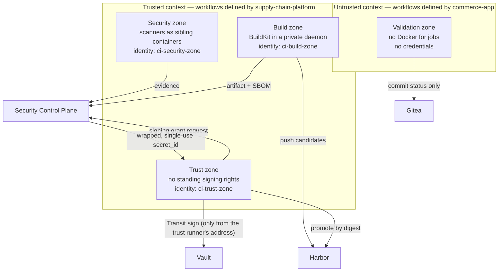

# Trust boundaries

A **trust boundary** is a point where data or control passes between parts of the system
that do not fully trust each other. Every boundary needs a mechanism that enforces it —
a policy, a permission, a network rule — not just a convention. This document lists the
boundaries of the software factory and what enforces each one. The threat model
([threat-model.md](threat-model.md)) refers back to them.

## CI trust zones

CI is split into four **zones**. A zone is an isolated CI environment with its own runner,
its own Docker daemon, its own network address and its own credentials.

| Zone | Runner registered to | Jobs get Docker? | Standing credentials | Can reach |
|---|---|---|---|---|
| Validation | organisation `commerce` | no | none | Gitea, NuGet |
| Security | repository `platform/supply-chain-platform` | yes — the zone's own rootless daemon | Vault AppRole `ci-security` (only from 172.30.0.22) | Gitea, Harbor (pull candidates), Control Plane, SonarQube, Keycloak, Vault |
| Build | repository `platform/supply-chain-platform` | yes — the zone's own rootless daemon with BuildKit | Vault AppRole `ci-build` (only from 172.30.0.23) | Gitea, Harbor (push candidates), Control Plane, Vault, NuGet |
| Trust | repository `platform/supply-chain-platform` | no | Vault AppRole `ci-trust` (only from 172.30.0.24), which can read nothing but the zone's Control Plane client | Control Plane, Vault, Harbor, Gitea |

### Why runner registration scope is the primary boundary

Gitea runners are chosen by label, and the workflow author chooses the label. A pull
request can therefore ask for *any* runner registered where the workflow runs. The
platform relies on **registration scope** instead of labels: the security, build and trust
runners are registered to the platform repository only. A job defined in `commerce-app` —
including one added by a malicious pull request — has no runner that will accept it. It
stays queued and never sees those runners or their credentials (Gitea cancels abandoned
jobs after 30 minutes).

### Why each zone has its own Docker daemon

Every runner container starts a private, **rootless** Docker daemon (one that runs without
root privileges on the runner). Job containers and scanner containers run inside it. As a
result:

- the host's Docker socket is never exposed to any job (access to it would equal root on
  the host);
- image layers, build cache and volumes are not shared between zones, so a poisoned
  validation cache cannot reach the build zone;
- all outbound traffic from a job leaves through its runner's fixed address on
  `sscp-edge`, which Vault uses to bind each zone's identity to its runner.

### Signing requires a fresh, policy-bound grant

The trust zone has **no standing right to sign**. For every release it asks the Control
Plane for a **signing grant**, and the Control Plane issues one only when:

1. a release manager requested the release through a protected tag on a commit with a
   successful main build;
2. the release's re-evaluation is `PASS` or `PASS_WITH_EXCEPTION` for every image;
3. the requesting workflow run is the one the Control Plane dispatched for this release.

The grant is a response-wrapped, single-use Vault `secret_id` for the `trust-signer` role.
It expires within minutes, can be redeemed only from the trust runner's address, and
yields a short-lived token that can sign with the release key and read the promotion
credentials. Vault's audit log records every use. Details:
[release-signing.md](release-signing.md#who-can-sign).

## Network boundaries

| Network | Members | Purpose |
|---|---|---|
| `sscp-edge` (172.30.0.0/16) | Gitea, Harbor's proxy, Vault, Keycloak, the Control Plane, SonarQube, the four runners, the kind node | services that CI and the cluster legitimately call |
| `sscp-data` (172.31.0.0/24, **internal**) | PostgreSQL, MinIO, and the services that own data in them (Gitea, Keycloak, SonarQube, Control Plane) | keeps platform databases and raw evidence out of reach of CI jobs and cluster workloads; an internal Docker network drops all traffic leaving it |
| Harbor's internal network (internal) | Harbor's components | only Harbor's TLS proxy is on `sscp-edge`; its database, cache and registry backend are unreachable from CI |
| `sscp-workload-dev` (172.32.0.0/24) | development data services (`--with workload` only) | host development, separate from the platform |
| Kubernetes pod network | pods in kind | default-deny NetworkPolicies with explicit allow rules per workload ([kubernetes-security.md](kubernetes-security.md#network-paths)) |

Host port mappings bind to `127.0.0.1` only, so nothing is reachable from other machines
on the local network.

## Identities

| Identity | Kind | Issued by | Used for |
|---|---|---|---|
| alice, max, rhea, pat, omar | people | Gitea | pull requests, reviews, protected tags, platform and GitOps changes |
| victor, rita, sean, paula | people | Keycloak `platform` realm | reading Control Plane records; requesting, approving and revoking risk exceptions; re-running builds |
| `ci-security-zone`, `ci-build-zone`, `ci-trust-zone` | machines | Keycloak `platform` realm (client credentials; the secret lives in Vault) | calling the Control Plane with zone-specific permissions |
| `ci-security`, `ci-build`, `ci-trust`, `trust-signer` | machines | Vault AppRole | reading zone secrets; signing (`trust-signer` only, through a grant) |
| `controlplane` | machine | Vault AppRole (only from 172.30.0.14) | minting signing grants — nothing else |
| Harbor robots | machines | Harbor | `candidate-pusher`, `candidate-reader`, `promoter`, `cluster-puller`, each limited to specific projects and actions ([artifact-registry.md](artifact-registry.md#robot-accounts)) |
| `sscp-controlplane`, `sscp-source-reader`, `sscp-gitops-bot`, `sscp-argocd` | machines | Gitea | dispatch and statuses; reading source; GitOps commits; Argo CD's reads ([repository-boundaries.md](repository-boundaries.md#machine-accounts-in-gitea)) |
| Commerce users (customers, staff) | people | Keycloak `commerce` realm | calling the workload through the gateway |
| `vault-secrets` service account (one per namespace) | machine | Kubernetes | External Secrets' login to Vault for that namespace |
| Workload service accounts | machines | Kubernetes | one per workload; bound to no Role, no token mounted ([kubernetes-security.md](kubernetes-security.md#workload-identities)) |

Root and bootstrap credentials — Vault's unseal keys and bootstrap token, the Gitea,
Harbor and Keycloak administrators — are generated on the workstation under
`.local/secrets/`, are never committed and are not given to any running service.

## How the boundaries are verified

| Boundary | Verified by |
|---|---|
| runner scope, jobs without Docker or credentials, private daemons | `sscp verify ci-isolation` |
| zone identities bound to runner addresses, zone secret scoping | `sscp verify ci-isolation` |
| signing only through grants; grants single-use and runner-bound | `sscp verify signing` |
| data services unreachable from the edge network | `sscp verify foundation` |
| zone permissions and run binding in the Control Plane | component tests (`ZoneBoundaryTests`) |
| no cluster access from CI | `sscp verify cluster` |
