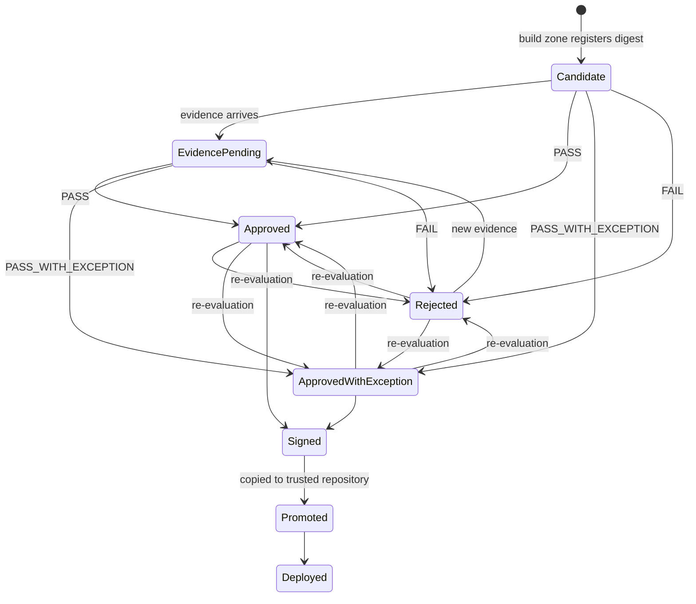
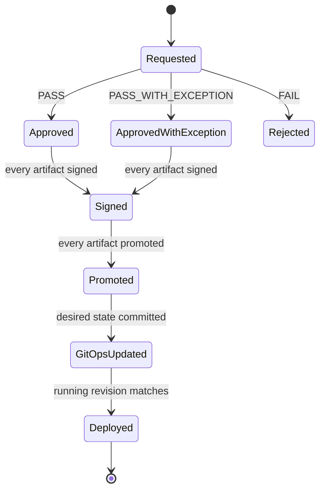

# Trust policy and decisions

This document explains what the Security Control Plane requires before it trusts an
artifact, how it reaches a decision, and the lifecycles of artifacts and releases. Accepting
a known risk temporarily is covered in [risk-exceptions.md](risk-exceptions.md); how the
service itself is built is in [security-control-plane.md](security-control-plane.md).

## In short

- Every image must have **complete evidence**: every mandatory scanner ran, completed, and
  described exactly this commit and this image digest.
- The evidence must be **intact**: the stored report still has the hash recorded when it
  arrived.
- The findings must be **within policy**: no leaked secret ever; no finding at or above
  the severity threshold; no vulnerability past its remediation window — unless an
  approved, unexpired exception covers that specific finding.
- The result is `PASS`, `PASS_WITH_EXCEPTION` (passed only because an exception was
  applied) or `FAIL`. Anything missing or broken makes it `FAIL` (**fail closed**).

## Where the policy lives

| File | Contains |
|---|---|
| [`policy/trust-policy.yaml`](../supply-chain-platform/policy/trust-policy.yaml) | mandatory evidence, severity gates, Checkov downgrades, the vulnerability SLA, the database age limit, exception rules |
| [`policy/applications.yaml`](../supply-chain-platform/policy/applications.yaml) | governed applications: source repository, deployables, candidate and trusted Harbor repositories, GitOps repository and environment |

Both files live in the platform repository and are copied into the Control Plane image
when it is built, so a running Control Plane applies exactly the reviewed content of those
files. Every decision records the policy version it used:
`<name>@sha256:<first 16 hex characters of the file's hash>`. `GET /api/policy` shows the
active version.

The deployable list in `applications.yaml` is authoritative. The build zone builds exactly
these deployables, and a release needs an artifact with full evidence for every one of
them. Nothing in the application repository can add a deployable or let one skip scanning.

## Mandatory evidence

| Kind | Tool | Describes | Pull requests | GitOps pull requests | Main builds |
|---|---|---|---|---|---|
| `SecretScan` | Gitleaks | commit | ✔ | ✔ | ✔ |
| `StaticAnalysis` | Semgrep | commit | ✔ | | ✔ |
| `InfrastructureScan` | Checkov | commit | ✔ | | ✔ |
| `DockerfileLint` | Hadolint | commit | ✔ | | ✔ |
| `DeploymentConfigScan` | Checkov on rendered overlays | commit | | ✔ | |
| `CodeQuality` | SonarQube quality gate | commit | | | ✔ |
| `DynamicScan` | OWASP ZAP | commit | | | ✔ |
| `SecurityTests` | authorization suite | commit | | | ✔ |
| `Sbom` | Syft (CycloneDX) | image digest | | | ✔ |
| `VulnerabilityScan` | Trivy (gating) | image digest | | | ✔ |
| `SecondaryVulnerabilityScan` | Grype (recorded, not gating) | image digest | | | ✔ |

Pull requests are judged on source evidence only, because no image exists yet and the
dynamic tests need a running candidate. How each tool is run and how its report is read is
in [security-scanning.md](security-scanning.md). Only the newest record of each kind for the
same build, commit and digest counts.

## Decision rules

Every evaluation produces a list of rule results. **Any failed blocking rule makes the
decision `FAIL`.**

| Rule | Passes when |
|---|---|
| `evidence.<Kind>` | the mandatory evidence exists for this build, commit and digest, and its scanner completed — a failed scanner is never evidence of safety |
| `integrity.<Kind>` | the stored raw report still matches the SHA-256 recorded at ingestion |
| `vulnerability-database` | Trivy's database is at most 7 days old |
| `vulnerabilities` | no Trivy finding is past a *blocking* remediation window, unless an approved exception covers it |
| `vulnerabilities.sla` *(warning only)* | no finding is past a *warning* window |
| `secrets` | Gitleaks found nothing — secrets can never be accepted as risk |
| `static-analysis`, `infrastructure`, `dockerfile`, `dynamic-scan`, `deployment-config` | no finding at or above **High**, unless an approved exception covers it (`deployment-config` uses the infrastructure threshold) |
| `code-quality` | the SonarQube quality gate is `OK` |
| `security-tests` | every authorization/API-security test passed |
| `sbom` | the SBOM describes this digest and lists components |

The outcome:

- **`PASS`** — no blocking rule failed and no exception was needed.
- **`PASS_WITH_EXCEPTION`** — no blocking rule failed, and at least one approved,
  unexpired exception was applied. The decision lists the exceptions it used.
- **`FAIL`** — at least one blocking rule failed. The decision lists the failing rules and
  the fingerprints of the findings responsible.

### Severity thresholds

```yaml
gates:
  staticAnalysis: { blockAtOrAbove: High, exceptionsAllowed: true }
  infrastructure: { blockAtOrAbove: High, exceptionsAllowed: true }
  dockerfile:     { blockAtOrAbove: High, exceptionsAllowed: true }
  dynamicScan:    { blockAtOrAbove: High, exceptionsAllowed: true }
```

### Checkov downgrades

Checkov's free edition does not grade its checks, so every failed Checkov check counts as
**High** — and so does every check skipped with an inline `checkov:skip` comment (the
platform never skips checks itself). The policy downgrades a small number of checks to
Low, each with a written reason:

| Check | Why it does not block |
|---|---|
| `CKV_K8S_40` (high UID) | the chiseled .NET images run as UID 1654; non-root is enforced by `runAsNonRoot` and the Pod Security Standard `restricted` |
| `CKV_K8S_15` (always pull) | images are pinned by digest, so re-pulling cannot change what runs |
| `CKV_DOCKER_2` (Docker `HEALTHCHECK`) | chiseled images have no shell; Kubernetes probes check health |
| `CKV_DOCKER_7` (base image tag) | the build zone supplies base images by digest and refuses Dockerfiles that bypass them |
| `CKV2_K8S_6` (pods without a NetworkPolicy) | GitOps manifests are scanned without the platform-owned default-deny policies that apply in the cluster |
| `CKV_K8S_11` (CPU limits) | CPU requests are set and memory limits enforced; CPU limits are left out on purpose because they throttle bursts without protecting other pods |
| `CKV_K8S_35` (secrets in environment variables) | an accepted weakness: the services read secrets from environment variables; mounting them as files needs an application change ([production-considerations.md](production-considerations.md)) |

## Vulnerability SLA

A vulnerability is not blocked the moment it appears; each severity has a **remediation
window**. Inside the window the finding is reported; after it, the listed action applies.
The age of a finding is measured from the first time *any* evidence for the application
contained it, so rebuilding does not restart the clock.

| Severity | Fix available | Remediation window | After the window |
|---|---|---|---|
| Critical | yes | 0 days | **block** |
| Critical | no | 14 days | **block** |
| High | yes | 7 days | **block** |
| High | no | 30 days | **block** |
| Medium | either | 30 days | warn |
| Low | either | 180 days | track |

So a critical vulnerability with a fix blocks immediately; a high one with a fix blocks
after a week. A severity the table does not mention is tracked, never silently dropped.

## Artifact lifecycle

Each candidate image moves through these states in the Control Plane. The state machine
rejects any transition not shown.



An artifact is signed only after a positive decision and promoted only after it was
signed. Once signed, a later decision is still recorded but does not rewind the state; a
negative one blocks further releases of that digest instead.

## Release lifecycle

A release is a protected tag on a commit that has a successful main build with an artifact
for every deployable.



- The trust zone evaluates the release again **immediately before signing**: time has
  passed since the main build, so an exception may have expired or a remediation window
  may have closed. The release is then `Rejected` and nothing is signed.
- Before signing, a re-evaluation may move a release between `Approved`,
  `ApprovedWithException` and `Rejected`; the diagram shows the common path.
- A pipeline error moves a release to `Failed` from any state before `Deployed`; the run
  watcher does the same if the run ends without finishing it.
- Each release is bound to exactly one trust-zone pipeline run.
- A later tag on the same commit is a new release of the same build: it is re-evaluated
  and signed again under its own records.

## Changing the policy

1. Edit `policy/trust-policy.yaml` or `policy/applications.yaml` in the platform
   repository and have the change reviewed like any other code.
2. Publish it (`uv run sscp repo sync -m "…"`) and run `uv run sscp up`; the Control Plane
   image is rebuilt with the new files and restarted.
3. `GET /api/policy` shows the new version. Decisions made from then on record it; older
   decisions keep the version they were made with, so they stay explainable.

The evaluator's behaviour is covered by `tests/Sscp.ControlPlane.UnitTests/Policy/TrustEvaluatorTests.cs`
(each rule, the SLA, exceptions) and the end-to-end flows by
`tests/Sscp.ControlPlane.ComponentTests/TrustFlowTests.cs`.
