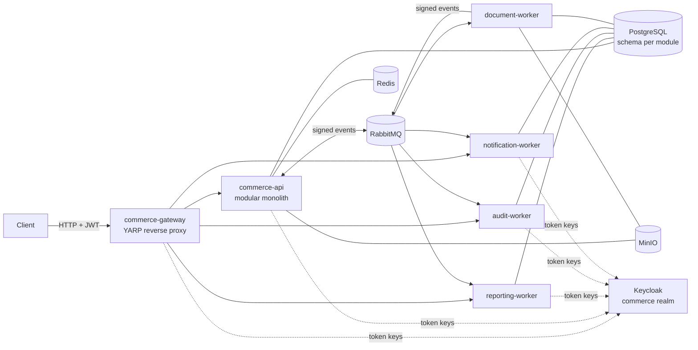
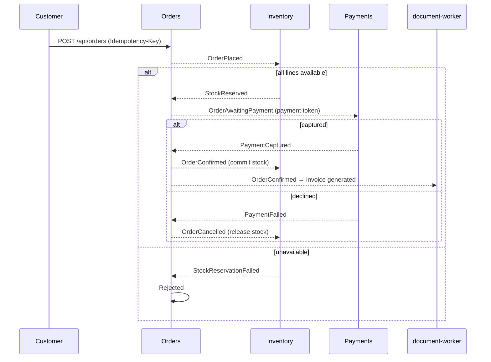

# Commerce workload architecture

The platform protects a realistic application rather than a toy: a commerce and
order-management backend. The workload gives the supply-chain controls real material to
work on:

- several deployable images built from one repository;
- real dependencies with real vulnerabilities to scan;
- asynchronous messaging;
- personal and financial data;
- a non-trivial authorization model.

This document describes the application itself. How it is built, checked and deployed is
covered in [end-to-end-flow.md](end-to-end-flow.md).

The source lives in [`commerce-app/`](../commerce-app), in the Gitea repository
`commerce/commerce-app`. It is a .NET 10 solution (`Commerce.slnx`).

## Shape of the system

The workload is a **modular monolith** plus **four independently deployable workers**,
behind a **gateway**:

- A *modular monolith* is one deployable application internally divided into modules with
  strict boundaries. It is simpler to run than many microservices, while keeping the code
  separated.
- The *workers* are small separate services that react to events and own their own data.
- The *gateway* is the single entry point; it applies security rules before any request
  reaches a backend.



## Deployables

| Deployable | Role | Owns schema | Routes through the gateway |
|---|---|---|---|
| `commerce-api` | the modular monolith hosting the eight business modules | one per module | `/api/*`, except the three worker prefixes below |
| `commerce-gateway` | the only public entry point: token check, rate limits, body-size limits, header clean-up | none | all |
| `notification-worker` | records and sends order notifications to customers | `notifications` | `/api/notifications/*` |
| `audit-worker` | the only writer of the hash-chained audit trail | `audit` (append-only) | `/api/audit/*` |
| `document-worker` | generates invoice documents into object storage | `document_processing` | none |
| `reporting-worker` | builds the reporting read model from events | `reporting` | `/api/reports/*` |

All six images are built from one [Dockerfile](../commerce-app/Dockerfile), with one build
target per deployable (`--target commerce-api`, …):

- the dependency restore is **locked**: `packages.lock.json` files pin every NuGet package
  version and hash;
- the SDK and runtime base images are **supplied by the build zone**, pinned by digest, as
  build arguments. The platform refuses a Dockerfile that picks its own base images
  ([ci-pipelines.md](ci-pipelines.md#main-pipeline));
- the runtime image is Microsoft's **chiseled** .NET image. It has no shell and no package
  manager, which leaves little for an attacker to use;
- containers run as a **non-root** user (UID 1654).

Every service has the same operational endpoints:

| Endpoint | Used by |
|---|---|
| `/health/live` | Kubernetes liveness probe: "the process is running" |
| `/health/ready` | Kubernetes readiness probe: "dependencies are reachable, send traffic" |
| `migrate` start argument | runs the service's database migrations and exits; used by the migrations Job and the dynamic test environment |

Telemetry (traces, metrics, logs) is exported over OTLP to the OpenTelemetry Collector
([observability.md](observability.md)).

## Modules

| Module | Responsibility | Notable rules |
|---|---|---|
| Identity | integration with Keycloak: account provisioning, role administration | nobody may change their own roles; every change is audited, and reverted if the audit record cannot be written |
| Customers | profiles and addresses (personal data) | identity comes from the token, never the request body; staff see masked data |
| Catalog | products, prices, public storefront listing | anonymous read of active products only; the listing is cached in Redis |
| Inventory | stock and order reservations | reserves all lines of an order or none |
| Orders | order placement and lifecycle (a state machine) | prices are always taken from the catalogue on the server; an idempotency key is required |
| Payments | captures and refunds through simulated providers | refunds only by `finance`, not `admin`; partial refunds behind a feature flag |
| Documents | uploaded attachments and generated invoices | content-type sniffing, size limits, server-generated storage keys, forced download |
| Administration | runtime feature flags | toggles need a reason, and are audited as privileged operations |

### Inside a module

Each module has two projects:

- `Commerce.Modules.<Name>`: the implementation;
- `Commerce.Modules.<Name>.Contracts`: what other modules may use. This means integration
  events and in-process query interfaces, for example `ICatalogQueries` for server-side
  pricing. Contracts depend only on the shared kernel.

The implementation follows Clean Architecture inside the module, with *vertical slices*
(one folder or file per use case):

| Folder | Contains | May depend on |
|---|---|---|
| `Domain` | aggregates, value objects, domain events, pure rules | the shared kernel only |
| `Features` | one file per use case: request, validation, handler, endpoint | Domain, Data, building blocks, other modules' **Contracts** |
| `Data` | EF Core DbContext, mappings, migrations | Domain, building blocks |
| `Integration` | consumers of other modules' events; translation of domain events into integration events | Domain, Data, other modules' **Contracts** |

Shared infrastructure lives in two projects:

- `src/BuildingBlocks/Commerce.BuildingBlocks`: security, messaging, persistence, storage,
  telemetry, health, auditing, data classification;
- `src/BuildingBlocks/Commerce.SharedKernel`: small shared types.

### How boundaries are enforced

- **At compile time.** Module projects reference only other modules' `Contracts`
  projects. They cannot see another module's internals.
- **Architecture tests.** These live in
  [`tests/Commerce.ArchitectureTests`](../commerce-app/tests/Commerce.ArchitectureTests) and
  inspect the compiled code. They check that:
  - no module uses another module's internals;
  - domain code does not touch EF Core, ASP.NET Core, RabbitMQ, Redis or S3;
  - persistence code never calls features;
  - contracts stay free of implementation types;
  - the gateway and workers use modules only through contracts.
- **Database privileges.** Each module connects with its own PostgreSQL role. That role can
  read and write rows only in the module's own schema
  ([messaging-and-data.md](messaging-and-data.md)). A bug in one module cannot read another
  module's tables, even by accident.

## Patterns and where they are used

| Pattern | Where | Why it is used there |
|---|---|---|
| Result pattern | all use cases | expected failures (not found, conflict, forbidden) are return values, mapped to HTTP problem details in one place, instead of exceptions |
| Domain events | aggregates | a change inside a module triggers side effects, such as an integration event and an audit record, in the same transaction |
| Integration events | Contracts | versioned, signed messages between modules and workers |
| Transactional outbox | every schema that publishes | the event and the business change are committed together, so neither can be lost without the other |
| Inbox and idempotent consumers | every consumer | at-least-once delivery becomes an exactly-once effect |
| Selective CQRS (separate read and write paths) | Orders, Reporting | order commands go through the aggregate; order queries and reports read projections without change tracking |
| Specification | Catalog search | the storefront, staff screens and the pricing query combine the same filters |
| Strategy | payment providers | card and wallet payments follow different rules, chosen per payment |

## Order flow



Every dashed arrow is an integration event travelling through the outbox, RabbitMQ and an
inbox. The notification, reporting and audit workers observe the same events:

- the notification worker records a notification for the customer. The local delivery
  channel writes a structured log entry; no e-mail is sent;
- the reporting worker updates the sales read model;
- the audit worker appends to the audit chain.

## Running it

| Where | How |
|---|---|
| Kubernetes (the normal path) | released through the supply chain; see [gitops-and-admission.md](gitops-and-admission.md). The gateway answers on `http://127.0.0.1:8088` |
| Host processes, for development | `uv run sscp up --with workload`, then `uv run sscp workload setup` and `uv run sscp workload start`; the gateway answers on `http://localhost:5080` ([cli-reference.md](cli-reference.md#workload)) |
| Tests | `cd commerce-app` then `dotnet test`. Integration tests start PostgreSQL, RabbitMQ, MinIO and Keycloak in disposable containers ([testing-strategy.md](testing-strategy.md)) |

A quick check against the cluster:

```bash
curl -s http://127.0.0.1:8088/api/catalog/products
curl -s -o /dev/null -w "%{http_code}\n" http://127.0.0.1:8088/api/orders/mine
```

The first command lists the catalogue anonymously. The second prints `401`, because orders
require a token.

## Related documents

- [identity-and-authorization.md](identity-and-authorization.md): tokens, roles,
  permissions, record rules, masking
- [messaging-and-data.md](messaging-and-data.md): outbox and inbox, signed events, schemas
  and roles
- [dynamic-security-testing.md](dynamic-security-testing.md): how the built images are
  attacked before release

## Limitations

- Payment providers are simulated (`card_approved_4242`-style tokens). No real payment
  network is contacted.
- Notifications are logged, not delivered.
- There is no user interface. The workload is an HTTP API; the personas act through tokens.
